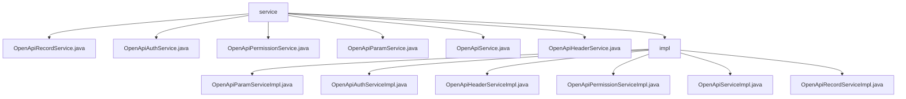

# 基础信息

|      |      |
|------|------|
| 名称 | service |
| 编码语言 | .java |
| 代码路径 | JeecgBoot/jeecg-boot/jeecg-module-system/jeecg-system-biz/src/main/java/org/jeecg/modules/openapi/service |
| 包名 | JeecgBoot.jeecg-boot.jeecg-module-system.jeecg-system-biz.src.main.java.org.jeecg.modules.openapi.service |
| 概述说明 | 该模块实现OpenApi功能，涵盖参数、认证、权限、记录等管理，确保API高效安全。 |

# 说明

## 概述
该代码模块主要围绕OpenApi相关功能进行实现，涵盖了参数管理、认证授权、权限控制、记录查询等多个方面。模块中的各个服务类通过实现特定的接口或继承基础类，提供了对OpenApi数据的增删改查操作，确保了系统对API请求的高效管理、安全验证和权限控制。

## 主要业务场景
1. **参数管理**：`OpenApiParamServiceImpl`类负责通过`apiId`对OpenApi参数数据进行删除和查询操作，确保对API参数的高效管理。
2. **认证授权**：`OpenApiAuthServiceImpl`类通过`appkey`查询OpenApi认证信息，确保API请求的安全性和有效性。
3. **请求头管理**：`OpenApiHeaderServiceImpl`类基于`apiId`对OpenApi请求头数据进行删除和查询操作，确保请求头数据的准确性和高效性。
4. **权限控制**：`OpenApiPermissionServiceImpl`类根据`authId`查询权限列表，用于权限管理系统中的权限验证和操作控制。
5. **API记录查询**：`OpenApiServiceImpl`类提供了`findByPath`方法，用于根据路径查询OpenApi记录，确保对API记录的快速检索。
6. **记录管理**：`OpenApiRecordServiceImpl`类继承了基础功能并实现了特定接口，确保在特定业务场景下对OpenApi记录的功能完整性和一致性。

该模块通过上述功能，全面支持了OpenApi的管理、验证和权限控制，适用于需要高效管理API请求和权限的系统场景。

### 包内部结构视图

该流程图展示了 `service` 文件夹及其子文件夹 `impl` 中的文件层级关系。`service` 文件夹包含多个服务接口文件，而 `impl` 文件夹则包含了这些接口的具体实现类。每个服务接口都有对应的实现类，清晰地展示了服务层与实现层之间的依赖关系。

# 文件列表 File List

| 名称   | 类型  | 说明 |
|-------|------|-------------|
| [OpenApiHeaderService.java](OpenApiHeaderService.md) | file | 无内容提供，无法生成概要描述。 |
| [OpenApiService.java](OpenApiService.md) | file | 信息为空，无法生成概要描述。 |
| [OpenApiParamService.java](OpenApiParamService.md) | file | 输入内容为空，无法生成概要描述。 |
| [OpenApiPermissionService.java](OpenApiPermissionService.md) | file | 信息为空，无法生成概要描述。 |
| [OpenApiRecordService.java](OpenApiRecordService.md) | file | 信息为空，无法生成概要描述。 |
| [OpenApiAuthService.java](OpenApiAuthService.md) | file | 信息缺失，请提供具体内容以便生成概要描述。 |
| [impl](impl/_module.md) | package | 各类实现功能：删除查询OpenApiParam，appkey查询OpenApiAuth，删除查询OpenApiHeader，authId查询权限列表，路径查询OpenApi记录，继承实现OpenApiRecordService。 |

