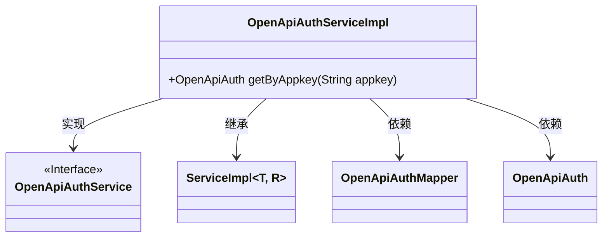
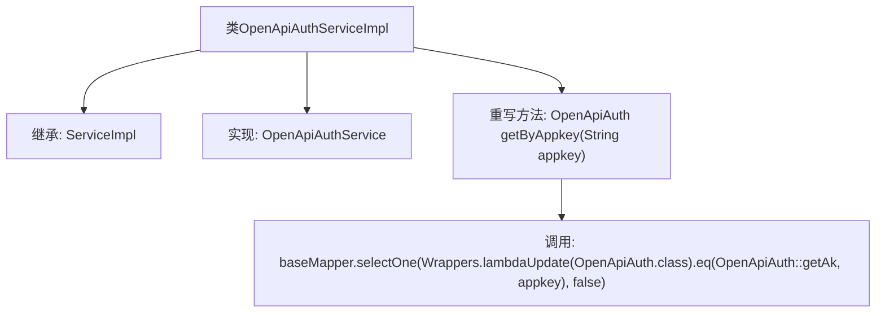

# 基础信息

|      |      |
|------|------|
| 名称 | OpenApiAuthServiceImpl |
| 编码语言 | .java |
| 代码路径 | JeecgBoot/jeecg-boot/jeecg-module-system/jeecg-system-biz/src/main/java/org/jeecg/modules/openapi/service/impl/OpenApiAuthServiceImpl.java |
| 包名 | org.jeecg.modules.openapi.service.impl |
| 依赖项 | ['com.baomidou.mybatisplus.core.toolkit.Wrappers', 'com.baomidou.mybatisplus.extension.service.impl.ServiceImpl', 'org.jeecg.modules.openapi.entity.OpenApiAuth', 'org.jeecg.modules.openapi.mapper.OpenApiAuthMapper', 'org.jeecg.modules.openapi.service.OpenApiAuthService', 'org.springframework.stereotype.Service'] |
| 概述说明 | OpenApiAuthServiceImpl通过appkey查询OpenApiAuth信息。 |

# 说明

OpenApiAuthServiceImpl类主要负责通过appkey查询OpenApiAuth信息。该服务实现的核心功能是根据提供的appkey参数，从相关数据源中检索并返回对应的OpenApiAuth数据。这一过程确保了系统能够准确验证和授权API请求，保障了接口调用的安全性和有效性。

# 类列表 Class Summary

| 名称   | 类型  | 说明 |
|-------|------|-------------|
| OpenApiAuthServiceImpl | class | OpenApiAuthServiceImpl通过appkey查询OpenApiAuth信息。 |

## 类 OpenApiAuthServiceImpl

|      |      |
|------|------|
| 访问范围 | @Service;public |
| 类型 | class |
| 名称 | OpenApiAuthServiceImpl |
| 说明 | OpenApiAuthServiceImpl通过appkey查询OpenApiAuth信息。 |

### UML类图

这段代码展示了一个名为 `OpenApiAuthServiceImpl` 的服务类，它继承了 `ServiceImpl` 并实现了 `OpenApiAuthService` 接口。该类通过 `OpenApiAuthMapper` 与数据库进行交互，并提供了一个方法 `getByAppkey`，用于根据 `appkey` 查询 `OpenApiAuth` 对象。代码结构清晰，依赖关系明确，符合面向对象设计原则。

### 内部方法调用关系图

这段代码定义了一个名为`OpenApiAuthServiceImpl`的类，该类继承了`ServiceImpl`并实现了`OpenApiAuthService`接口。类中重写了`getByAppkey`方法，该方法通过`baseMapper.selectOne`查询并返回与给定`appkey`匹配的`OpenApiAuth`对象。`selectOne`方法使用了`Wrappers.lambdaUpdate`来构建查询条件，确保查询结果准确。

### 字段列表 Field List

| 名称  | 类型  | 说明 |
|-------|-------|------|

### 方法列表 Method List

| 名称  | 类型  | 说明 |
|-------|-------|------|
| getByAppkey | OpenApiAuth | 通过appkey查询OpenApiAuth信息，使用lambda表达式匹配条件。 |

