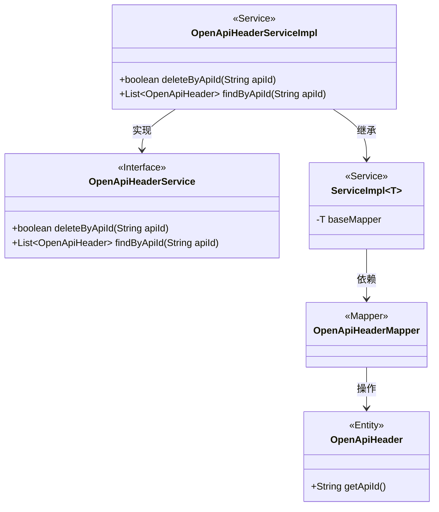
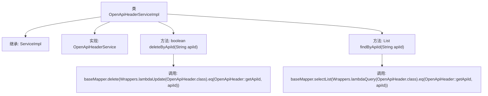

# 基础信息

|      |      |
|------|------|
| 名称 | OpenApiHeaderServiceImpl |
| 编码语言 | .java |
| 代码路径 | JeecgBoot/jeecg-boot/jeecg-module-system/jeecg-system-biz/src/main/java/org/jeecg/modules/openapi/service/impl/OpenApiHeaderServiceImpl.java |
| 包名 | org.jeecg.modules.openapi.service.impl |
| 依赖项 | ['com.baomidou.mybatisplus.core.toolkit.Wrappers', 'com.baomidou.mybatisplus.extension.service.impl.ServiceImpl', 'org.jeecg.modules.openapi.entity.OpenApiHeader', 'org.jeecg.modules.openapi.mapper.OpenApiHeaderMapper', 'org.jeecg.modules.openapi.service.OpenApiHeaderService', 'org.springframework.stereotype.Service', 'java.util.List'] |
| 概述说明 | OpenApiHeaderServiceImpl类实现删除和查询功能，操作OpenApiHeader表。 |

# 说明

OpenApiHeaderServiceImpl类主要负责实现删除和查询功能，这些功能基于apiId对OpenApiHeader表进行操作。具体来说，该类通过apiId来定位并删除或查询OpenApiHeader表中的相关记录，确保数据操作的准确性和高效性。

# 类列表 Class Summary

| 名称   | 类型  | 说明 |
|-------|------|-------------|
| OpenApiHeaderServiceImpl | class | OpenApiHeaderServiceImpl类实现删除和查询功能，基于apiId操作OpenApiHeader表。 |

## 类 OpenApiHeaderServiceImpl

|      |      |
|------|------|
| 访问范围 | @Service;public |
| 类型 | class |
| 名称 | OpenApiHeaderServiceImpl |
| 说明 | OpenApiHeaderServiceImpl类实现删除和查询功能，基于apiId操作OpenApiHeader表。 |

### UML类图

这段代码描述了一个服务类 `OpenApiHeaderServiceImpl`，它继承了 `ServiceImpl` 并实现了 `OpenApiHeaderService` 接口。该类提供了两个主要方法：`deleteByApiId` 用于根据 `apiId` 删除记录，`findByApiId` 用于根据 `apiId` 查询记录。`ServiceImpl` 是一个泛型类，依赖于 `OpenApiHeaderMapper` 来操作 `OpenApiHeader` 实体。`OpenApiHeaderMapper` 是一个映射器类，负责与数据库交互。

### 内部方法调用关系图

该流程图描述了`OpenApiHeaderServiceImpl`类的结构及其方法调用关系。该类继承自`ServiceImpl`并实现了`OpenApiHeaderService`接口。它包含两个主要方法：`deleteByApiId`和`findByApiId`。`deleteByApiId`方法通过`baseMapper.delete`删除指定`apiId`的记录，而`findByApiId`方法通过`baseMapper.selectList`查询并返回指定`apiId`的记录列表。

### 字段列表 Field List

| 名称  | 类型  | 说明 |
|-------|-------|------|

### 方法列表 Method List

| 名称  | 类型  | 说明 |
|-------|-------|------|
| findByApiId | List<OpenApiHeader> | 根据API ID查询OpenApiHeader列表并返回结果。 |
| deleteByApiId | boolean | 方法删除指定API ID的OpenApiHeader记录，返回是否成功。 |

