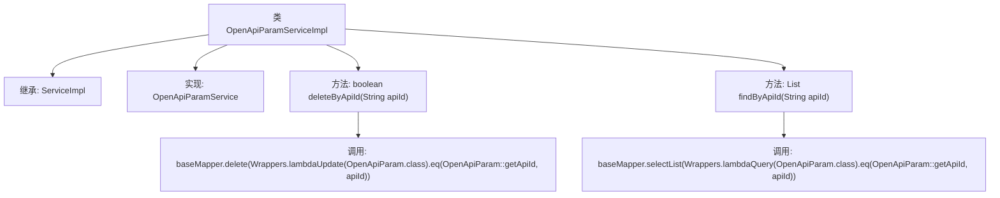

# 基础信息

|      |      |
|------|------|
| 名称 | OpenApiParamServiceImpl |
| 编码语言 | .java |
| 代码路径 | JeecgBoot/jeecg-boot/jeecg-module-system/jeecg-system-biz/src/main/java/org/jeecg/modules/openapi/service/impl/OpenApiParamServiceImpl.java |
| 包名 | org.jeecg.modules.openapi.service.impl |
| 依赖项 | ['com.baomidou.mybatisplus.core.toolkit.Wrappers', 'com.baomidou.mybatisplus.extension.service.impl.ServiceImpl', 'org.jeecg.modules.openapi.entity.OpenApiParam', 'org.jeecg.modules.openapi.mapper.OpenApiParamMapper', 'org.jeecg.modules.openapi.service.OpenApiParamService', 'org.springframework.stereotype.Service', 'java.util.List'] |
| 概述说明 | OpenApiParamServiceImpl类实现删除和查询功能，通过apiId操作数据。 |

# 说明

OpenApiParamServiceImpl类负责实现删除和查询功能，主要通过apiId对OpenApiParam数据进行操作。该类提供了删除指定apiId对应数据的方法，以及查询apiId相关数据的功能，确保对OpenApiParam数据的高效管理和访问。

# 类列表 Class Summary

| 名称   | 类型  | 说明 |
|-------|------|-------------|
| OpenApiParamServiceImpl | class | OpenApiParamServiceImpl类实现删除和查询功能，通过apiId操作OpenApiParam数据。 |


## 类 OpenApiParamServiceImpl

|      |      |
|------|------|
| 访问范围 | @Service;public |
| 类型 | class |
| 名称 | OpenApiParamServiceImpl |
| 说明 | OpenApiParamServiceImpl类实现删除和查询功能，通过apiId操作OpenApiParam数据。 |


### UML类图

```mermaid
classDiagram
    class OpenApiParamServiceImpl {
        +boolean deleteByApiId(String apiId)
        +List~OpenApiParam~ findByApiId(String apiId)
    }
    class ServiceImpl~T~ {
        +T baseMapper
    }
    class OpenApiParamMapper {
    }
    class OpenApiParam {
        +String getApiId()
    }
    <<Interface>> OpenApiParamService {
        +boolean deleteByApiId(String apiId)
        +List~OpenApiParam~ findByApiId(String apiId)
    }

    OpenApiParamServiceImpl --> ServiceImpl~OpenApiParamMapper, OpenApiParam~ : 继承
    OpenApiParamServiceImpl --> OpenApiParamService : 实现
    ServiceImpl~OpenApiParamMapper, OpenApiParam~ --> OpenApiParamMapper : 依赖
    OpenApiParamServiceImpl --> OpenApiParam : 依赖
```

类图描述：
`OpenApiParamServiceImpl` 类继承了 `ServiceImpl` 泛型类，并实现了 `OpenApiParamService` 接口。该类提供了两个方法：`deleteByApiId` 和 `findByApiId`，分别用于根据 `apiId` 删除和查询 `OpenApiParam` 对象。`ServiceImpl` 类依赖于 `OpenApiParamMapper`，而 `OpenApiParamServiceImpl` 类则依赖于 `OpenApiParam` 类。


### 内部方法调用关系图



这段代码定义了一个名为`OpenApiParamServiceImpl`的服务类，该类继承自`ServiceImpl`并实现了`OpenApiParamService`接口。类中包含两个方法：`deleteByApiId`和`findByApiId`。`deleteByApiId`方法通过`apiId`删除相关记录，`findByApiId`方法通过`apiId`查询相关记录。这两个方法分别调用了`baseMapper`的`delete`和`selectList`方法，使用了`Wrappers`工具类进行条件构造。

### 字段列表 Field List

| 名称  | 类型  | 说明 |
|-------|-------|------|

### 方法列表 Method List

| 名称  | 类型  | 说明 |
|-------|-------|------|
| findByApiId | List<OpenApiParam> | 根据API ID查询OpenApiParam列表。 |
| deleteByApiId | boolean | 该方法通过API ID删除OpenApiParam记录，删除成功返回true。 |


