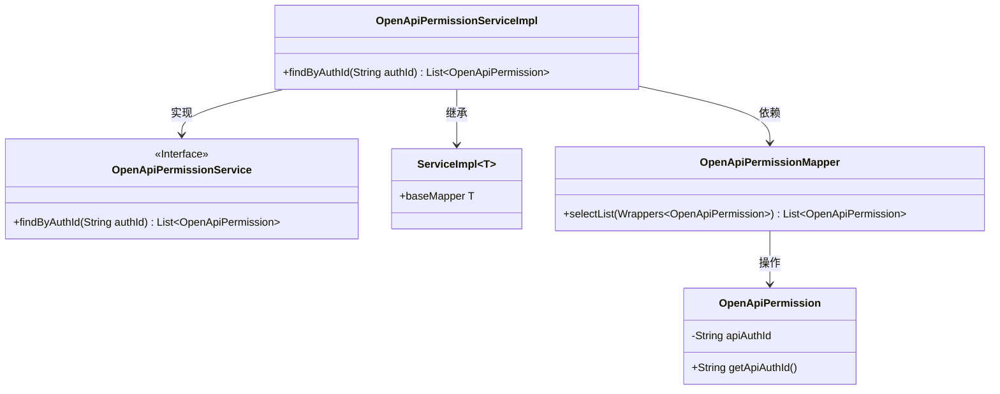
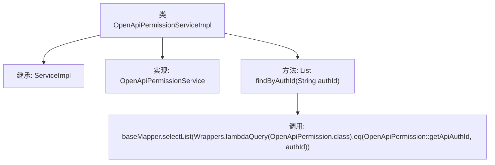

# 基础信息

|      |      |
|------|------|
| 名称 | OpenApiPermissionServiceImpl |
| 编码语言 | .java |
| 代码路径 | JeecgBoot/jeecg-boot/jeecg-module-system/jeecg-system-biz/src/main/java/org/jeecg/modules/openapi/service/impl/OpenApiPermissionServiceImpl.java |
| 包名 | org.jeecg.modules.openapi.service.impl |
| 依赖项 | ['com.baomidou.mybatisplus.core.toolkit.Wrappers', 'com.baomidou.mybatisplus.extension.service.impl.ServiceImpl', 'org.jeecg.modules.openapi.entity.OpenApiPermission', 'org.jeecg.modules.openapi.mapper.OpenApiPermissionMapper', 'org.jeecg.modules.openapi.service.OpenApiPermissionService', 'org.springframework.stereotype.Service', 'java.util.Collections', 'java.util.List'] |
| 概述说明 | OpenApiPermissionServiceImpl类通过authId查询权限列表。 |

# 说明

OpenApiPermissionServiceImpl类负责实现根据authId查询权限列表的功能。该类通过接收authId作为输入参数，执行相应的逻辑处理，最终返回与该authId关联的权限列表。该功能主要用于权限管理系统中，确保用户或系统根据其身份标识获取相应的权限信息，以便进行后续的权限验证和操作控制。

# 类列表 Class Summary

| 名称   | 类型  | 说明 |
|-------|------|-------------|
| OpenApiPermissionServiceImpl | class | OpenApiPermissionServiceImpl类实现根据authId查询权限列表功能。 |

## 类 OpenApiPermissionServiceImpl

|      |      |
|------|------|
| 访问范围 | @Service;public |
| 类型 | class |
| 名称 | OpenApiPermissionServiceImpl |
| 说明 | OpenApiPermissionServiceImpl类实现根据authId查询权限列表功能。 |

### UML类图

**描述：**
`OpenApiPermissionServiceImpl`类实现了`OpenApiPermissionService`接口，并继承了`ServiceImpl`类。它通过`baseMapper`调用`OpenApiPermissionMapper`的`selectList`方法，根据`authId`查询`OpenApiPermission`对象的列表。`OpenApiPermission`类包含`apiAuthId`属性及其getter方法。

### 内部方法调用关系图

这段代码定义了一个名为 `OpenApiPermissionServiceImpl` 的服务类，它继承了 `ServiceImpl` 并实现了 `OpenApiPermissionService` 接口。类中包含一个 `findByAuthId` 方法，该方法通过 `baseMapper.selectList` 查询与给定 `authId` 匹配的 `OpenApiPermission` 对象列表。流程图展示了类的继承关系、接口实现以及方法调用的逻辑流程。

### 字段列表 Field List

| 名称  | 类型  | 说明 |
|-------|-------|------|

### 方法列表 Method List

| 名称  | 类型  | 说明 |
|-------|-------|------|
| findByAuthId | List<OpenApiPermission> | 根据认证ID查询OpenApi权限列表。 |

