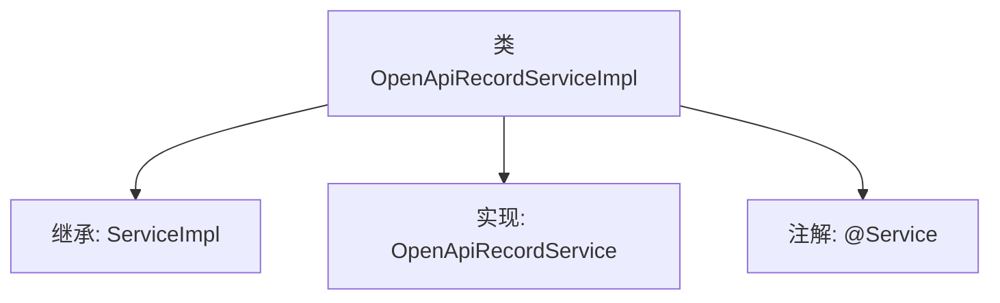

# 基础信息

|      |      |
|------|------|
| 名称 | OpenApiRecordServiceImpl |
| 编码语言 | .java |
| 代码路径 | JeecgBoot/jeecg-boot/jeecg-module-system/jeecg-system-biz/src/main/java/org/jeecg/modules/openapi/service/impl/OpenApiRecordServiceImpl.java |
| 包名 | org.jeecg.modules.openapi.service.impl |
| 依赖项 | ['com.baomidou.mybatisplus.extension.service.impl.ServiceImpl', 'org.jeecg.modules.openapi.entity.OpenApiRecord', 'org.jeecg.modules.openapi.mapper.OpenApiRecordMapper', 'org.jeecg.modules.openapi.service.OpenApiRecordService', 'org.springframework.stereotype.Service'] |
| 概述说明 | OpenApiRecordServiceImpl继承ServiceImpl并实现OpenApiRecordService接口。 |

# 说明

OpenApiRecordServiceImpl类继承了ServiceImpl类，并实现了OpenApiRecordService接口。该类通过继承和接口实现，具备了ServiceImpl类的基础功能，同时满足了OpenApiRecordService接口定义的方法要求，确保了在特定业务场景下的功能完整性和一致性。

# 类列表 Class Summary

| 名称   | 类型  | 说明 |
|-------|------|-------------|
| OpenApiRecordServiceImpl | class | OpenApiRecordServiceImpl类继承ServiceImpl并实现OpenApiRecordService接口。 |


## 类 OpenApiRecordServiceImpl

|      |      |
|------|------|
| 访问范围 | @Service;public |
| 类型 | class |
| 名称 | OpenApiRecordServiceImpl |
| 说明 | OpenApiRecordServiceImpl类继承ServiceImpl并实现OpenApiRecordService接口。 |


### UML类图

```mermaid
classDiagram
    class OpenApiRecordServiceImpl {
        <<Service>>
        +OpenApiRecordServiceImpl()
    }
    class ServiceImpl~T~ {
        <<Service>>
        +ServiceImpl()
    }
    class OpenApiRecordMapper {
        <<Mapper>>
    }
    class OpenApiRecord {
        <<Entity>>
    }
    interface OpenApiRecordService {
        <<Interface>>
    }

    OpenApiRecordServiceImpl --> OpenApiRecordMapper : 依赖
    OpenApiRecordServiceImpl --> OpenApiRecord : 依赖
    OpenApiRecordServiceImpl --|> ServiceImpl~OpenApiRecord~ : 继承
    OpenApiRecordServiceImpl ..|> OpenApiRecordService : 实现
```

### 描述
`OpenApiRecordServiceImpl` 是一个服务类，继承自 `ServiceImpl` 并实现了 `OpenApiRecordService` 接口。它依赖于 `OpenApiRecordMapper` 和 `OpenApiRecord` 实体类。`ServiceImpl` 是一个泛型类，`OpenApiRecordMapper` 是数据访问层接口，`OpenApiRecord` 是实体类。`OpenApiRecordService` 是服务接口，定义了业务逻辑的契约。


### 内部方法调用关系图



这段代码定义了一个名为 `OpenApiRecordServiceImpl` 的类，它继承了 `ServiceImpl` 类并实现了 `OpenApiRecordService` 接口。类上使用了 `@Service` 注解，表明它是一个服务层的组件。`ServiceImpl` 是一个泛型类，接收 `OpenApiRecordMapper` 和 `OpenApiRecord` 作为类型参数。这个类的主要作用是提供与 `OpenApiRecord` 相关的业务逻辑实现。

### 字段列表 Field List

| 名称  | 类型  | 说明 |
|-------|-------|------|

### 方法列表 Method List

| 名称  | 类型  | 说明 |
|-------|-------|------|


