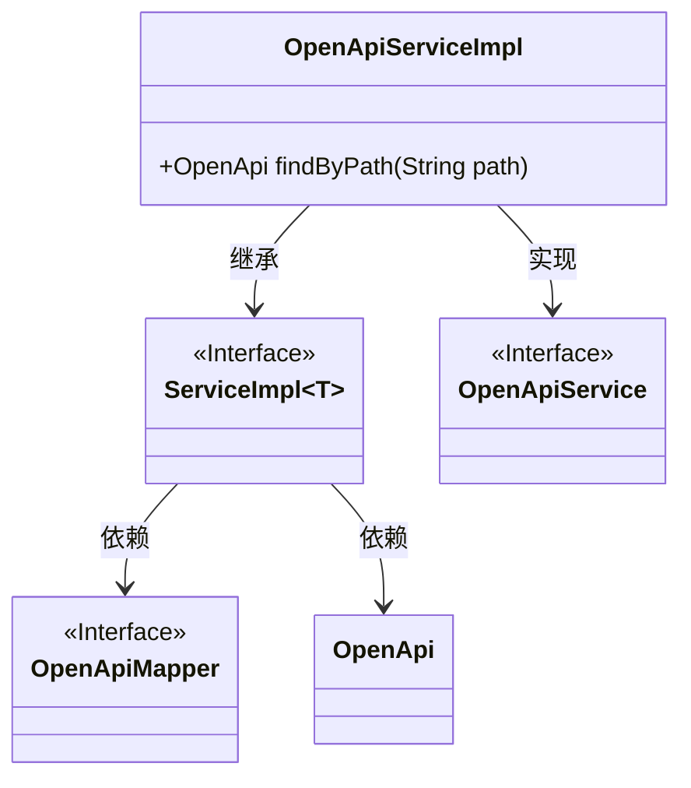
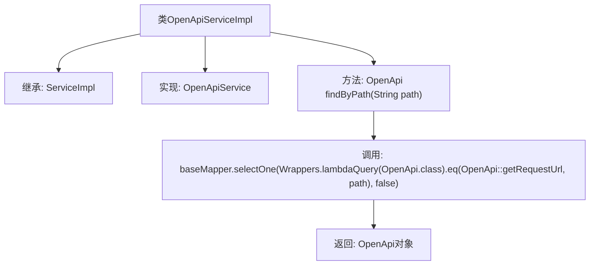

# 基础信息

|      |      |
|------|------|
| 名称 | OpenApiServiceImpl |
| 编码语言 | .java |
| 代码路径 | JeecgBoot/jeecg-boot/jeecg-module-system/jeecg-system-biz/src/main/java/org/jeecg/modules/openapi/service/impl/OpenApiServiceImpl.java |
| 包名 | org.jeecg.modules.openapi.service.impl |
| 依赖项 | ['com.baomidou.mybatisplus.core.toolkit.Wrappers', 'com.baomidou.mybatisplus.extension.service.impl.ServiceImpl', 'org.jeecg.modules.openapi.entity.OpenApi', 'org.jeecg.modules.openapi.mapper.OpenApiMapper', 'org.jeecg.modules.openapi.service.OpenApiService', 'org.springframework.stereotype.Service'] |
| 概述说明 | OpenApiServiceImpl类实现接口，提供按路径查询OpenApi记录功能。 |

# 说明

OpenApiServiceImpl类实现了OpenApiService接口，提供了findByPath方法，用于根据指定路径查询OpenApi记录。该方法通过路径参数进行检索，返回符合条件的OpenApi记录。

# 类列表 Class Summary

| 名称   | 类型  | 说明 |
|-------|------|-------------|
| OpenApiServiceImpl | class | OpenApiServiceImpl类实现OpenApiService接口，通过findByPath方法根据路径查询OpenApi记录。 |

## 类 OpenApiServiceImpl

|      |      |
|------|------|
| 访问范围 | @Service;public |
| 类型 | class |
| 名称 | OpenApiServiceImpl |
| 说明 | OpenApiServiceImpl类实现OpenApiService接口，通过findByPath方法根据路径查询OpenApi记录。 |

### UML类图

这段代码展示了一个名为 `OpenApiServiceImpl` 的服务类，它继承了 `ServiceImpl` 并实现了 `OpenApiService` 接口。`ServiceImpl` 是一个泛型类，依赖于 `OpenApiMapper` 和 `OpenApi` 两个类。`OpenApiServiceImpl` 提供了一个方法 `findByPath`，用于根据路径查找 `OpenApi` 对象。整体结构体现了服务层的实现与数据访问层的依赖关系。

### 内部方法调用关系图

这段代码定义了一个名为`OpenApiServiceImpl`的类，该类继承了`ServiceImpl`并实现了`OpenApiService`接口。`findByPath`方法通过`baseMapper.selectOne`查询数据库，返回与给定路径匹配的`OpenApi`对象。流程图展示了类的继承关系、方法调用及返回结果的流程。

### 字段列表 Field List

| 名称  | 类型  | 说明 |
|-------|-------|------|

### 方法列表 Method List

| 名称  | 类型  | 说明 |
|-------|-------|------|
| findByPath | OpenApi | 该方法通过路径查询OpenApi对象，使用lambda表达式匹配请求URL。 |

