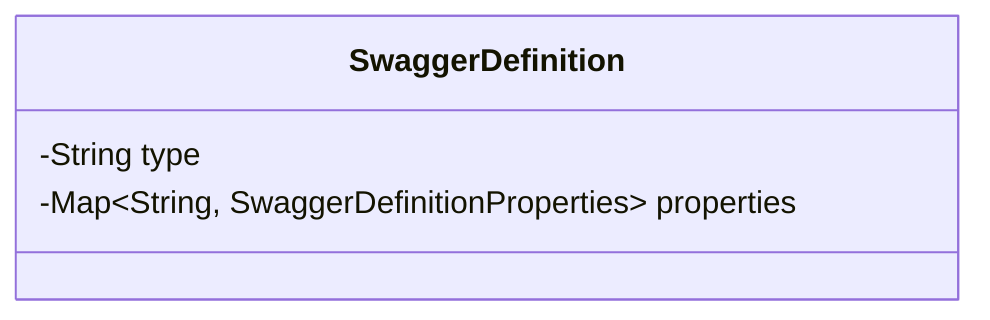
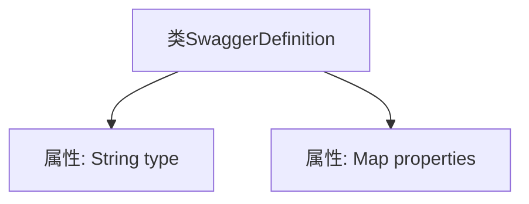

# 基础信息

|      |      |
|------|------|
| 名称 | SwaggerDefinition |
| 编码语言 | .java |
| 代码路径 | JeecgBoot/jeecg-boot/jeecg-module-system/jeecg-system-biz/src/main/java/org/jeecg/modules/openapi/swagger/SwaggerDefinition.java |
| 包名 | org.jeecg.modules.openapi.swagger |
| 依赖项 | ['lombok.Data', 'java.util.Map'] |
| 概述说明 | SwaggerDefinition类含类型属性及SwaggerDefinitionProperties映射属性。 |

# 说明

SwaggerDefinition类主要包含两个关键属性：类型属性和SwaggerDefinitionProperties映射属性。类型属性用于定义类的具体类型，而SwaggerDefinitionProperties映射属性则用于存储与Swagger定义相关的各种属性和配置信息。这两个属性共同构成了SwaggerDefinition类的核心结构，使其能够有效地管理和描述API的元数据。

# 类列表 Class Summary

| 名称   | 类型  | 说明 |
|-------|------|-------------|
| SwaggerDefinition | class | SwaggerDefinition类包含类型属性和SwaggerDefinitionProperties映射属性。 |

## 类 SwaggerDefinition

|      |      |
|------|------|
| 访问范围 | @Data;public |
| 类型 | class |
| 名称 | SwaggerDefinition |
| 说明 | SwaggerDefinition类包含类型属性和SwaggerDefinitionProperties映射属性。 |

### UML类图

这段代码定义了一个名为 `SwaggerDefinition` 的类，该类包含两个私有成员变量：`type` 和 `properties`。`type` 是一个字符串类型，用于存储某种类型的定义；`properties` 是一个泛型映射，键为字符串类型，值为 `SwaggerDefinitionProperties` 类型，用于存储属性定义。该类主要用于描述 Swagger 文档中的某个定义结构。

### 内部方法调用关系图

这段代码定义了一个名为`SwaggerDefinition`的类，该类包含两个属性：`type`和`properties`。`type`是一个字符串类型的属性，而`properties`是一个映射类型的属性，其键为字符串，值为`SwaggerDefinitionProperties`对象。该类的结构简单，主要用于存储Swagger定义中的类型和属性信息。

### 字段列表 Field List

| 名称  | 类型  | 说明 |
|-------|-------|------|
| type | String | 定义了一个私有字符串类型变量。 |
| properties | Map<String, SwaggerDefinitionProperties> | 私有Map类型变量properties，键为String，值为SwaggerDefinitionProperties。 |

### 方法列表 Method List

| 名称  | 类型  | 说明 |
|-------|-------|------|

