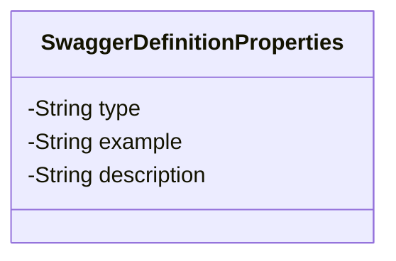
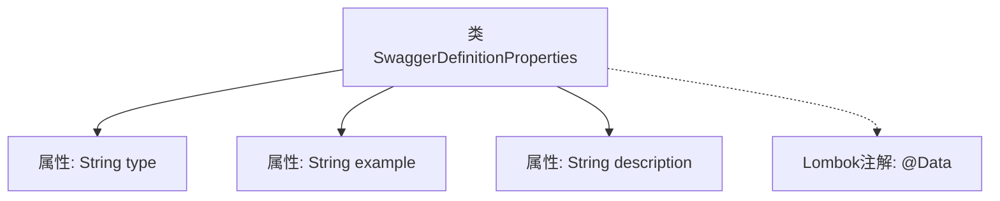

# 基础信息

|      |      |
|------|------|
| 名称 | SwaggerDefinitionProperties |
| 编码语言 | .java |
| 代码路径 | JeecgBoot/jeecg-boot/jeecg-module-system/jeecg-system-biz/src/main/java/org/jeecg/modules/openapi/swagger/SwaggerDefinitionProperties.java |
| 包名 | org.jeecg.modules.openapi.swagger |
| 依赖项 | ['lombok.Data'] |
| 概述说明 | Swagger定义属性类含类型、示例、描述字段。 |

# 说明

Swagger定义属性类包含三个主要字段：类型、示例和描述。类型字段用于指定属性的数据类型，示例字段提供该属性的具体示例值，描述字段则用于详细说明属性的用途或背景信息。这些字段共同帮助开发人员理解和正确使用API中的属性。

# 类列表 Class Summary

| 名称   | 类型  | 说明 |
|-------|------|-------------|
| SwaggerDefinitionProperties | class | Swagger定义属性类包含类型、示例和描述字段。 |

## 类 SwaggerDefinitionProperties

|      |      |
|------|------|
| 访问范围 | @Data;public |
| 类型 | class |
| 名称 | SwaggerDefinitionProperties |
| 说明 | Swagger定义属性类包含类型、示例和描述字段。 |

### UML类图

这段代码定义了一个名为 `SwaggerDefinitionProperties` 的类，该类包含三个私有属性：`type`、`example` 和 `description`。这些属性分别用于存储类型、示例和描述信息。类图展示了类的结构，突出了私有属性和类的名称，但没有包含任何公共方法或构造函数。该类的设计简洁，适合用于描述 Swagger 文档中的属性定义。

### 内部方法调用关系图

这段代码定义了一个名为 `SwaggerDefinitionProperties` 的类，使用了 Lombok 的 `@Data` 注解，该注解会自动生成 getter、setter、toString、equals 和 hashCode 方法。类中包含三个私有属性：`type`、`example` 和 `description`，分别表示类型、示例和描述。流程图展示了类与属性及注解之间的关系，清晰地反映了类的结构。

### 字段列表 Field List

| 名称  | 类型  | 说明 |
|-------|-------|------|
| type | String | 定义了一个私有字符串类型的变量`type`。 |
| description | String | 私有字符串变量描述。 |
| example | String | 定义了一个私有字符串变量`example`。 |

### 方法列表 Method List

| 名称  | 类型  | 说明 |
|-------|-------|------|

