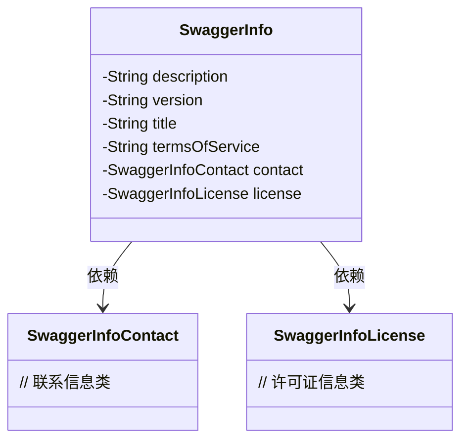
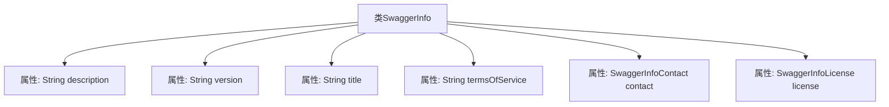

# 基础信息

|      |      |
|------|------|
| 名称 | SwaggerInfo |
| 编码语言 | .java |
| 代码路径 | JeecgBoot/jeecg-boot/jeecg-module-system/jeecg-system-biz/src/main/java/org/jeecg/modules/openapi/swagger/SwaggerInfo.java |
| 包名 | org.jeecg.modules.openapi.swagger |
| 依赖项 | ['lombok.Data'] |
| 概述说明 | SwaggerInfo类包含描述、版本、标题、服务条款、联系信息和许可证信息。 |

# 说明

SwaggerInfo类用于存储和描述API的相关信息，包括API的描述、版本号、标题、服务条款、联系信息以及许可证信息。这些信息有助于用户了解API的基本情况和使用规范。

# 类列表 Class Summary

| 名称   | 类型  | 说明 |
|-------|------|-------------|
| SwaggerInfo | class | SwaggerInfo类包含描述、版本、标题、服务条款、联系信息和许可证信息。 |

## 类 SwaggerInfo

|      |      |
|------|------|
| 访问范围 | @Data;public |
| 类型 | class |
| 名称 | SwaggerInfo |
| 说明 | SwaggerInfo类包含描述、版本、标题、服务条款、联系信息和许可证信息。 |

### UML类图

这段代码定义了一个名为 `SwaggerInfo` 的类，用于存储Swagger文档的基本信息。该类包含描述、版本、标题、服务条款等字段，并通过 `SwaggerInfoContact` 和 `SwaggerInfoLicense` 类分别存储联系信息和许可证信息。类图清晰地展示了 `SwaggerInfo` 类与 `SwaggerInfoContact` 和 `SwaggerInfoLicense` 类之间的依赖关系。

### 内部方法调用关系图

这段代码定义了一个名为`SwaggerInfo`的类，包含了六个属性：`description`、`version`、`title`、`termsOfService`、`contact`和`license`。这些属性分别用于描述Swagger文档的相关信息，如文档的描述、版本、标题、服务条款、联系信息和许可证信息。代码结构清晰，每个属性的类型和用途都明确，便于后续使用和维护。

### 字段列表 Field List

| 名称  | 类型  | 说明 |
|-------|-------|------|
| description | String | 定义私有字符串变量description。 |
| license | SwaggerInfoLicense | 私有SwaggerInfoLicense许可证对象。 |
| termsOfService | String | 私有字符串变量termsOfService。 |
| title | String | 定义一个私有字符串类型的变量title。 |
| contact | SwaggerInfoContact | Swagger信息中的联系人对象。 |
| version | String | 定义了一个私有字符串变量version。 |

### 方法列表 Method List

| 名称  | 类型  | 说明 |
|-------|-------|------|

