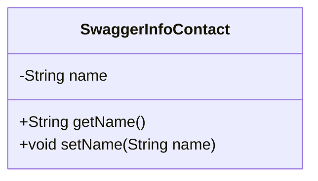
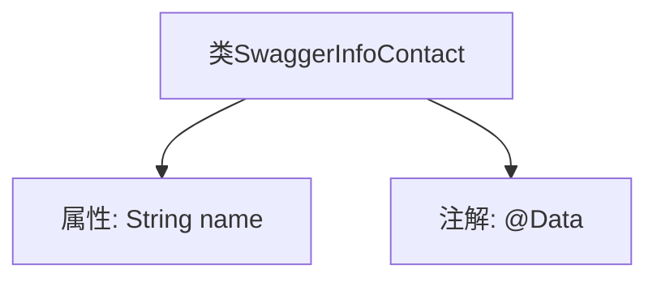

# 基础信息

|      |      |
|------|------|
| 名称 | SwaggerInfoContact |
| 编码语言 | .java |
| 代码路径 | JeecgBoot/jeecg-boot/jeecg-module-system/jeecg-system-biz/src/main/java/org/jeecg/modules/openapi/swagger/SwaggerInfoContact.java |
| 包名 | org.jeecg.modules.openapi.swagger |
| 依赖项 | ['lombok.Data'] |
| 概述说明 | SwaggerInfoContact类包含私有字符串属性name。 |

# 说明

SwaggerInfoContact类中定义了一个私有字符串属性name，用于存储联系人信息。该属性具有私有访问权限，确保数据封装性和安全性。

# 类列表 Class Summary

| 名称   | 类型  | 说明 |
|-------|------|-------------|
| SwaggerInfoContact | class | SwaggerInfoContact类包含一个私有字符串属性name。 |

## 类 SwaggerInfoContact

|      |      |
|------|------|
| 访问范围 | @Data;public |
| 类型 | class |
| 名称 | SwaggerInfoContact |
| 说明 | SwaggerInfoContact类包含一个私有字符串属性name。 |

### UML类图

这段代码定义了一个名为 `SwaggerInfoContact` 的类，该类包含一个私有成员变量 `name`，以及对应的 `getName` 和 `setName` 方法。`@Data` 注解通常用于自动生成这些方法，简化代码编写。该类主要用于存储联系人信息，适用于需要管理联系人姓名的场景。

### 内部方法调用关系图

这段代码定义了一个名为 `SwaggerInfoContact` 的类，其中包含一个私有属性 `name`，并使用 `@Data` 注解来自动生成 getter、setter、toString 等方法。`@Data` 是 Lombok 库提供的注解，用于简化代码编写，减少样板代码。流程图展示了类与属性及注解之间的关系。

### 字段列表 Field List

| 名称  | 类型  | 说明 |
|-------|-------|------|
| name | String | 定义私有字符串类型变量name。 |

### 方法列表 Method List

| 名称  | 类型  | 说明 |
|-------|-------|------|

