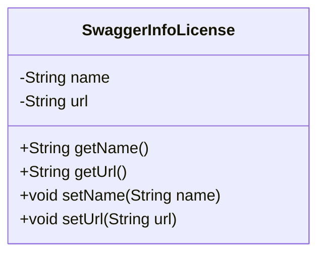
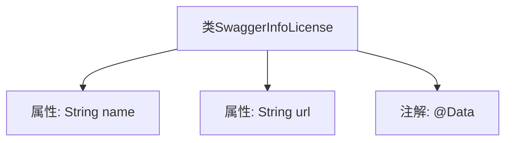

# 基础信息

|      |      |
|------|------|
| 名称 | SwaggerInfoLicense |
| 编码语言 | .java |
| 代码路径 | JeecgBoot/jeecg-boot/jeecg-module-system/jeecg-system-biz/src/main/java/org/jeecg/modules/openapi/swagger/SwaggerInfoLicense.java |
| 包名 | org.jeecg.modules.openapi.swagger |
| 依赖项 | ['lombok.Data'] |
| 概述说明 | SwaggerInfoLicense类包含名称和URL两个私有属性。 |

# 说明

SwaggerInfoLicense类是一个用于表示许可证信息的类，它包含两个私有属性：名称和URL。名称属性用于存储许可证的名称，URL属性则用于存储与许可证相关的链接地址。这两个属性共同提供了关于许可证的详细信息，便于在Swagger文档中进行引用和展示。通过封装这些属性，该类确保了数据的安全性和完整性，同时为开发者提供了清晰的接口来访问和操作这些信息。

# 类列表 Class Summary

| 名称   | 类型  | 说明 |
|-------|------|-------------|
| SwaggerInfoLicense | class | SwaggerInfoLicense类包含名称和URL两个私有属性。 |

## 类 SwaggerInfoLicense

|      |      |
|------|------|
| 访问范围 | @Data;public |
| 类型 | class |
| 名称 | SwaggerInfoLicense |
| 说明 | SwaggerInfoLicense类包含名称和URL两个私有属性。 |

### UML类图

这段代码定义了一个名为 `SwaggerInfoLicense` 的类，该类包含两个私有属性 `name` 和 `url`，并提供了相应的 getter 和 setter 方法。通过 `@Data` 注解，Lombok 库自动生成了这些方法，简化了代码的编写。该类用于表示 Swagger 文档中许可证的相关信息，包括许可证名称和 URL。

### 内部方法调用关系图

这段代码定义了一个名为`SwaggerInfoLicense`的类，该类包含两个私有属性`name`和`url`，并使用`@Data`注解来自动生成getter、setter、toString等方法。`@Data`注解通常用于简化POJO类的代码，减少手动编写样板代码的工作量。

### 字段列表 Field List

| 名称  | 类型  | 说明 |
|-------|-------|------|
| name | String | 声明了一个私有的字符串类型变量name。 |
| url | String | 定义了一个私有字符串变量url。 |

### 方法列表 Method List

| 名称  | 类型  | 说明 |
|-------|-------|------|

