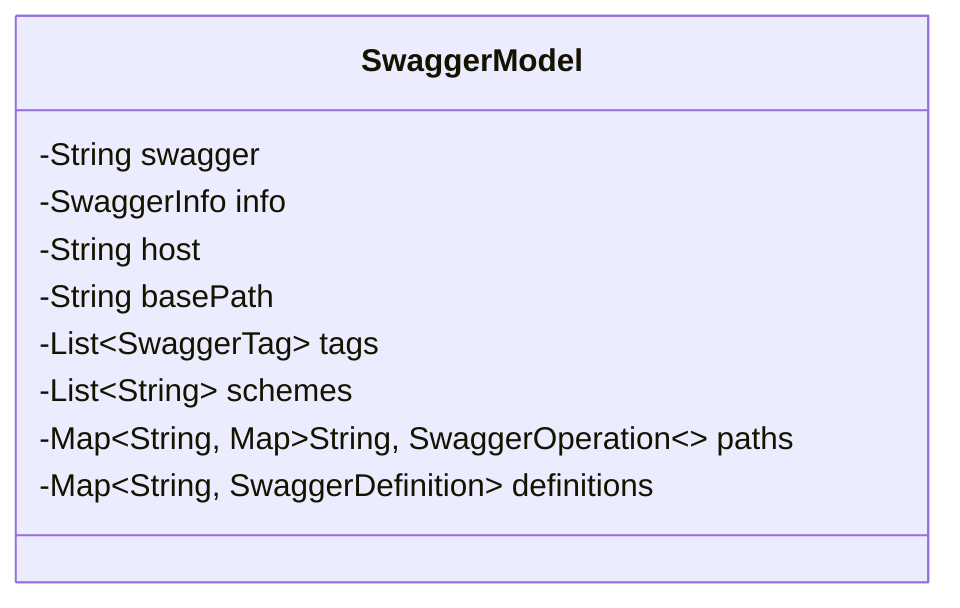
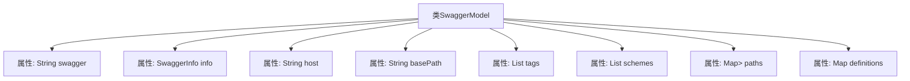

# 基础信息

|      |      |
|------|------|
| 名称 | SwaggerModel |
| 编码语言 | .java |
| 代码路径 | JeecgBoot/jeecg-boot/jeecg-module-system/jeecg-system-biz/src/main/java/org/jeecg/modules/openapi/swagger/SwaggerModel.java |
| 包名 | org.jeecg.modules.openapi.swagger |
| 依赖项 | ['lombok.Data', 'java.util.List', 'java.util.Map'] |
| 概述说明 | SwaggerModel类包含API版本、信息、主机、路径等关键字段。 |

# 说明

SwaggerModel类是一个用于描述API的结构化模型，包含多个关键字段。这些字段包括API版本、信息、主机、路径、标签、协议、操作和定义。API版本用于标识API的版本号，信息字段包含API的详细描述，主机字段指定API的服务地址，路径字段定义API的端点，标签用于分类和组织API，协议字段列出支持的通信协议，操作字段描述具体的API方法，定义字段则包含API的数据模型和参数定义。通过这些字段，SwaggerModel类能够全面描述API的结构和功能。

# 类列表 Class Summary

| 名称   | 类型  | 说明 |
|-------|------|-------------|
| SwaggerModel | class | SwaggerModel类包含API版本、信息、主机、路径、标签、协议、操作和定义等字段。 |

## 类 SwaggerModel

|      |      |
|------|------|
| 访问范围 | @Data;public |
| 类型 | class |
| 名称 | SwaggerModel |
| 说明 | SwaggerModel类包含API版本、信息、主机、路径、标签、协议、操作和定义等字段。 |

### UML类图

这段代码定义了一个名为 `SwaggerModel` 的类，用于表示Swagger API文档的模型。类中包含多个私有字段，分别表示Swagger文档的不同部分，如 `swagger` 版本、`info` 信息、`host` 主机地址、`basePath` 基础路径、`tags` 标签列表、`schemes` 协议列表、`paths` 路径操作映射以及 `definitions` 定义映射。这些字段通过 `@Data` 注解自动生成getter和setter方法，简化了代码的编写。

### 内部方法调用关系图

这段代码定义了一个名为`SwaggerModel`的类，该类包含了多个属性，分别用于描述Swagger API文档的不同部分。这些属性包括`swagger`版本、`info`信息、`host`主机地址、`basePath`基础路径、`tags`标签列表、`schemes`协议列表、`paths`路径操作映射以及`definitions`定义映射。每个属性都对应Swagger API文档中的一个关键部分，用于完整地描述API的结构和行为。

### 字段列表 Field List

| 名称  | 类型  | 说明 |
|-------|-------|------|
| swagger | String | 该代码定义了一个私有字符串变量`swagger`。 |
| host | String | 定义了一个私有字符串变量host。 |
| schemes | List<String> | 私有字符串列表变量schemes。 |
| basePath | String | 定义私有字符串变量basePath。 |
| definitions | Map<String, SwaggerDefinition> | 定义了一个私有映射，键为字符串，值为SwaggerDefinition对象。 |
| paths | Map<String, Map<String, SwaggerOperation>> | 私有变量paths存储字符串键与SwaggerOperation映射的嵌套映射。 |
| info | SwaggerInfo | 私有SwaggerInfo类型变量info。 |
| tags | List<SwaggerTag> | 包含SwaggerTag对象的私有列表。 |

### 方法列表 Method List

| 名称  | 类型  | 说明 |
|-------|-------|------|

