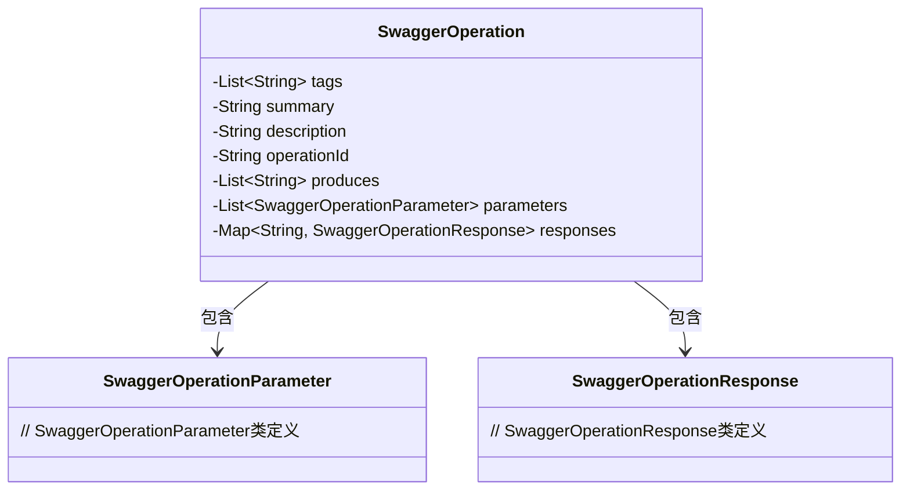
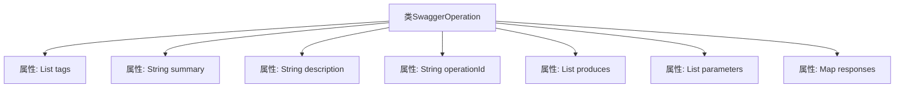

# 基础信息

|      |      |
|------|------|
| 名称 | SwaggerOperation |
| 编码语言 | .java |
| 代码路径 | JeecgBoot/jeecg-boot/jeecg-module-system/jeecg-system-biz/src/main/java/org/jeecg/modules/openapi/swagger/SwaggerOperation.java |
| 包名 | org.jeecg.modules.openapi.swagger |
| 依赖项 | ['lombok.Data', 'java.util.List', 'java.util.Map'] |
| 概述说明 | SwaggerOperation类包含标签、摘要、描述、操作ID、格式、参数和响应字段。 |

# 说明

SwaggerOperation类是一个用于定义API操作的结构，包含多个关键字段。这些字段包括标签，用于对操作进行分类；摘要，提供操作的简要说明；描述，详细解释操作的功能；操作ID，唯一标识该操作；输出格式，指定返回数据的格式；参数，定义操作所需的输入参数；响应，描述操作返回的响应信息。这些字段共同构成了一个完整的API操作定义，帮助开发者和用户理解和使用API。

# 类列表 Class Summary

| 名称   | 类型  | 说明 |
|-------|------|-------------|
| SwaggerOperation | class | SwaggerOperation类包含标签、摘要、描述、操作ID、输出格式、参数和响应等字段。 |

## 类 SwaggerOperation

|      |      |
|------|------|
| 访问范围 | @Data;public |
| 类型 | class |
| 名称 | SwaggerOperation |
| 说明 | SwaggerOperation类包含标签、摘要、描述、操作ID、输出格式、参数和响应等字段。 |

### UML类图

这段代码定义了一个名为 `SwaggerOperation` 的类，用于描述 Swagger API 文档中的操作信息。该类包含多个私有成员变量，如 `tags`、`summary`、`description` 等，分别表示操作的标签、摘要、描述等信息。`parameters` 和 `responses` 分别表示操作的参数和响应，它们分别依赖于 `SwaggerOperationParameter` 和 `SwaggerOperationResponse` 类。通过这些成员变量，`SwaggerOperation` 类能够完整地描述一个 API 操作的详细信息。

### 内部方法调用关系图

这段代码定义了一个名为 `SwaggerOperation` 的类，该类包含了多个属性，分别用于存储与Swagger API操作相关的信息。这些属性包括标签列表 (`tags`)、摘要 (`summary`)、描述 (`description`)、操作ID (`operationId`)、生成的内容类型列表 (`produces`)、参数列表 (`parameters`) 以及响应映射 (`responses`)。这些属性共同描述了Swagger API操作的元数据，便于在API文档中展示和解析。

### 字段列表 Field List

| 名称  | 类型  | 说明 |
|-------|-------|------|
| tags | List<String> | 定义一个私有字符串列表变量tags。 |
| produces | List<String> | 定义了一个私有字符串列表变量produces。 |
| operationId | String | 操作ID的私有字符串变量声明。 |
| description | String | 描述字段为私有字符串类型。 |
| parameters | List<SwaggerOperationParameter> | 包含Swagger操作参数的私有列表。 |
| responses | Map<String, SwaggerOperationResponse> | 存储Swagger操作响应的私有映射，键为字符串，值为SwaggerOperationResponse。 |
| summary | String | 总结信息未提供具体内容，无法生成概要描述。 |

### 方法列表 Method List

| 名称  | 类型  | 说明 |
|-------|-------|------|

