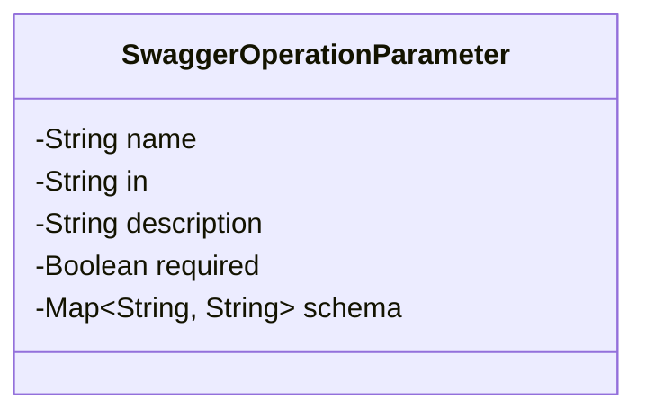
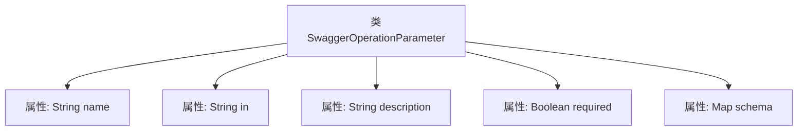

# 基础信息

|      |      |
|------|------|
| 名称 | SwaggerOperationParameter |
| 编码语言 | .java |
| 代码路径 | JeecgBoot/jeecg-boot/jeecg-module-system/jeecg-system-biz/src/main/java/org/jeecg/modules/openapi/swagger/SwaggerOperationParameter.java |
| 包名 | org.jeecg.modules.openapi.swagger |
| 依赖项 | ['lombok.Data', 'java.util.List', 'java.util.Map'] |
| 概述说明 | SwaggerOperationParameter类包含名称、位置、描述、必填及模式映射属性。 |

# 说明

SwaggerOperationParameter类是一个用于定义API操作参数的类，包含多个关键属性。这些属性包括参数的名称，用于标识参数；参数的位置，指示参数是出现在请求的路径、查询、头部还是其他位置；参数的描述，提供参数的详细说明；是否必填，标识该参数是否为必选项；以及模式映射，用于定义参数的数据结构和类型。这些属性共同帮助开发者准确描述和使用API操作中的参数。

# 类列表 Class Summary

| 名称   | 类型  | 说明 |
|-------|------|-------------|
| SwaggerOperationParameter | class | SwaggerOperationParameter类包含名称、位置、描述、是否必填及模式映射等属性。 |

## 类 SwaggerOperationParameter

|      |      |
|------|------|
| 访问范围 | @Data;public |
| 类型 | class |
| 名称 | SwaggerOperationParameter |
| 说明 | SwaggerOperationParameter类包含名称、位置、描述、是否必填及模式映射等属性。 |

### UML类图

这段代码定义了一个名为 `SwaggerOperationParameter` 的类，用于表示 Swagger 文档中的操作参数。类中包含五个私有属性：`name`（参数名称）、`in`（参数位置）、`description`（参数描述）、`required`（是否必需）和 `schema`（参数的模式定义，使用 `Map<String, String>` 类型存储）。该类通过 `@Data` 注解自动生成了 getter 和 setter 方法，简化了代码的编写。

### 内部方法调用关系图

这段代码定义了一个名为`SwaggerOperationParameter`的类，该类包含了五个属性：`name`、`in`、`description`、`required`和`schema`。这些属性分别用于存储参数的名称、位置、描述、是否必填以及参数的架构信息。该类没有定义任何方法，仅通过`@Data`注解自动生成了getter和setter方法。这段代码主要用于描述Swagger API文档中的操作参数。

### 字段列表 Field List

| 名称  | 类型  | 说明 |
|-------|-------|------|
| name | String | 定义了一个私有的字符串类型变量name。 |
| description | String | 定义私有字符串变量description。 |
| in | String | 声明一个私有字符串变量in。 |
| required | Boolean | 定义了一个私有的布尔类型变量required。 |
| schema | Map<String, String> | 私有Map类型变量schema，键值对为字符串。 |

### 方法列表 Method List

| 名称  | 类型  | 说明 |
|-------|-------|------|

