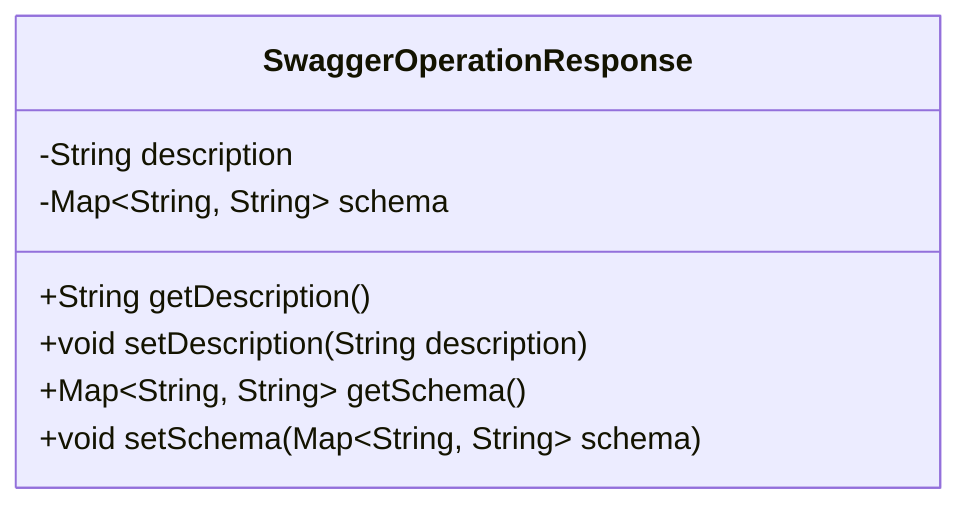
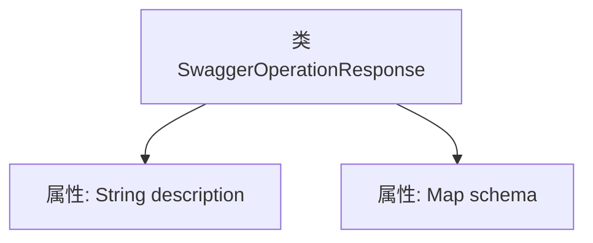

# 基础信息

|      |      |
|------|------|
| 名称 | SwaggerOperationResponse |
| 编码语言 | .java |
| 代码路径 | JeecgBoot/jeecg-boot/jeecg-module-system/jeecg-system-biz/src/main/java/org/jeecg/modules/openapi/swagger/SwaggerOperationResponse.java |
| 包名 | org.jeecg.modules.openapi.swagger |
| 依赖项 | ['lombok.Data', 'java.util.Map'] |
| 概述说明 | SwaggerOperationResponse类包含描述和模式映射字段。 |

# 说明

SwaggerOperationResponse类是一个用于描述Swagger操作响应的数据结构。它包含两个主要字段：描述和模式映射。描述字段用于提供关于响应的详细说明，帮助用户理解响应的内容和用途。模式映射字段则用于定义响应的数据结构，通常与JSON模式或其他数据模式相关联，以确保响应的格式和内容符合预期。这两个字段共同构成了SwaggerOperationResponse类的核心功能，使其能够准确地描述和规范API的响应行为。

# 类列表 Class Summary

| 名称   | 类型  | 说明 |
|-------|------|-------------|
| SwaggerOperationResponse | class | SwaggerOperationResponse类包含描述和模式映射字段。 |

## 类 SwaggerOperationResponse

|      |      |
|------|------|
| 访问范围 | @Data;public |
| 类型 | class |
| 名称 | SwaggerOperationResponse |
| 说明 | SwaggerOperationResponse类包含描述和模式映射字段。 |

### UML类图

**描述：**  
`SwaggerOperationResponse` 类用于表示 Swagger 文档中的操作响应。它包含两个私有成员变量：`description` 用于描述响应的内容，`schema` 是一个键值对映射，表示响应的数据结构。类中提供了这些成员变量的 getter 和 setter 方法，以便外部代码可以访问和修改这些属性。这个类通常用于生成或解析 Swagger 文档中的响应部分。

### 内部方法调用关系图

这段代码定义了一个名为 `SwaggerOperationResponse` 的类，该类包含两个属性：`description` 和 `schema`。`description` 是一个字符串类型的属性，用于存储描述信息；`schema` 是一个键值对映射类型的属性，键和值都是字符串类型。代码使用 `@Data` 注解，通常用于自动生成 getter、setter、toString 等方法，简化代码编写。流程图清晰地展示了类的结构及其属性关系。

### 字段列表 Field List

| 名称  | 类型  | 说明 |
|-------|-------|------|
| description | String | 描述字段为私有字符串类型。 |
| schema | Map<String, String> | 私有映射变量schema，键值对均为字符串类型。 |

### 方法列表 Method List

| 名称  | 类型  | 说明 |
|-------|-------|------|

