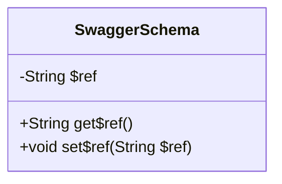
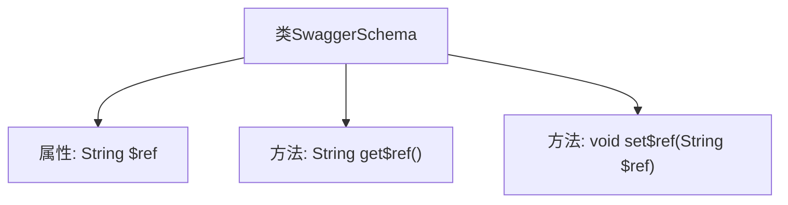

# 基础信息

|      |      |
|------|------|
| 名称 | SwaggerSchema |
| 编码语言 | .java |
| 代码路径 | JeecgBoot/jeecg-boot/jeecg-module-system/jeecg-system-biz/src/main/java/org/jeecg/modules/openapi/swagger/SwaggerSchema.java |
| 包名 | org.jeecg.modules.openapi.swagger |
| 依赖项 | [] |
| 概述说明 | SwaggerSchema类包含$ref属性及其访问方法。 |

# 说明

SwaggerSchema类包含一个名为$ref的属性，该属性用于引用其他模式或定义。类中提供了相应的getter和setter方法，用于获取和设置$ref属性的值。这些方法使得在操作SwaggerSchema对象时，能够方便地访问和修改$ref属性，从而实现对模式引用的灵活管理。

# 类列表 Class Summary

| 名称   | 类型  | 说明 |
|-------|------|-------------|
| SwaggerSchema | class | SwaggerSchema类包含$ref属性及其getter和setter方法。 |

## 类 SwaggerSchema

|      |      |
|------|------|
| 访问范围 | public |
| 类型 | class |
| 名称 | SwaggerSchema |
| 说明 | SwaggerSchema类包含$ref属性及其getter和setter方法。 |

### UML类图

这段代码定义了一个名为 `SwaggerSchema` 的类，该类包含一个私有成员变量 `$ref`，以及两个公有方法 `get$ref()` 和 `set$ref(String $ref)`。`get$ref()` 方法用于获取 `$ref` 的值，而 `set$ref(String $ref)` 方法用于设置 `$ref` 的值。该类的主要作用是封装一个引用字符串，并通过公有方法提供对该字符串的访问和修改功能。

### 内部方法调用关系图

这段代码定义了一个名为 `SwaggerSchema` 的类，包含一个私有属性 `$ref`，以及用于获取和设置该属性的方法 `get$ref()` 和 `set$ref(String $ref)`。流程图清晰地展示了类的结构，包括属性与方法的层级关系，帮助理解类的内部逻辑和数据流动。

### 字段列表 Field List

| 名称  | 类型  | 说明 |
|-------|-------|------|
| $ref | String | 定义了一个私有字符串类型的引用变量。 |

### 方法列表 Method List

| 名称  | 类型  | 说明 |
|-------|-------|------|
| get$ref | String | 获取引用值的方法。 |
| set$ref | void | 设置引用变量的方法。 |

