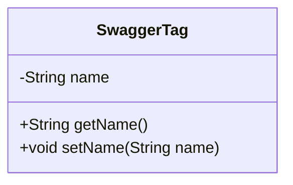
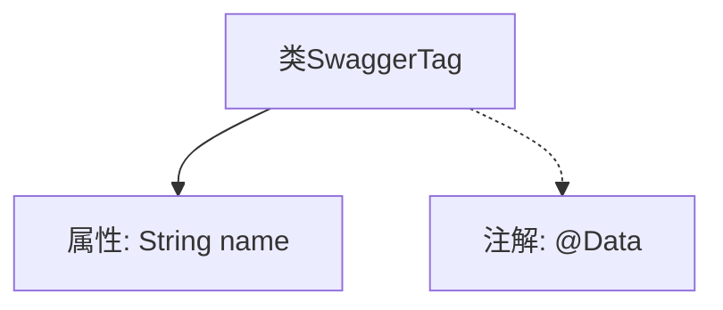

# 基础信息

|      |      |
|------|------|
| 名称 | SwaggerTag |
| 编码语言 | .java |
| 代码路径 | JeecgBoot/jeecg-boot/jeecg-module-system/jeecg-system-biz/src/main/java/org/jeecg/modules/openapi/swagger/SwaggerTag.java |
| 包名 | org.jeecg.modules.openapi.swagger |
| 依赖项 | ['lombok.Data'] |
| 概述说明 | SwaggerTag类有一个私有字符串属性name。 |

# 说明

SwaggerTag类中定义了一个私有字符串属性，名为name。该属性用于存储与Swagger标签相关的名称信息，确保其封装性和安全性，避免外部直接访问或修改。

# 类列表 Class Summary

| 名称   | 类型  | 说明 |
|-------|------|-------------|
| SwaggerTag | class | SwaggerTag类包含一个名为name的私有字符串属性。 |

## 类 SwaggerTag

|      |      |
|------|------|
| 访问范围 | @Data;public |
| 类型 | class |
| 名称 | SwaggerTag |
| 说明 | SwaggerTag类包含一个名为name的私有字符串属性。 |

### UML类图

**描述：**  
`SwaggerTag` 类是一个简单的数据类，包含一个私有的 `name` 属性。该类提供了 `getName` 和 `setName` 方法，分别用于获取和设置 `name` 属性的值。这个类通常用于表示 Swagger 文档中的标签信息，通过 `@Data` 注解自动生成 getter 和 setter 方法，简化了代码的编写。

### 内部方法调用关系图

这段代码定义了一个名为 `SwaggerTag` 的类，其中包含一个私有属性 `name`，并使用 `@Data` 注解来自动生成 `getter`、`setter`、`toString`、`equals` 和 `hashCode` 方法。`@Data` 注解简化了代码的编写，避免了手动编写这些常用方法的需求。通过流程图可以清晰地看到类的结构及其与注解的关系。

### 字段列表 Field List

| 名称  | 类型  | 说明 |
|-------|-------|------|
| name | String | 声明了一个私有的字符串类型变量name。 |

### 方法列表 Method List

| 名称  | 类型  | 说明 |
|-------|-------|------|

