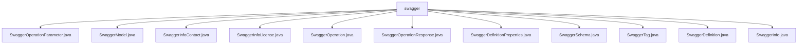

# 基础信息

|      |      |
|------|------|
| 名称 | swagger |
| 编码语言 | .java |
| 代码路径 | JeecgBoot/jeecg-boot/jeecg-module-system/jeecg-system-biz/src/main/java/org/jeecg/modules/openapi/swagger |
| 包名 | JeecgBoot.jeecg-boot.jeecg-module-system.jeecg-system-biz.src.main.java.org.jeecg.modules.openapi.swagger |
| 概述说明 | Swagger类库包含多个类，用于定义API操作、参数、响应、模型、标签、许可证等信息，确保API描述准确和完整。 |

# 说明

## 概述
该代码模块是一个用于定义和管理Swagger API文档的结构化模型，主要包含多个类，用于描述API的各个组成部分，如操作参数、响应、模型、标签、许可证信息等。通过这些类，开发者可以准确地定义和描述API的结构、行为和元数据，从而生成规范的Swagger文档，便于API的使用和理解。

## 主要业务场景
1. **API参数定义**：通过`SwaggerOperationParameter`类定义API操作的参数，包括参数名称、位置、描述、是否必填等信息，确保API调用时参数的准确性和规范性。
2. **API模型描述**：使用`SwaggerModel`类描述API的整体结构，包括API版本、主机、路径、标签、协议、操作等，帮助开发者全面理解API的功能和组成。
3. **API操作定义**：通过`SwaggerOperation`类定义具体的API操作，包括标签、摘要、描述、操作ID、输出格式、参数和响应信息，确保API操作的清晰和可理解性。
4. **API响应描述**：使用`SwaggerOperationResponse`类描述API操作的响应，包括响应的描述和模式映射，确保响应数据的格式和内容符合预期。
5. **API元数据管理**：通过`SwaggerInfo`类管理API的基本信息，如描述、版本号、标题、服务条款、联系信息和许可证信息，帮助用户了解API的基本情况和使用规范。
6. **API标签管理**：使用`SwaggerTag`类定义API的标签，便于对API操作进行分类和组织，提高API文档的可读性和可维护性。
7. **API许可证信息管理**：通过`SwaggerInfoLicense`类管理API的许可证信息，包括许可证名称和URL，确保许可证信息的准确展示和引用。
8. **API属性定义**：使用`SwaggerDefinitionProperties`类定义API属性的类型、示例和描述，帮助开发者正确理解和使用API中的属性。
9. **API模式引用管理**：通过`SwaggerSchema`类管理API模式的引用，使用`$ref`属性引用其他模式或定义，确保模式引用的灵活性和一致性。
10. **API定义管理**：使用`SwaggerDefinition`类管理API的定义，包括类型属性和属性映射，确保API元数据的有效管理和描述。

该模块的核心目标是提供一个结构化的方式来定义和描述API，确保API文档的规范性、可读性和可维护性，从而帮助开发者和用户更好地理解和使用API。

### 包内部结构视图

该流程图展示了 `swagger` 目录下的文件层级关系。`swagger` 作为根节点，包含了多个与 Swagger 相关的 Java 文件，这些文件分别用于定义 Swagger 的操作参数、模型、信息联系人、许可证、操作、响应、定义属性、模式、标签、定义和信息等内容。

# 文件列表 File List

| 名称   | 类型  | 说明 |
|-------|------|-------------|
| [SwaggerTag.java](SwaggerTag.md) | file | SwaggerTag类有一个私有字符串属性name。 |
| [SwaggerSchema.java](SwaggerSchema.md) | file | SwaggerSchema类包含$ref属性及其访问方法。 |
| [SwaggerInfoLicense.java](SwaggerInfoLicense.md) | file | SwaggerInfoLicense类包含名称和URL两个私有属性。 |
| [SwaggerOperationParameter.java](SwaggerOperationParameter.md) | file | SwaggerOperationParameter类包含名称、位置、描述、必填及模式映射属性。 |
| [SwaggerInfo.java](SwaggerInfo.md) | file | SwaggerInfo类包含描述、版本、标题、服务条款、联系信息和许可证信息。 |
| [SwaggerDefinition.java](SwaggerDefinition.md) | file | SwaggerDefinition类含类型属性及SwaggerDefinitionProperties映射属性。 |
| [SwaggerDefinitionProperties.java](SwaggerDefinitionProperties.md) | file | Swagger定义属性类含类型、示例、描述字段。 |
| [SwaggerOperationResponse.java](SwaggerOperationResponse.md) | file | SwaggerOperationResponse类包含描述和模式映射字段。 |
| [SwaggerOperation.java](SwaggerOperation.md) | file | SwaggerOperation类包含标签、摘要、描述、操作ID、格式、参数和响应字段。 |
| [SwaggerInfoContact.java](SwaggerInfoContact.md) | file | SwaggerInfoContact类包含私有字符串属性name。 |
| [SwaggerModel.java](SwaggerModel.md) | file | SwaggerModel类包含API版本、信息、主机、路径等关键字段。 |

