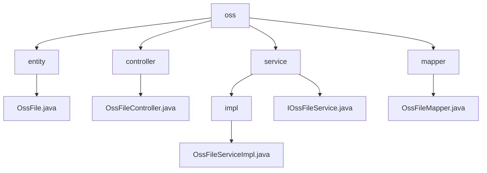

# 基础信息

|      |      |
|------|------|
| 名称 | oss |
| 编码语言 | .java |
| 代码路径 | JeecgBoot/jeecg-boot/jeecg-module-system/jeecg-system-biz/src/main/java/org/jeecg/modules/oss |
| 包名 | JeecgBoot.jeecg-boot.jeecg-module-system.jeecg-system-biz.src.main.java.org.jeecg.modules.oss |
| 概述说明 | OssFile类继承JeecgEntity，管理文件名和地址，支持文件操作，集成阿里云OSS。 |

# 说明

## 概述
该代码模块主要围绕文件管理功能展开，核心实现位于 `OssFileServiceImpl` 类中。该类通过集成阿里云OSS（对象存储服务）的API，提供了文件上传、删除以及URL生成等功能。模块设计旨在简化文件操作的复杂性，同时确保生成的URL符合阿里云的规范，便于用户直接访问存储的文件。整体架构注重高效性、稳定性和可扩展性。

`OssFile` 类继承自 `JeecgEntity`，主要包含两个关键字段：文件名和文件地址。文件名用于存储文件的名称，文件地址则用于记录文件在系统中的存储路径。通过继承 `JeecgEntity`，`OssFile` 类具备了 `JeecgEntity` 所提供的基础功能，同时专注于文件管理的特定需求。这种设计使得 `OssFile` 类能够高效地处理文件相关操作，并与其他系统组件无缝集成。

`OssFileController` 负责处理文件相关的操作，包括文件列表的获取、文件的上传、文件的删除以及文件的查询。该控制器通过调用 `OssFileService` 来处理具体的业务逻辑，确保各项文件操作能够高效、准确地执行。`OssFileService` 作为业务逻辑层，提供了必要的功能支持，使得控制器能够专注于请求的处理和响应的返回。

## 主要业务场景
1. **文件上传**：用户可以将文件上传至阿里云OSS，系统会自动生成对应的访问URL，确保文件能够被外部访问。
2. **文件删除**：用户可以从阿里云OSS中移除指定文件，释放存储空间。
3. **URL处理**：支持对阿里云原生域名的处理，确保生成的URL符合阿里云的规范，便于用户直接访问存储的文件。
4. **文件管理**：通过集成阿里云OSS的API，提供高效的文件管理能力，满足系统对文件存储和访问的需求。

### 包内部结构视图

该流程图展示了`oss`模块的层级结构，包括`entity`、`controller`、`service`和`mapper`四个主要目录。每个目录下又包含具体的文件，如`OssFile.java`、`OssFileController.java`、`OssFileServiceImpl.java`和`OssFileMapper.java`等。通过该图可以清晰地看到各个文件在模块中的位置及其相互关系。

# 文件列表 File List

| 名称   | 类型  | 说明 |
|-------|------|-------------|
| [controller](controller/_module.md) | package | OssFileController管理文件操作，依赖OssFileService处理业务逻辑。 |
| [service](service/_module.md) | package | OssFileServiceImpl类实现阿里云OSS文件上传与删除，支持原生域名URL处理。 |
| [mapper](mapper/_module.md) | package | 无内容，无法生成概要描述。 |
| [entity](entity/_module.md) | package | OssFile类继承JeecgEntity，包含文件名和文件地址。 |

