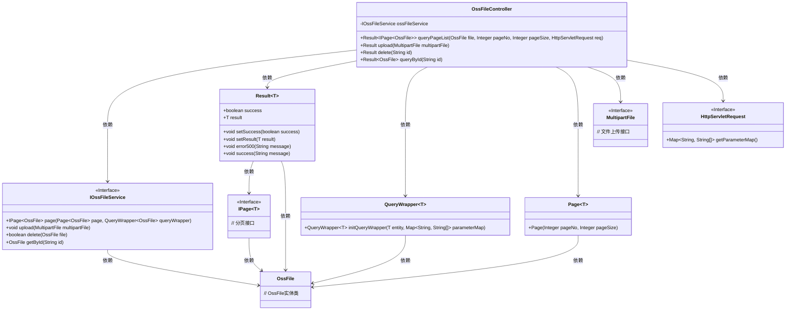

# 基础信息

|      |      |
|------|------|
| 名称 | OssFileController |
| 编码语言 | .java |
| 代码路径 | JeecgBoot/jeecg-boot/jeecg-module-system/jeecg-system-biz/src/main/java/org/jeecg/modules/oss/controller/OssFileController.java |
| 包名 | org.jeecg.modules.oss.controller |
| 依赖项 | ['javax.servlet.http.HttpServletRequest', 'org.apache.shiro.authz.annotation.RequiresPermissions', 'org.apache.shiro.authz.annotation.RequiresRoles', 'org.jeecg.common.api.vo.Result', 'org.jeecg.common.system.query.QueryGenerator', 'org.jeecg.modules.oss.entity.OssFile', 'org.jeecg.modules.oss.service.IOssFileService', 'org.springframework.beans.factory.annotation.Autowired', 'org.springframework.stereotype.Controller', 'org.springframework.web.bind.annotation', 'org.springframework.web.multipart.MultipartFile', 'com.baomidou.mybatisplus.core.conditions.query.QueryWrapper', 'com.baomidou.mybatisplus.core.metadata.IPage', 'com.baomidou.mybatisplus.extension.plugins.pagination.Page', 'lombok.extern.slf4j.Slf4j'] |
| 概述说明 | OssFileController管理文件操作，依赖OssFileService处理业务逻辑。 |

# 说明

OssFileController负责处理文件相关的操作，包括文件列表的获取、文件的上传、文件的删除以及文件的查询。该控制器通过调用OssFileService来处理具体的业务逻辑，确保各项文件操作能够高效、准确地执行。OssFileService作为业务逻辑层，提供了必要的功能支持，使得控制器能够专注于请求的处理和响应的返回。

# 类列表 Class Summary

| 名称   | 类型  | 说明 |
|-------|------|-------------|
| OssFileController | class | OssFileController处理文件列表、上传、删除和查询操作，使用OssFileService进行业务逻辑处理。 |

## 类 OssFileController

|      |      |
|------|------|
| 访问范围 | @Slf4j;@Controller;@RequestMapping("/sys/oss/file");public |
| 类型 | class |
| 名称 | OssFileController |
| 说明 | OssFileController处理文件列表、上传、删除和查询操作，使用OssFileService进行业务逻辑处理。 |

### UML类图

### 描述
`OssFileController` 是一个处理文件上传、删除、查询等操作的控制器类，依赖于 `IOssFileService` 接口来实现具体的业务逻辑。`Result` 类用于封装返回结果，支持泛型以返回不同类型的数据。`QueryWrapper` 和 `Page` 类用于构建查询条件和分页信息。`OssFile` 是实体类，表示文件信息。`MultipartFile` 和 `HttpServletRequest` 是接口，分别用于处理文件上传和请求参数。

### 内部方法调用关系图

```mermaid
graph TD
    A["类OssFileController"]
    B["属性: IOssFileService ossFileService"]
    C["方法: queryPageList(OssFile file, Integer pageNo, Integer pageSize, HttpServletRequest req)"]
    D["方法: upload(MultipartFile multipartFile)"]
    E["方法: delete(String id)"]
    F["方法: queryById(String id)"]
    G["步骤: 初始化Result对象"]
    H["步骤: 初始化QueryWrapper对象"]
    I["步骤: 创建Page对象"]
    J["步骤: 调用ossFileService.page方法"]
    K["步骤: 设置Result对象为成功"]
    L["步骤: 返回Result对象"]
    M["步骤: 初始化Result对象"]
    N["步骤: 调用ossFileService.upload方法"]
    O["步骤: 设置Result对象为成功"]
    P["步骤: 捕获异常并记录日志"]
    Q["步骤: 返回Result对象"]
    R["步骤: 初始化Result对象"]
    S["步骤: 调用ossFileService.getById方法"]
    T["步骤: 检查文件是否存在"]
    U["步骤: 调用ossFileService.delete方法"]
    V["步骤: 设置Result对象为成功"]
    W["步骤: 返回Result对象"]
    X["步骤: 初始化Result对象"]
    Y["步骤: 调用ossFileService.getById方法"]
    Z["步骤: 检查文件是否存在"]
    AA["步骤: 设置Result对象为成功"]
    AB["步骤: 返回Result对象"]

    A --> B
    A --> C
    A --> D
    A --> E
    A --> F
    C --> G
    C --> H
    C --> I
    C --> J
    C --> K
    C --> L
    D --> M
    D --> N
    D --> O
    D --> P
    D --> Q
    E --> R
    E --> S
    E --> T
    E --> U
    E --> V
    E --> W
    F --> X
    F --> Y
    F --> Z
    F --> AA
    F --> AB
```

这段代码定义了一个`OssFileController`类，用于处理与OSS文件相关的HTTP请求。它包含了四个主要方法：`queryPageList`用于分页查询文件列表，`upload`用于上传文件，`delete`用于删除文件，`queryById`用于通过ID查询文件。每个方法都通过调用`ossFileService`的不同方法来实现具体功能，并返回`Result`对象以表示操作结果。流程图展示了每个方法的内部调用步骤及其逻辑顺序。

### 字段列表 Field List

| 名称  | 类型  | 说明 |
|-------|-------|------|
| ossFileService | IOssFileService | 自动注入OSS文件服务实例。 |

### 方法列表 Method List

| 名称  | 类型  | 说明 |
|-------|-------|------|
| upload | Result | 上传文件接口，需系统文件上传权限，成功返回成功信息，失败返回错误信息。 |
| queryById | Result<OssFile> | 通过ID查询OSS文件，返回结果或错误信息。 |
| queryPageList | Result<IPage<OssFile>> | GET请求分页查询OssFile，返回分页结果。 |
| delete | Result | 删除接口，根据ID查找文件，存在则删除并返回成功，否则返回错误。 |

