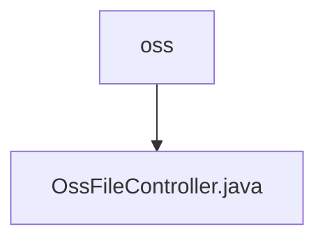

# 基础信息

|      |      |
|------|------|
| 名称 | controller |
| 编码语言 | .java |
| 代码路径 | JeecgBoot/jeecg-boot/jeecg-module-system/jeecg-system-biz/src/main/java/org/jeecg/modules/oss/controller |
| 包名 | JeecgBoot.jeecg-boot.jeecg-module-system.jeecg-system-biz.src.main.java.org.jeecg.modules.oss.controller |
| 概述说明 | OssFileController管理文件操作，依赖OssFileService处理业务逻辑。 |

# 说明

OssFileController负责处理文件相关的操作，包括文件列表的获取、文件的上传、文件的删除以及文件的查询。该控制器通过调用OssFileService来处理具体的业务逻辑，确保各项文件操作能够高效、准确地执行。OssFileService作为业务逻辑层，提供了必要的功能支持，使得控制器能够专注于请求的处理和响应的返回。

### 包内部结构视图

该流程图展示了路径层级关系，`oss`文件夹下包含一个文件`OssFileController.java`。路径结构简洁明了，反映了文件夹与文件之间的直接包含关系。

# 文件列表 File List

| 名称   | 类型  | 说明 |
|-------|------|-------------|
| [OssFileController.java](OssFileController.md) | file | OssFileController管理文件操作，依赖OssFileService处理业务逻辑。 |

