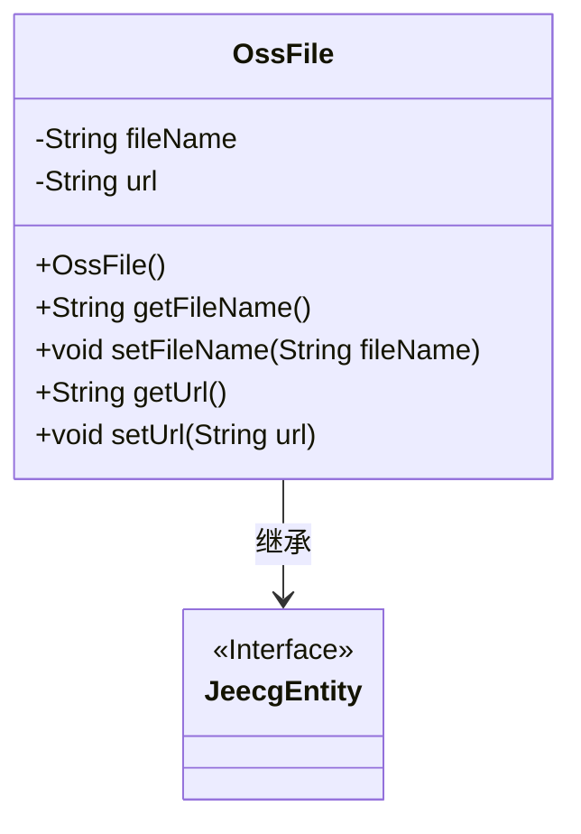
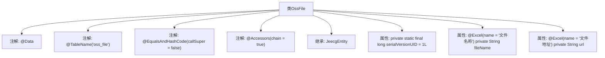

# 基础信息

|      |      |
|------|------|
| 名称 | OssFile |
| 编码语言 | .java |
| 代码路径 | JeecgBoot/jeecg-boot/jeecg-module-system/jeecg-system-biz/src/main/java/org/jeecg/modules/oss/entity/OssFile.java |
| 包名 | org.jeecg.modules.oss.entity |
| 依赖项 | ['com.baomidou.mybatisplus.annotation.TableName', 'lombok.Data', 'lombok.EqualsAndHashCode', 'lombok.experimental.Accessors', 'org.jeecg.common.system.base.entity.JeecgEntity', 'org.jeecgframework.poi.excel.annotation.Excel'] |
| 概述说明 | OssFile类继承JeecgEntity，包含文件名和文件地址。 |

# 说明

OssFile类继承自JeecgEntity，主要包含两个关键字段：文件名和文件地址。文件名用于存储文件的名称，文件地址则用于记录文件在系统中的存储路径。通过继承JeecgEntity，OssFile类具备了JeecgEntity所提供的基础功能，同时专注于文件管理的特定需求。这种设计使得OssFile类能够高效地处理文件相关操作，并与其他系统组件无缝集成。

# 类列表 Class Summary

| 名称   | 类型  | 说明 |
|-------|------|-------------|
| OssFile | class | OssFile类继承JeecgEntity，包含文件名和文件地址字段。 |

## 类 OssFile

|      |      |
|------|------|
| 访问范围 | @Data;@TableName("oss_file");@EqualsAndHashCode(callSuper = false);@Accessors(chain = true);public |
| 类型 | class |
| 名称 | OssFile |
| 说明 | OssFile类继承JeecgEntity，包含文件名和文件地址字段。 |

### UML类图

**描述：**
`OssFile` 类继承自 `JeecgEntity` 接口，包含两个私有属性 `fileName` 和 `url`，分别表示文件名称和文件地址。该类提供了这些属性的 getter 和 setter 方法，并继承了 `JeecgEntity` 的接口特性。通过 `@Excel` 注解，`fileName` 和 `url` 在导出为 Excel 时会被标记为“文件名称”和“文件地址”。

### 内部方法调用关系图

这段代码定义了一个名为 `OssFile` 的类，该类继承自 `JeecgEntity`，并使用了多个注解来简化代码。类中包含两个带有 `@Excel` 注解的属性 `fileName` 和 `url`，分别表示文件名称和文件地址。此外，类还包含一个静态的 `serialVersionUID` 属性，用于序列化。通过 `@Data` 注解，Lombok 自动生成了 getter、setter、toString 等方法，`@Accessors(chain = true)` 则支持链式调用。

### 字段列表 Field List

| 名称  | 类型  | 说明 |
|-------|-------|------|
| serialVersionUID = 1L | long | 定义序列化版本号为1L的静态常量。 |
| fileName | String | Excel文件类包含文件名属性。 |
| url | String | Excel文件地址字段定义为私有的字符串类型URL。 |

### 方法列表 Method List

| 名称  | 类型  | 说明 |
|-------|-------|------|

