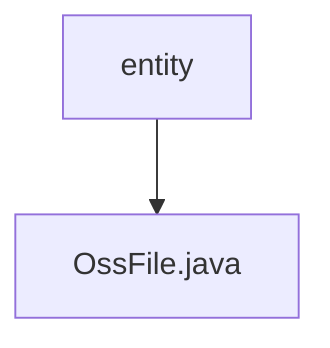

# 基础信息

|      |      |
|------|------|
| 名称 | entity |
| 编码语言 | .java |
| 代码路径 | JeecgBoot/jeecg-boot/jeecg-module-system/jeecg-system-biz/src/main/java/org/jeecg/modules/oss/entity |
| 包名 | JeecgBoot.jeecg-boot.jeecg-module-system.jeecg-system-biz.src.main.java.org.jeecg.modules.oss.entity |
| 概述说明 | OssFile类继承JeecgEntity，包含文件名和文件地址。 |

# 说明

OssFile类继承自JeecgEntity，主要包含两个关键字段：文件名和文件地址。文件名用于存储文件的名称，文件地址则用于记录文件在系统中的存储路径。通过继承JeecgEntity，OssFile类具备了JeecgEntity所提供的基础功能，同时专注于文件管理的特定需求。这种设计使得OssFile类能够高效地处理文件相关操作，并与其他系统组件无缝集成。

### 包内部结构视图

该流程图展示了路径的层级关系，`entity` 文件夹下包含一个文件 `OssFile.java`。简洁明了地表示了文件与文件夹之间的从属关系，便于理解项目结构。

# 文件列表 File List

| 名称   | 类型  | 说明 |
|-------|------|-------------|
| [OssFile.java](OssFile.md) | file | OssFile类继承JeecgEntity，包含文件名和文件地址。 |

