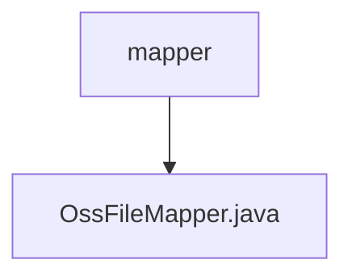

# 基础信息

|      |      |
|------|------|
| 名称 | mapper |
| 编码语言 | .java |
| 代码路径 | JeecgBoot/jeecg-boot/jeecg-module-system/jeecg-system-biz/src/main/java/org/jeecg/modules/oss/mapper |
| 包名 | JeecgBoot.jeecg-boot.jeecg-module-system.jeecg-system-biz.src.main.java.org.jeecg.modules.oss.mapper |
| 概述说明 | 无内容，无法生成概要描述。 |

# 说明

未提供具体内容，无法进行总结描述。请提供需要总结的文本或信息，以便生成全面详尽的描述。

### 包内部结构视图

该流程图展示了路径中的层级关系，`mapper` 是上级文件夹，`OssFileMapper.java` 是下级文件。通过简洁的图形表示，清晰地反映了文件与文件夹之间的从属关系，便于快速理解项目结构。

# 文件列表 File List

| 名称   | 类型  | 说明 |
|-------|------|-------------|
| [OssFileMapper.java](OssFileMapper.md) | file | 无内容，无法生成概要描述。 |

