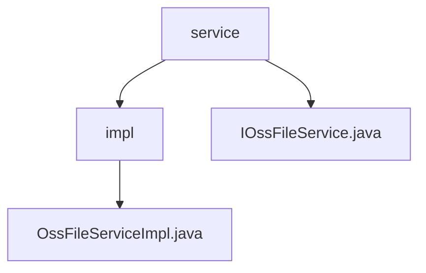

# 基础信息

|      |      |
|------|------|
| 名称 | service |
| 编码语言 | .java |
| 代码路径 | JeecgBoot/jeecg-boot/jeecg-module-system/jeecg-system-biz/src/main/java/org/jeecg/modules/oss/service |
| 包名 | JeecgBoot.jeecg-boot.jeecg-module-system.jeecg-system-biz.src.main.java.org.jeecg.modules.oss.service |
| 概述说明 | OssFileServiceImpl类实现阿里云OSS文件上传与删除，支持原生域名URL处理。 |

# 说明

## 概述
该代码模块主要围绕文件管理功能展开，核心实现位于 `OssFileServiceImpl` 类中。该类通过集成阿里云OSS（对象存储服务）的API，提供了文件上传、删除以及URL生成等功能。模块设计旨在简化文件操作的复杂性，同时确保生成的URL符合阿里云的规范，便于用户直接访问存储的文件。整体架构注重高效性、稳定性和可扩展性。

## 主要业务场景
1. **文件上传**：用户可以将文件上传至阿里云OSS，系统会自动生成对应的访问URL，确保文件能够被外部访问。
2. **文件删除**：用户可以从阿里云OSS中移除指定文件，释放存储空间。
3. **URL处理**：支持对阿里云原生域名的处理，确保生成的URL符合阿里云的规范，便于用户直接访问存储的文件。
4. **文件管理**：通过集成阿里云OSS的API，提供高效的文件管理能力，满足系统对文件存储和访问的需求。

### 包内部结构视图

该流程图展示了`service`文件夹与其子文件夹`impl`以及两个Java文件之间的层级关系。`service`文件夹包含`impl`子文件夹和`IOssFileService.java`文件，而`impl`子文件夹中则包含`OssFileServiceImpl.java`文件。这种结构清晰地反映了服务层代码的组织方式。

# 文件列表 File List

| 名称   | 类型  | 说明 |
|-------|------|-------------|
| [IOssFileService.java](IOssFileService.md) | file | 输入内容为空，请提供具体信息以便生成概要描述。 |
| [impl](impl/_module.md) | package | OssFileServiceImpl类实现文件上传删除，支持阿里云域名处理。 |

