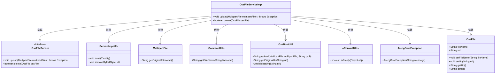

# 基础信息

|      |      |
|------|------|
| 名称 | OssFileServiceImpl |
| 编码语言 | .java |
| 代码路径 | JeecgBoot/jeecg-boot/jeecg-module-system/jeecg-system-biz/src/main/java/org/jeecg/modules/oss/service/impl/OssFileServiceImpl.java |
| 包名 | org.jeecg.modules.oss.service.impl |
| 依赖项 | ['com.baomidou.mybatisplus.extension.service.impl.ServiceImpl', 'org.jeecg.common.exception.JeecgBootException', 'org.jeecg.common.util.CommonUtils', 'org.jeecg.common.util.oConvertUtils', 'org.jeecg.common.util.oss.OssBootUtil', 'org.jeecg.modules.oss.entity.OssFile', 'org.jeecg.modules.oss.mapper.OssFileMapper', 'org.jeecg.modules.oss.service.IOssFileService', 'org.springframework.stereotype.Service', 'org.springframework.web.multipart.MultipartFile', 'java.io.IOException'] |
| 概述说明 | OssFileServiceImpl类实现文件上传删除，支持阿里云域名处理。 |

# 说明

OssFileServiceImpl类主要负责实现文件的上传与删除功能，特别支持阿里云原生域名的URL处理。该服务类通过集成阿里云OSS（对象存储服务）的API，提供了高效的文件管理能力。上传功能允许用户将文件存储到阿里云OSS中，并生成对应的访问URL；删除功能则用于从OSS中移除指定文件。此外，该类还支持对阿里云原生域名的处理，确保生成的URL符合阿里云的规范，便于用户直接访问存储的文件。整体设计旨在简化文件操作的复杂性，提升系统的稳定性和可扩展性。

# 类列表 Class Summary

| 名称   | 类型  | 说明 |
|-------|------|-------------|
| OssFileServiceImpl | class | OssFileServiceImpl类实现文件上传与删除功能，支持阿里云原生域名URL处理。 |

## 类 OssFileServiceImpl

|      |      |
|------|------|
| 访问范围 | @Service("ossFileService");public |
| 类型 | class |
| 名称 | OssFileServiceImpl |
| 说明 | OssFileServiceImpl类实现文件上传与删除功能，支持阿里云原生域名URL处理。 |

### UML类图

**描述：**  
`OssFileServiceImpl` 类实现了 `IOssFileService` 接口，并继承了 `ServiceImpl<OssFile>` 类。该类主要负责文件的上传和删除操作。在 `upload` 方法中，它通过 `MultipartFile` 获取文件名，使用 `CommonUtils` 和 `OssBootUtil` 进行文件处理和上传，并处理异常情况。`delete` 方法则通过 `OssBootUtil` 删除文件，并处理可能的异常。该类依赖多个工具类和异常类来完成其功能。

### 内部方法调用关系图

这段代码展示了一个名为`OssFileServiceImpl`的类，它实现了文件上传和删除的功能。`upload`方法首先获取并处理文件名，然后创建一个`OssFile`对象并设置文件名，接着上传文件并检查URL是否为空，如果为空则抛出异常，否则设置URL并保存对象。`delete`方法尝试删除`OssFile`对象及其对应的URL，如果操作成功则返回`true`，否则捕获异常并返回`false`。

### 字段列表 Field List

| 名称  | 类型  | 说明 |
|-------|-------|------|

### 方法列表 Method List

| 名称  | 类型  | 说明 |
|-------|-------|------|
| delete | boolean | 删除OSS文件，成功返回true，失败返回false并记录错误。 |
| upload | void | 上传文件至阿里云OSS，返回原生域名URL，失败则抛出异常。 |

