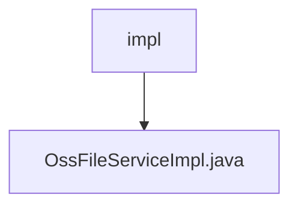

# 基础信息

|      |      |
|------|------|
| 名称 | impl |
| 编码语言 | .java |
| 代码路径 | JeecgBoot/jeecg-boot/jeecg-module-system/jeecg-system-biz/src/main/java/org/jeecg/modules/oss/service/impl |
| 包名 | JeecgBoot.jeecg-boot.jeecg-module-system.jeecg-system-biz.src.main.java.org.jeecg.modules.oss.service.impl |
| 概述说明 | OssFileServiceImpl类实现文件上传删除，支持阿里云域名处理。 |

# 说明

OssFileServiceImpl类主要负责实现文件的上传与删除功能，特别支持阿里云原生域名的URL处理。该服务类通过集成阿里云OSS（对象存储服务）的API，提供了高效的文件管理能力。上传功能允许用户将文件存储到阿里云OSS中，并生成对应的访问URL；删除功能则用于从OSS中移除指定文件。此外，该类还支持对阿里云原生域名的处理，确保生成的URL符合阿里云的规范，便于用户直接访问存储的文件。整体设计旨在简化文件操作的复杂性，提升系统的稳定性和可扩展性。

### 包内部结构视图

该流程图展示了`impl`文件夹与`OssFileServiceImpl.java`文件之间的层级关系。`impl`文件夹是`OssFileServiceImpl.java`文件的直接上级目录，文件位于`impl`文件夹内。这种层级关系清晰地表明了文件在项目结构中的位置。

# 文件列表 File List

| 名称   | 类型  | 说明 |
|-------|------|-------------|
| [OssFileServiceImpl.java](OssFileServiceImpl.md) | file | OssFileServiceImpl类实现文件上传删除，支持阿里云域名处理。 |

