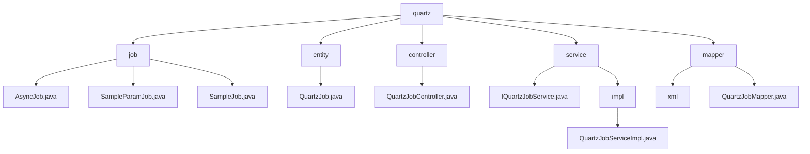

# 基础信息

|      |      |
|------|------|
| 名称 | quartz |
| 编码语言 | .java |
| 代码路径 | JeecgBoot/jeecg-boot/jeecg-module-system/jeecg-system-biz/src/main/java/org/jeecg/modules/quartz |
| 包名 | JeecgBoot.jeecg-boot.jeecg-module-system.jeecg-system-biz.src.main.java.org.jeecg.modules.quartz |
| 概述说明 | JeecgBoot定时任务模块，支持周期性任务、参数设置、日志记录和全生命周期管理。 |

# 说明

## 概述
该代码模块是一个基于JeecgBoot框架的定时任务管理模块，主要用于实现周期性任务的调度和执行。模块的核心功能包括任务的创建、调度、执行、监控和管理。通过实现`Job`接口的任务类与调度框架的无缝集成，模块能够确保任务按照预定的时间和条件准确执行。模块的设计注重任务的顺序性、稳定性和可维护性，提供了单线程执行、日志记录、参数设置等机制，简化了任务管理并提高了任务执行的透明度。

## 主要业务场景
1. **周期性任务处理**：`AsyncJob`类设计为单线程执行，每5秒完成一次任务，适用于需要周期性处理的业务场景。这种机制确保了任务按固定时间间隔进行，避免了多线程并发带来的复杂性，同时保证了任务执行的顺序性和稳定性。
2. **带参数的任务执行**：`SampleParamJob`类实现了`Job`接口，主要用于设置参数并执行定时任务。在执行过程中，该类会记录相关的日志信息，便于跟踪和调试任务的执行情况，为任务的监控和问题排查提供了重要支持。
3. **任务执行信息记录**：`SampleJob`类同样实现了`Job`接口，主要用于记录任务执行的关键信息，包括任务执行键和时间信息。通过捕获和存储相关的时间戳和执行标识，提高了任务管理的透明度和可维护性，便于后续追踪和分析任务执行情况。
4. **定时任务的保存与持久化**：支持将定时任务的信息持久化存储，确保任务配置在系统重启后依然有效。
5. **任务的启动与恢复**：允许任务在需要时立即执行，或从暂停状态重新激活，确保任务的及时执行。
6. **任务的编辑与配置调整**：提供灵活的编辑功能，允许用户根据业务需求调整任务配置。
7. **任务的删除**：支持彻底移除不再需要的任务记录，避免无效任务占用资源。
8. **任务的暂停**：允许临时停止任务的执行，而无需删除任务本身，便于任务的临时调整或维护。

这些功能共同支持了定时任务的全生命周期管理，适用于需要精确控制任务执行时间的业务场景，如定时数据同步、报表生成、任务调度等。

### 包内部结构视图

该流程图展示了JeecgBoot项目中`quartz`模块的目录结构及其子模块的层级关系。`quartz`模块下包含`job`、`entity`、`controller`、`service`和`mapper`等子模块，每个子模块又进一步细分为具体的Java文件或子目录。例如，`job`子模块包含`AsyncJob.java`、`SampleParamJob.java`和`SampleJob.java`等文件，而`service`子模块则包含`IQuartzJobService.java`和`impl`子目录，`impl`子目录下又包含`QuartzJobServiceImpl.java`文件。

# 文件列表 File List

| 名称   | 类型  | 说明 |
|-------|------|-------------|
| [mapper](mapper/_module.md) | package | 信息为空，无法生成概要描述。 |
| [service](service/_module.md) | package | QuartzJobServiceImpl提供定时任务的保存、启动、恢复、编辑、删除和暂停功能。 |
| [controller](controller/_module.md) | package | 定时任务接口提供增删改查、启动暂停、导入导出功能。 |
| [entity](entity/_module.md) | package | QuartzJob类包含任务ID、创建、删除、修改、类名、cron表达式、参数、描述和状态信息。 |
| [job](job/_module.md) | package | 异步任务类单线程执行，每5秒完成一次，适用于周期性任务。SampleParamJob类实现Job接口，记录日志便于调试。SampleJob类记录任务关键信息，提高任务管理透明度。 |

