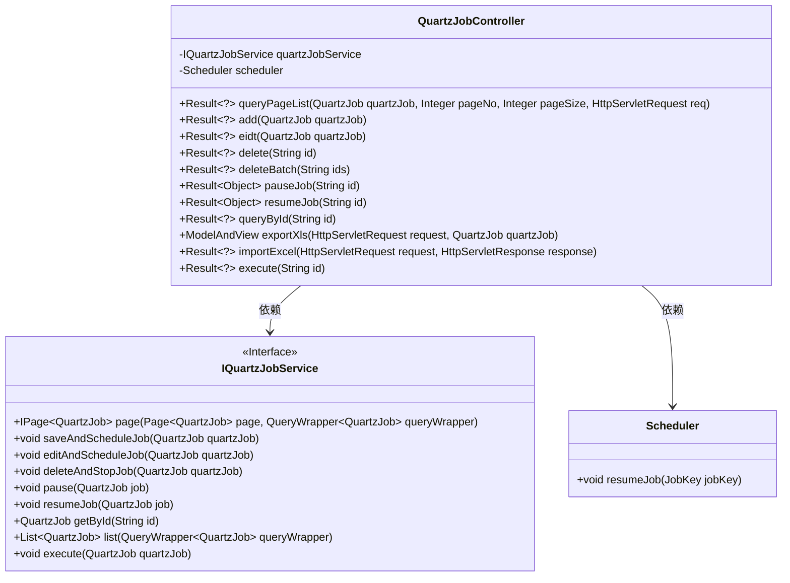

# 基础信息

|      |      |
|------|------|
| 名称 | QuartzJobController |
| 编码语言 | .java |
| 代码路径 | JeecgBoot/jeecg-boot/jeecg-module-system/jeecg-system-biz/src/main/java/org/jeecg/modules/quartz/controller/QuartzJobController.java |
| 包名 | org.jeecg.modules.quartz.controller |
| 依赖项 | ['com.baomidou.mybatisplus.core.conditions.query.QueryWrapper', 'com.baomidou.mybatisplus.core.metadata.IPage', 'com.baomidou.mybatisplus.extension.plugins.pagination.Page', 'io.swagger.v3.oas.annotations.Operation', 'io.swagger.v3.oas.annotations.tags.Tag', 'lombok.extern.slf4j.Slf4j', 'org.apache.shiro.SecurityUtils', 'org.apache.shiro.authz.annotation.RequiresPermissions', 'org.apache.shiro.authz.annotation.RequiresRoles', 'org.jeecg.common.api.vo.Result', 'org.jeecg.common.constant.CommonConstant', 'org.jeecg.common.constant.SymbolConstant', 'org.jeecg.common.system.query.QueryGenerator', 'org.jeecg.common.system.vo.LoginUser', 'org.jeecg.common.util.ImportExcelUtil', 'org.jeecg.common.util.oConvertUtils', 'org.jeecg.modules.quartz.entity.QuartzJob', 'org.jeecg.modules.quartz.service.IQuartzJobService', 'org.jeecgframework.poi.excel.ExcelImportUtil', 'org.jeecgframework.poi.excel.def.NormalExcelConstants', 'org.jeecgframework.poi.excel.entity.ExportParams', 'org.jeecgframework.poi.excel.entity.ImportParams', 'org.jeecgframework.poi.excel.view.JeecgEntityExcelView', 'org.quartz.Scheduler', 'org.quartz.SchedulerException', 'org.springframework.beans.factory.annotation.Autowired', 'org.springframework.web.bind.annotation', 'org.springframework.web.multipart.MultipartFile', 'org.springframework.web.multipart.MultipartHttpServletRequest', 'org.springframework.web.servlet.ModelAndView', 'javax.servlet.http.HttpServletRequest', 'javax.servlet.http.HttpServletResponse', 'java.io.IOException', 'java.util.ArrayList', 'java.util.Arrays', 'java.util.List', 'java.util.Map'] |
| 概述说明 | 定时任务接口提供增删改查、启动暂停、导入导出功能。 |

# 说明

定时任务接口提供了全面的管理功能，包括增加、删除、修改和查询定时任务，同时还支持启动和暂停任务的操作。此外，该接口还具备导入和导出功能，方便用户进行任务数据的迁移和备份。这些功能集成在一个统一的接口中，确保用户能够高效地管理和操作定时任务，满足各种业务需求。

# 类列表 Class Summary

| 名称   | 类型  | 说明 |
|-------|------|-------------|
| QuartzJobController | class | 定时任务接口，支持增删改查、启动暂停、导入导出等功能。 |

## 类 QuartzJobController

|      |      |
|------|------|
| 访问范围 | @RestController;@RequestMapping("/sys/quartzJob");@Slf4j;@Tag(name = "定时任务接口");public |
| 类型 | class |
| 名称 | QuartzJobController |
| 说明 | 定时任务接口，支持增删改查、启动暂停、导入导出等功能。 |

### UML类图

类图描述：`QuartzJobController` 是一个控制器类，负责处理与定时任务相关的HTTP请求。它依赖于 `IQuartzJobService` 接口和 `Scheduler` 类来实现具体的业务逻辑和任务调度。`IQuartzJobService` 是一个接口，定义了与定时任务相关的操作方法，如添加、删除、暂停、恢复等。`Scheduler` 类用于管理定时任务的调度和执行。

### 内部方法调用关系图

```mermaid
graph TD
    A["类QuartzJobController"]
    B["属性: IQuartzJobService quartzJobService"]
    C["属性: Scheduler scheduler"]
    D["方法: queryPageList(QuartzJob quartzJob, Integer pageNo, Integer pageSize, HttpServletRequest req)"]
    E["方法: add(@RequestBody QuartzJob quartzJob)"]
    F["方法: eidt(@RequestBody QuartzJob quartzJob)"]
    G["方法: delete(@RequestParam(name = 'id', required = true) String id)"]
    H["方法: deleteBatch(@RequestParam(name = 'ids', required = true) String ids)"]
    I["方法: pauseJob(@RequestParam(name = 'id') String id)"]
    J["方法: resumeJob(@RequestParam(name = 'id') String id)"]
    K["方法: queryById(@RequestParam(name = 'id', required = true) String id)"]
    L["方法: exportXls(HttpServletRequest request, QuartzJob quartzJob)"]
    M["方法: importExcel(HttpServletRequest request, HttpServletResponse response)"]
    N["方法: execute(@RequestParam(name = 'id', required = true) String id)"]

    A --> B
    A --> C
    A --> D
    A --> E
    A --> F
    A --> G
    A --> H
    A --> I
    A --> J
    A --> K
    A --> L
    A --> M
    A --> N
```

这段代码定义了一个名为 `QuartzJobController` 的控制器类，用于管理定时任务。该类包含多个方法，分别用于分页查询定时任务列表、添加、更新、删除、暂停、启动、查询、导出和导入定时任务。每个方法都通过 `RequestMapping` 注解映射到特定的 HTTP 请求路径和请求方法。类中使用了 `IQuartzJobService` 和 `Scheduler` 两个依赖注入的服务类来处理具体的业务逻辑。代码还包含了权限控制和日志记录的功能，确保操作的安全性和可追溯性。

### 字段列表 Field List

| 名称  | 类型  | 说明 |
|-------|-------|------|
| quartzJobService | IQuartzJobService | 自动注入Quartz任务服务实例。 |
| scheduler | Scheduler | 自动注入调度器实例。 |

### 方法列表 Method List

| 名称  | 类型  | 说明 |
|-------|-------|------|
| pauseJob | Result<Object> | 停止定时任务接口，需权限，根据ID暂停任务。 |
| deleteBatch | Result<?> | 删除批量定时任务接口，需权限验证，处理ID参数并执行删除操作。 |
| delete | Result<?> | 删除定时任务接口，需权限，根据ID删除并停止任务。 |
| resumeJob | Result<Object> | 启动定时任务的API，需权限验证，根据ID恢复任务，返回结果。 |
| queryPageList | Result<?> | GET请求查询QuartzJob分页列表，默认页码1，页大小10。 |
| add | Result<?> | 添加定时任务接口，需权限，POST请求，保存并调度任务，返回成功信息。 |
| importExcel | Result<?> | 处理Excel导入请求，解析文件并保存数据，记录成功与错误行数。 |
| exportXls | ModelAndView | 该方法用于导出定时任务数据到Excel，包括查询条件组装、数据过滤、导出文件设置和用户信息获取。 |
| eidt | Result<?> | 需权限，通过PUT或POST请求更新定时任务，成功返回成功信息，失败返回错误信息。 |
| queryById | Result<?> | 通过GET请求查询指定ID的QuartzJob信息并返回结果。 |
| execute | Result<?> | 系统权限下执行定时任务，根据ID查找并执行，成功返回成功信息，失败记录日志并返回失败信息。 |

