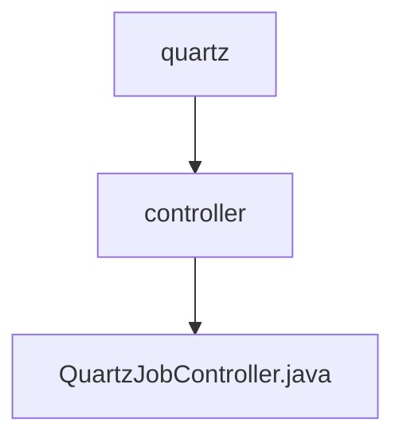

# 基础信息

|      |      |
|------|------|
| 名称 | controller |
| 编码语言 | .java |
| 代码路径 | JeecgBoot/jeecg-boot/jeecg-module-system/jeecg-system-biz/src/main/java/org/jeecg/modules/quartz/controller |
| 包名 | JeecgBoot.jeecg-boot.jeecg-module-system.jeecg-system-biz.src.main.java.org.jeecg.modules.quartz.controller |
| 概述说明 | 定时任务接口提供增删改查、启动暂停、导入导出功能。 |

# 说明

定时任务接口提供了全面的管理功能，包括增加、删除、修改和查询定时任务，同时还支持启动和暂停任务的操作。此外，该接口还具备导入和导出功能，方便用户进行任务数据的迁移和备份。这些功能集成在一个统一的接口中，确保用户能够高效地管理和操作定时任务，满足各种业务需求。

### 包内部结构视图

该流程图展示了路径的层级关系，`quartz`文件夹包含`controller`子文件夹，而`controller`文件夹中又包含`QuartzJobController.java`文件。这种结构清晰地反映了项目中的文件组织方式，便于理解和管理。

# 文件列表 File List

| 名称   | 类型  | 说明 |
|-------|------|-------------|
| [QuartzJobController.java](QuartzJobController.md) | file | 定时任务接口提供增删改查、启动暂停、导入导出功能。 |

