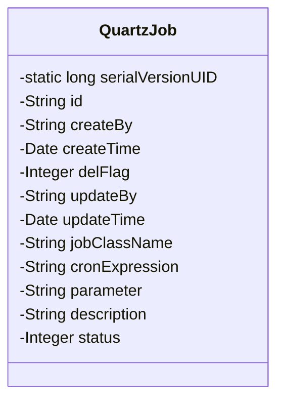
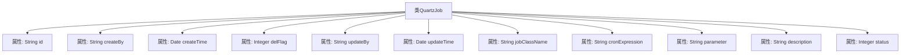

# 基础信息

|      |      |
|------|------|
| 名称 | QuartzJob |
| 编码语言 | .java |
| 代码路径 | JeecgBoot/jeecg-boot/jeecg-module-system/jeecg-system-biz/src/main/java/org/jeecg/modules/quartz/entity/QuartzJob.java |
| 包名 | org.jeecg.modules.quartz.entity |
| 依赖项 | ['java.io.Serializable', 'org.jeecg.common.aspect.annotation.Dict', 'org.jeecgframework.poi.excel.annotation.Excel', 'org.springframework.format.annotation.DateTimeFormat', 'com.baomidou.mybatisplus.annotation.IdType', 'com.baomidou.mybatisplus.annotation.TableField', 'com.baomidou.mybatisplus.annotation.TableId', 'com.baomidou.mybatisplus.annotation.TableName', 'com.fasterxml.jackson.annotation.JsonFormat', 'lombok.Data'] |
| 概述说明 | QuartzJob类包含任务ID、创建、删除、修改、类名、cron表达式、参数、描述和状态信息。 |

# 说明

QuartzJob类是一个用于管理定时任务的数据结构，包含多个关键属性。任务ID用于唯一标识每个任务，创建信息记录任务的创建时间和创建者，删除状态指示任务是否已被删除。修改信息记录任务的最后修改时间和修改者。任务类名指定任务执行的具体类，cron表达式定义任务的调度时间规则。参数用于传递任务执行时所需的额外数据，描述提供任务的简要说明。状态属性则用于表示任务的当前执行状态，如启用或禁用。这些属性共同构成了QuartzJob类的完整任务管理功能。

# 类列表 Class Summary

| 名称   | 类型  | 说明 |
|-------|------|-------------|
| QuartzJob | class | QuartzJob类包含任务ID、创建信息、删除状态、修改信息、任务类名、cron表达式、参数、描述和状态。 |

## 类 QuartzJob

|      |      |
|------|------|
| 访问范围 | @Data;@TableName("sys_quartz_job");public |
| 类型 | class |
| 名称 | QuartzJob |
| 说明 | QuartzJob类包含任务ID、创建信息、删除状态、修改信息、任务类名、cron表达式、参数、描述和状态。 |

### UML类图

这段代码定义了一个名为 `QuartzJob` 的类，该类实现了 `Serializable` 接口，用于表示一个定时任务的相关信息。类中包含多个私有属性，如任务的唯一标识 `id`、创建人 `createBy`、创建时间 `createTime`、删除状态 `delFlag`、修改人 `updateBy`、修改时间 `updateTime`、任务类名 `jobClassName`、cron 表达式 `cronExpression`、参数 `parameter`、描述 `description` 和状态 `status`。这些属性通过注解与数据库表 `sys_quartz_job` 进行映射，并用于存储和操作定时任务的相关数据。

### 内部方法调用关系图

这段代码定义了一个名为 `QuartzJob` 的类，用于表示一个定时任务的相关信息。类中包含多个属性，如任务ID、创建人、创建时间、删除状态、修改人、修改时间、任务类名、cron表达式、参数、描述和状态等。这些属性通过注解与数据库表 `sys_quartz_job` 进行映射，并提供了格式化和字典转换的功能。

### 字段列表 Field List

| 名称  | 类型  | 说明 |
|-------|-------|------|
| serialVersionUID = 1L | long | 声明一个静态常量序列化版本ID，值为1。 |
| description | java.lang.String | Excel描述字段为私有字符串类型。 |
| jobClassName | java.lang.String | 任务类名定义为Java私有字符串类型。 |
| cronExpression | java.lang.String | Excel中cron表达式字段定义为私有字符串类型。 |
| createBy | java.lang.String | 私有字符串变量createBy的声明。 |
| id | java.lang.String | 表ID类型为分配ID，私有字符串类型ID。 |
| status | java.lang.Integer | Excel字段状态，宽度15，字典quartz_status，类型Integer。 |
| updateBy | java.lang.String | 更新者字段，用于记录最后修改的用户。 |
| delFlag | java.lang.Integer | 私有整型变量delFlag，用于标记删除状态。 |
| parameter | java.lang.String | Excel参数类包含一个私有的字符串类型变量parameter。 |
| createTime | java.util.Date | Java中定义日期格式为"yyyy-MM-dd HH:mm:ss"，时区为GMT+8。 |
| updateTime | java.util.Date | 定义日期格式为"yyyy-MM-dd HH:mm:ss"，时区为GMT+8。 |

### 方法列表 Method List

| 名称  | 类型  | 说明 |
|-------|-------|------|

