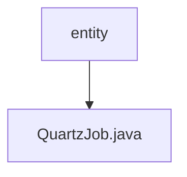

# 基础信息

|      |      |
|------|------|
| 名称 | entity |
| 编码语言 | .java |
| 代码路径 | JeecgBoot/jeecg-boot/jeecg-module-system/jeecg-system-biz/src/main/java/org/jeecg/modules/quartz/entity |
| 包名 | JeecgBoot.jeecg-boot.jeecg-module-system.jeecg-system-biz.src.main.java.org.jeecg.modules.quartz.entity |
| 概述说明 | QuartzJob类包含任务ID、创建、删除、修改、类名、cron表达式、参数、描述和状态信息。 |

# 说明

QuartzJob类是一个用于管理定时任务的数据结构，包含多个关键属性。任务ID用于唯一标识每个任务，创建信息记录任务的创建时间和创建者，删除状态指示任务是否已被删除。修改信息记录任务的最后修改时间和修改者。任务类名指定任务执行的具体类，cron表达式定义任务的调度时间规则。参数用于传递任务执行时所需的额外数据，描述提供任务的简要说明。状态属性则用于表示任务的当前执行状态，如启用或禁用。这些属性共同构成了QuartzJob类的完整任务管理功能。

### 包内部结构视图

该流程图展示了`entity`文件夹与`QuartzJob.java`文件之间的层级关系。`entity`文件夹位于`quartz`模块下，`QuartzJob.java`文件是`entity`文件夹中的一个具体实现文件。

# 文件列表 File List

| 名称   | 类型  | 说明 |
|-------|------|-------------|
| [QuartzJob.java](QuartzJob.md) | file | QuartzJob类包含任务ID、创建、删除、修改、类名、cron表达式、参数、描述和状态信息。 |

