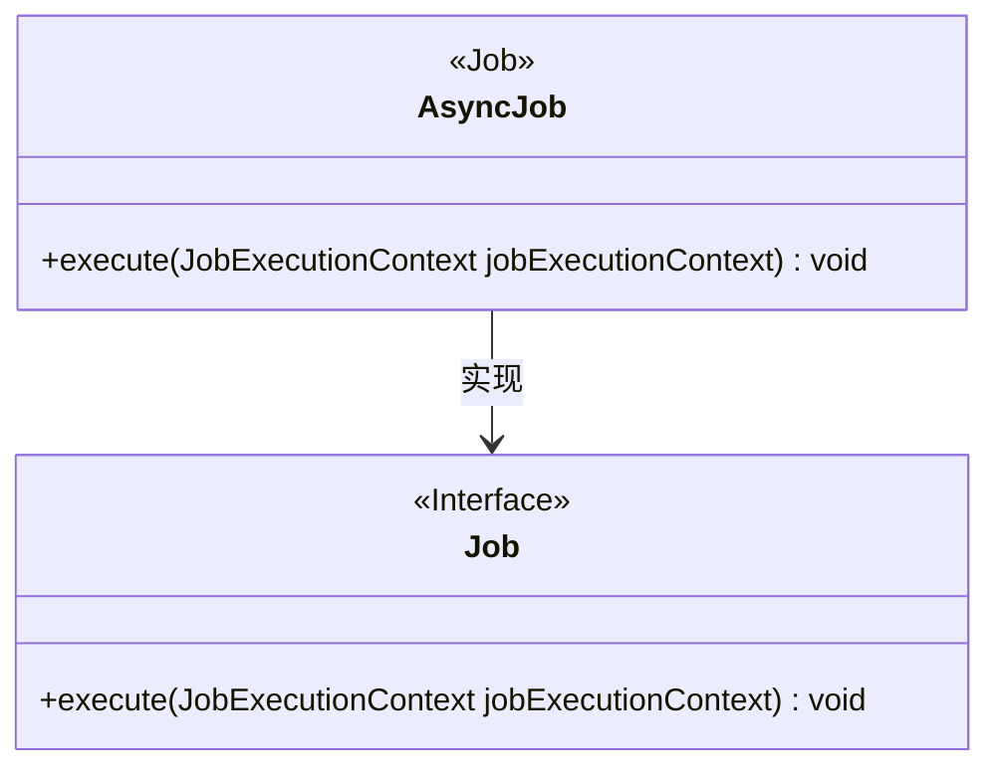
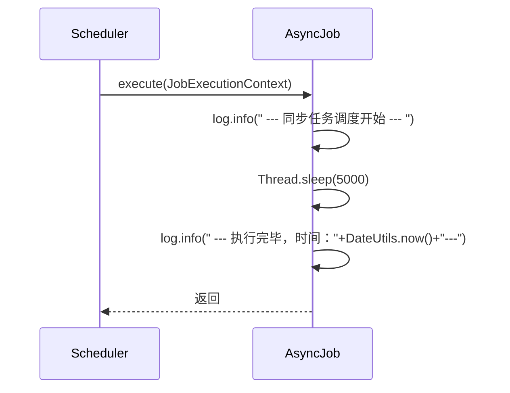
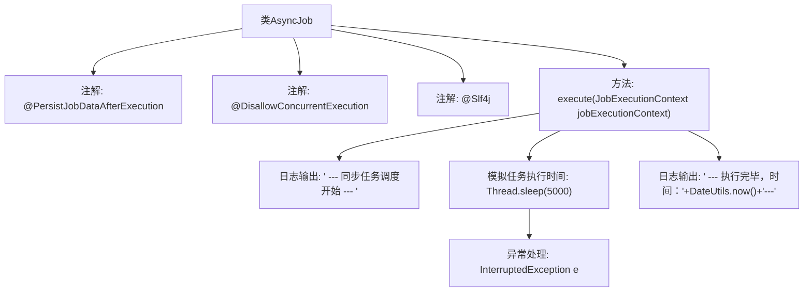

# 基础信息

|      |      |
|------|------|
| 名称 | AsyncJob |
| 编码语言 | .java |
| 代码路径 | JeecgBoot/jeecg-boot/jeecg-module-system/jeecg-system-biz/src/main/java/org/jeecg/modules/quartz/job/AsyncJob.java |
| 包名 | org.jeecg.modules.quartz.job |
| 依赖项 | ['lombok.extern.slf4j.Slf4j', 'org.jeecg.common.util.DateUtils', 'org.quartz'] |
| 概述说明 | 单线程异步任务，每5秒完成一次。 |

# 说明

该异步任务类设计为单线程执行，任务每5秒完成一次。这种机制确保任务按固定时间间隔进行，适用于需要周期性处理的任务场景。单线程执行避免了多线程并发带来的复杂性，简化了任务管理，同时保证了任务执行的顺序性和稳定性。

# 类列表 Class Summary

| 名称   | 类型  | 说明 |
|-------|------|-------------|
| AsyncJob | class | 异步任务类，单线程执行，每5秒完成一次任务。 |

## 类 AsyncJob

|      |      |
|------|------|
| 访问范围 | @PersistJobDataAfterExecution;@DisallowConcurrentExecution;@Slf4j;public |
| 类型 | class |
| 名称 | AsyncJob |
| 说明 | 异步任务类，单线程执行，每5秒完成一次任务。 |

### UML类图

这段代码定义了一个名为 `AsyncJob` 的类，它实现了 `Job` 接口，并重写了 `execute` 方法。`execute` 方法模拟了一个耗时5秒的任务，并在任务开始和结束时分别记录日志。由于使用了 `@DisallowConcurrentExecution` 注解，即使任务表达式配置为每秒执行一次，任务实际上每5秒才会执行一次。类图展示了 `AsyncJob` 与 `Job` 接口的继承关系，时序图则展示了任务调度的执行流程。

### 内部方法调用关系图

这段代码定义了一个`AsyncJob`类，该类实现了`Job`接口，并使用了三个注解：`@PersistJobDataAfterExecution`、`@DisallowConcurrentExecution`和`@Slf4j`。`execute`方法是该类的核心，它首先记录任务开始的日志，然后通过`Thread.sleep(5000)`模拟任务执行5秒钟，最后记录任务完成的日志。由于任务配置为每秒执行一次，但实际执行时间为5秒，因此任务每5秒执行一次。

### 字段列表 Field List

| 名称  | 类型  | 说明 |
|-------|-------|------|

### 方法列表 Method List

| 名称  | 类型  | 说明 |
|-------|-------|------|
| execute | void | 同步任务调度开始，模拟执行5秒，实际每5秒执行一次。 |

