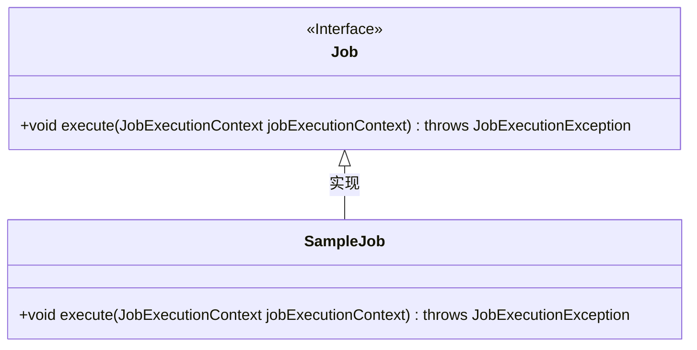
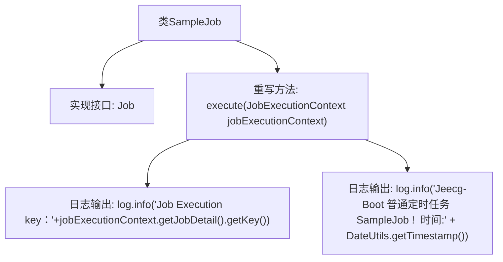

# 基础信息

|      |      |
|------|------|
| 名称 | SampleJob |
| 编码语言 | .java |
| 代码路径 | JeecgBoot/jeecg-boot/jeecg-module-system/jeecg-system-biz/src/main/java/org/jeecg/modules/quartz/job/SampleJob.java |
| 包名 | org.jeecg.modules.quartz.job |
| 依赖项 | ['org.jeecg.common.util.DateUtils', 'org.quartz.Job', 'org.quartz.JobExecutionContext', 'org.quartz.JobExecutionException', 'lombok.extern.slf4j.Slf4j'] |
| 概述说明 | SampleJob类实现Job接口，记录任务执行键和时间。 |

# 说明

SampleJob类实现了Job接口，主要用于记录任务执行的关键信息，包括任务执行键和时间信息。该类通过实现Job接口，确保能够按照接口定义的标准执行任务，并在执行过程中捕获和存储相关的时间戳和执行标识，以便后续追踪和分析任务执行情况。这种设计有助于提高任务管理的透明度和可维护性。

# 类列表 Class Summary

| 名称   | 类型  | 说明 |
|-------|------|-------------|
| SampleJob | class | SampleJob类实现Job接口，记录任务执行键和时间信息。 |

## 类 SampleJob

|      |      |
|------|------|
| 访问范围 | @Slf4j;public |
| 类型 | class |
| 名称 | SampleJob |
| 说明 | SampleJob类实现Job接口，记录任务执行键和时间信息。 |

### UML类图

类图描述：`SampleJob` 类实现了 `Job` 接口，并重写了 `execute` 方法。`Job` 接口定义了一个 `execute` 方法，该方法接收 `JobExecutionContext` 参数并可能抛出 `JobExecutionException` 异常。`SampleJob` 类在 `execute` 方法中记录了任务执行的键和时间戳，展示了如何通过实现接口来完成定时任务的具体逻辑。

### 内部方法调用关系图

这段代码定义了一个名为 `SampleJob` 的类，该类实现了 `Job` 接口，并重写了 `execute` 方法。在 `execute` 方法中，首先通过 `log.info` 方法输出当前任务的执行键（Job Execution Key），然后输出一条包含当前时间戳的日志信息，表明这是一个普通的定时任务。该代码主要用于在定时任务执行时记录相关信息，便于后续的监控和调试。

### 字段列表 Field List

| 名称  | 类型  | 说明 |
|-------|-------|------|

### 方法列表 Method List

| 名称  | 类型  | 说明 |
|-------|-------|------|
| execute | void | Jeecg-Boot定时任务执行日志，记录任务键和时间戳。 |

