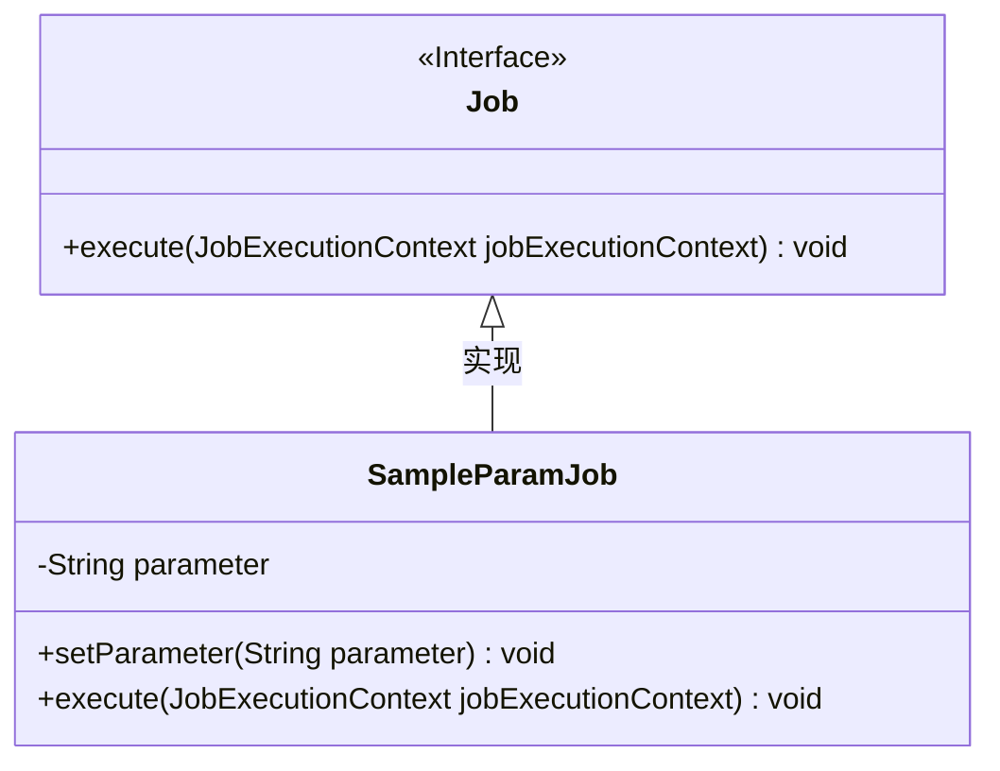
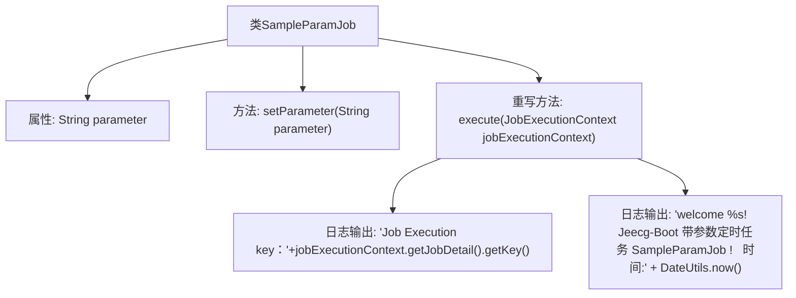

# 基础信息

|      |      |
|------|------|
| 名称 | SampleParamJob |
| 编码语言 | .java |
| 代码路径 | JeecgBoot/jeecg-boot/jeecg-module-system/jeecg-system-biz/src/main/java/org/jeecg/modules/quartz/job/SampleParamJob.java |
| 包名 | org.jeecg.modules.quartz.job |
| 依赖项 | ['org.jeecg.common.util.DateUtils', 'org.quartz.Job', 'org.quartz.JobExecutionContext', 'org.quartz.JobExecutionException', 'lombok.extern.slf4j.Slf4j'] |
| 概述说明 | SampleParamJob类实现Job接口，执行定时任务并记录日志。 |

# 说明

SampleParamJob类实现了Job接口，主要用于设置参数并执行定时任务。在执行过程中，该类会记录相关的日志信息，以便于跟踪和调试任务的执行情况。通过实现Job接口，该类能够与调度框架无缝集成，确保定时任务能够按照预定的时间和条件准确执行。日志信息的记录为任务的监控和问题排查提供了重要支持。

# 类列表 Class Summary

| 名称   | 类型  | 说明 |
|-------|------|-------------|
| SampleParamJob | class | SampleParamJob类实现Job接口，设置参数并执行定时任务，记录日志信息。 |

## 类 SampleParamJob

|      |      |
|------|------|
| 访问范围 | @Slf4j;public |
| 类型 | class |
| 名称 | SampleParamJob |
| 说明 | SampleParamJob类实现Job接口，设置参数并执行定时任务，记录日志信息。 |

### UML类图

**描述：**  
`SampleParamJob` 类实现了 `Job` 接口，并包含一个私有字符串类型的 `parameter` 属性。该类提供了 `setParameter` 方法用于设置 `parameter` 的值，并重写了 `execute` 方法以执行具体的任务逻辑。`execute` 方法会记录任务的执行信息，包括任务的关键字和带参数的欢迎信息。类图展示了 `SampleParamJob` 对 `Job` 接口的实现关系。

### 内部方法调用关系图

这段代码定义了一个名为 `SampleParamJob` 的类，该类实现了 `Job` 接口。类中包含一个私有属性 `parameter` 和一个用于设置该属性的方法 `setParameter`。`execute` 方法是 `Job` 接口的重写方法，用于执行定时任务，并在执行时输出日志信息，包括任务的执行键和带有参数的欢迎信息。代码通过日志记录器 `log` 输出信息，确保任务执行时的关键信息能够被跟踪和记录。

### 字段列表 Field List

| 名称  | 类型  | 说明 |
|-------|-------|------|
| parameter | String | 私有字符串类型变量parameter声明。 |

### 方法列表 Method List

| 名称  | 类型  | 说明 |
|-------|-------|------|
| execute | void | Jeecg-Boot定时任务执行日志，记录任务键和带参数欢迎信息及当前时间。 |
| setParameter | void | 设置类成员变量parameter的值为传入的字符串参数。 |

