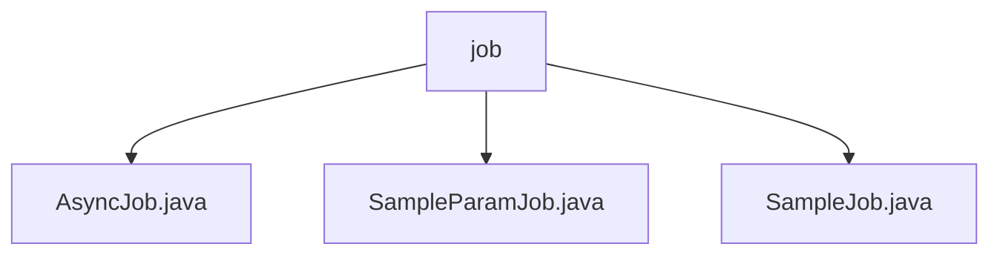

# 基础信息

|      |      |
|------|------|
| 名称 | job |
| 编码语言 | .java |
| 代码路径 | JeecgBoot/jeecg-boot/jeecg-module-system/jeecg-system-biz/src/main/java/org/jeecg/modules/quartz/job |
| 包名 | JeecgBoot.jeecg-boot.jeecg-module-system.jeecg-system-biz.src.main.java.org.jeecg.modules.quartz.job |
| 概述说明 | 异步任务类单线程执行，每5秒完成一次，适用于周期性任务。SampleParamJob类实现Job接口，记录日志便于调试。SampleJob类记录任务关键信息，提高任务管理透明度。 |

# 说明

## 概述
该代码模块是一个基于JeecgBoot框架的定时任务管理模块，主要用于实现周期性任务的调度和执行。模块中包含多个任务类，这些类均实现了`Job`接口，能够与调度框架无缝集成，确保任务能够按照预定的时间和条件准确执行。模块的设计注重任务的顺序性、稳定性和可维护性，通过单线程执行、日志记录和参数设置等机制，简化了任务管理并提高了任务执行的透明度。

## 主要业务场景
1. **周期性任务处理**：`AsyncJob`类设计为单线程执行，每5秒完成一次任务，适用于需要周期性处理的业务场景。这种机制确保了任务按固定时间间隔进行，避免了多线程并发带来的复杂性，同时保证了任务执行的顺序性和稳定性。
2. **带参数的任务执行**：`SampleParamJob`类实现了`Job`接口，主要用于设置参数并执行定时任务。在执行过程中，该类会记录相关的日志信息，便于跟踪和调试任务的执行情况，为任务的监控和问题排查提供了重要支持。
3. **任务执行信息记录**：`SampleJob`类同样实现了`Job`接口，主要用于记录任务执行的关键信息，包括任务执行键和时间信息。通过捕获和存储相关的时间戳和执行标识，提高了任务管理的透明度和可维护性，便于后续追踪和分析任务执行情况。

### 包内部结构视图

该流程图展示了`job`目录下的三个Java文件：`AsyncJob.java`、`SampleParamJob.java`和`SampleJob.java`。这些文件均位于`job`目录中，没有更深层次的子目录结构。通过该图可以清晰地看出`job`目录与其包含的文件之间的层级关系，简洁明了地呈现了文件组织结构。

# 文件列表 File List

| 名称   | 类型  | 说明 |
|-------|------|-------------|
| [AsyncJob.java](AsyncJob.md) | file | 单线程异步任务，每5秒完成一次。 |
| [SampleJob.java](SampleJob.md) | file | SampleJob类实现Job接口，记录任务执行键和时间。 |
| [SampleParamJob.java](SampleParamJob.md) | file | SampleParamJob类实现Job接口，执行定时任务并记录日志。 |

