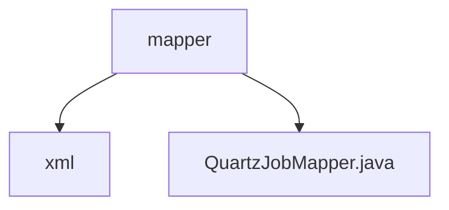

# 基础信息

|      |      |
|------|------|
| 名称 | mapper |
| 编码语言 | .java |
| 代码路径 | JeecgBoot/jeecg-boot/jeecg-module-system/jeecg-system-biz/src/main/java/org/jeecg/modules/quartz/mapper |
| 包名 | JeecgBoot.jeecg-boot.jeecg-module-system.jeecg-system-biz.src.main.java.org.jeecg.modules.quartz.mapper |
| 概述说明 | 信息为空，无法生成概要描述。 |

# 说明

由于提供的输入内容为空，无法生成具体的总结描述。请提供具体内容以便进行准确和全面的总结。

### 包内部结构视图

该流程图展示了`mapper`目录下的层级关系，`mapper`包含两个子节点：`xml`和`QuartzJobMapper.java`。`xml`是一个文件夹，而`QuartzJobMapper.java`是一个文件。这种结构常用于Java项目中，`mapper`通常用于存放与数据库操作相关的接口或映射文件，`xml`文件夹可能存放XML配置文件，而`QuartzJobMapper.java`则是一个具体的Mapper接口文件。

# 文件列表 File List

| 名称   | 类型  | 说明 |
|-------|------|-------------|
| [QuartzJobMapper.java](QuartzJobMapper.md) | file | 信息为空，无法生成概要描述。 |
| [xml](xml/_module.md) | package | None |

