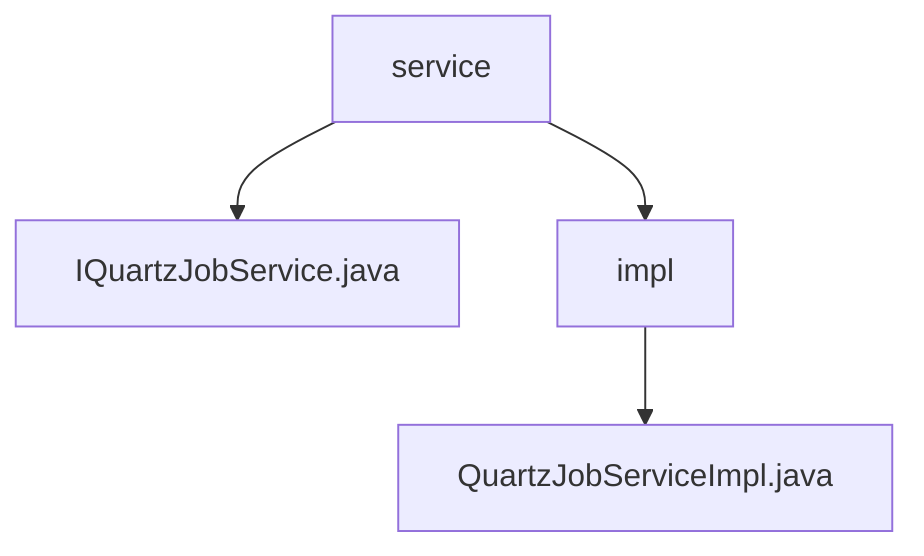

# 基础信息

|      |      |
|------|------|
| 名称 | service |
| 编码语言 | .java |
| 代码路径 | JeecgBoot/jeecg-boot/jeecg-module-system/jeecg-system-biz/src/main/java/org/jeecg/modules/quartz/service |
| 包名 | JeecgBoot.jeecg-boot.jeecg-module-system.jeecg-system-biz.src.main.java.org.jeecg.modules.quartz.service |
| 概述说明 | QuartzJobServiceImpl提供定时任务的保存、启动、恢复、编辑、删除和暂停功能。 |

# 说明

## 概述
该代码模块主要实现了定时任务的管理功能，核心服务类为`QuartzJobServiceImpl`。该服务类提供了定时任务的保存、启动、恢复、编辑、删除和暂停等操作，确保定时任务的生命周期管理能够灵活且高效地进行。通过这些功能，模块能够满足业务中对定时任务的多样化需求，提供了一套完整的定时任务管理解决方案。

## 主要业务场景
1. **定时任务的保存与持久化**：支持将定时任务的信息持久化存储，确保任务配置在系统重启后依然有效。
2. **任务的启动与恢复**：允许任务在需要时立即执行，或从暂停状态重新激活，确保任务的及时执行。
3. **任务的编辑与配置调整**：提供灵活的编辑功能，允许用户根据业务需求调整任务配置。
4. **任务的删除**：支持彻底移除不再需要的任务记录，避免无效任务占用资源。
5. **任务的暂停**：允许临时停止任务的执行，而无需删除任务本身，便于任务的临时调整或维护。

这些功能共同支持了定时任务的全生命周期管理，适用于需要精确控制任务执行时间的业务场景，如定时数据同步、报表生成、任务调度等。

### 包内部结构视图

该流程图展示了JeecgBoot项目中与定时任务相关的服务层结构。`service`节点下包含一个接口文件`IQuartzJobService.java`和一个子目录`impl`，`impl`目录中包含了该接口的实现类`QuartzJobServiceImpl.java`。这种结构清晰地反映了服务层接口与实现之间的层级关系。

# 文件列表 File List

| 名称   | 类型  | 说明 |
|-------|------|-------------|
| [IQuartzJobService.java](IQuartzJobService.md) | file | 内容为空，无法生成概要描述。 |
| [impl](impl/_module.md) | package | QuartzJobServiceImpl实现定时任务的管理功能。 |

