# 基础信息

|      |      |
|------|------|
| 名称 | QuartzJobServiceImpl |
| 编码语言 | .java |
| 代码路径 | JeecgBoot/jeecg-boot/jeecg-module-system/jeecg-system-biz/src/main/java/org/jeecg/modules/quartz/service/impl/QuartzJobServiceImpl.java |
| 包名 | org.jeecg.modules.quartz.service.impl |
| 依赖项 | ['com.baomidou.mybatisplus.extension.service.impl.ServiceImpl', 'lombok.extern.slf4j.Slf4j', 'org.jeecg.common.constant.CommonConstant', 'org.jeecg.common.exception.JeecgBootException', 'org.jeecg.common.util.DateUtils', 'org.jeecg.modules.quartz.entity.QuartzJob', 'org.jeecg.modules.quartz.mapper.QuartzJobMapper', 'org.jeecg.modules.quartz.service.IQuartzJobService', 'org.quartz', 'org.springframework.beans.factory.annotation.Autowired', 'org.springframework.stereotype.Service', 'org.springframework.transaction.annotation.Transactional', 'java.util.Date', 'java.util.List'] |
| 概述说明 | QuartzJobServiceImpl实现定时任务的管理功能。 |

# 说明

QuartzJobServiceImpl是一个实现定时任务管理的服务类，提供了全面的功能支持。它能够处理定时任务的保存，确保任务信息被持久化存储。同时，该服务支持任务的启动和恢复，允许任务在需要时立即执行或从暂停状态重新激活。此外，QuartzJobServiceImpl还提供了任务的编辑功能，使得任务配置可以灵活调整。对于不再需要的任务，该服务支持删除操作，彻底移除任务记录。最后，任务暂停功能允许临时停止任务的执行，而无需删除任务本身。这些功能共同构成了一个完整的定时任务管理解决方案。

# 类列表 Class Summary

| 名称   | 类型  | 说明 |
|-------|------|-------------|
| QuartzJobServiceImpl | class | QuartzJobServiceImpl实现定时任务的保存、启动、恢复、编辑、删除和暂停功能。 |

## 类 QuartzJobServiceImpl

|      |      |
|------|------|
| 访问范围 | @Slf4j;@Service;public |
| 类型 | class |
| 名称 | QuartzJobServiceImpl |
| 说明 | QuartzJobServiceImpl实现定时任务的保存、启动、恢复、编辑、删除和暂停功能。 |

### UML类图

```mermaid
classDiagram
    class QuartzJobServiceImpl {
        -QuartzJobMapper quartzJobMapper
        -Scheduler scheduler
        -static final String JOB_TEST_GROUP
        +List~QuartzJob~ findByJobClassName(String jobClassName)
        +boolean saveAndScheduleJob(QuartzJob quartzJob)
        +boolean resumeJob(QuartzJob quartzJob)
        +boolean editAndScheduleJob(QuartzJob quartzJob) throws SchedulerException
        +boolean deleteAndStopJob(QuartzJob job)
        +void execute(QuartzJob quartzJob) throws Exception
        +void pause(QuartzJob quartzJob)
        -void schedulerAdd(String id, String jobClassName, String cronExpression, String parameter)
        -void schedulerDelete(String id)
        -static Job getClass(String classname) throws Exception
    }

    class QuartzJobMapper {
        +List~QuartzJob~ findByJobClassName(String jobClassName)
    }

    class Scheduler {
        +void start()
        +void scheduleJob(JobDetail jobDetail, Trigger trigger) throws SchedulerException
        +void pauseJob(JobKey jobKey) throws SchedulerException
        +void pauseTrigger(TriggerKey triggerKey) throws SchedulerException
        +void unscheduleJob(TriggerKey triggerKey) throws SchedulerException
        +void deleteJob(JobKey jobKey) throws SchedulerException
    }

    class JobDetail {
        +JobBuilder withIdentity(String identity)
        +JobBuilder usingJobData(String key, String value)
    }

    class Trigger {
        +TriggerBuilder withIdentity(String identity)
        +TriggerBuilder withSchedule(CronScheduleBuilder scheduleBuilder)
    }

    class JobBuilder {
        +static JobBuilder newJob(Class~? extends Job~ jobClass)
        +JobDetail withIdentity(String identity)
    }

    class TriggerBuilder {
        +static TriggerBuilder newTrigger()
        +Trigger withIdentity(String identity)
        +Trigger withSchedule(CronScheduleBuilder scheduleBuilder)
    }

    class CronScheduleBuilder {
        +static CronScheduleBuilder cronSchedule(String cronExpression)
    }

    class JeecgBootException {
        +JeecgBootException(String message, Throwable cause)
    }

    QuartzJobServiceImpl --> QuartzJobMapper : 依赖
    QuartzJobServiceImpl --> Scheduler : 依赖
    QuartzJobServiceImpl --> JeecgBootException : 依赖
    JobBuilder --> JobDetail : 创建
    TriggerBuilder --> Trigger : 创建
    CronScheduleBuilder --> Trigger : 构建
```

这段代码定义了一个`QuartzJobServiceImpl`类，它继承自`ServiceImpl`并实现了`IQuartzJobService`接口。该类主要负责管理和调度Quartz定时任务。它依赖于`QuartzJobMapper`来访问数据库，以及`Scheduler`来管理任务的调度。类中包含了一系列方法来保存、恢复、编辑、删除和暂停定时任务，并且通过`schedulerAdd`和`schedulerDelete`方法来具体操作调度器。代码中还定义了一些异常处理逻辑，确保在任务调度过程中出现的错误能够被捕获和处理。

### 内部方法调用关系图

```mermaid
graph TD
    A["类QuartzJobServiceImpl"]
    B["属性: QuartzJobMapper quartzJobMapper"]
    C["属性: Scheduler scheduler"]
    D["常量: String JOB_TEST_GROUP"]
    E["方法: List<QuartzJob> findByJobClassName(String jobClassName)"]
    F["方法: boolean saveAndScheduleJob(QuartzJob quartzJob)"]
    G["方法: boolean resumeJob(QuartzJob quartzJob)"]
    H["方法: boolean editAndScheduleJob(QuartzJob quartzJob)"]
    I["方法: boolean deleteAndStopJob(QuartzJob job)"]
    J["方法: void execute(QuartzJob quartzJob)"]
    K["方法: void pause(QuartzJob quartzJob)"]
    L["方法: void schedulerAdd(String id, String jobClassName, String cronExpression, String parameter)"]
    M["方法: void schedulerDelete(String id)"]
    N["方法: static Job getClass(String classname)"]

    A --> B
    A --> C
    A --> D
    A --> E
    A --> F
    A --> G
    A --> H
    A --> I
    A --> J
    A --> K
    A --> L
    A --> M
    A --> N
```

这段代码定义了一个名为`QuartzJobServiceImpl`的类，它负责管理定时任务的操作。类中包含了多个方法，如`saveAndScheduleJob`用于保存并启动定时任务，`resumeJob`用于恢复定时任务，`editAndScheduleJob`用于编辑和启停定时任务，`deleteAndStopJob`用于删除和停止定时任务等。类中还定义了私有的辅助方法`schedulerAdd`和`schedulerDelete`，分别用于添加和删除定时任务。通过这些方法，该类能够有效地管理和调度定时任务的执行。

### 字段列表 Field List

| 名称  | 类型  | 说明 |
|-------|-------|------|
| scheduler | Scheduler | 自动注入调度器实例。 |
| quartzJobMapper | QuartzJobMapper | 自动注入QuartzJobMapper对象。 |
| JOB_TEST_GROUP = "test_group" | String | 定义常量字符串JOB_TEST_GROUP，值为"test_group"。 |

### 方法列表 Method List

| 名称  | 类型  | 说明 |
|-------|-------|------|
| findByJobClassName | List<QuartzJob> | 根据类名查询QuartzJob列表的方法。 |
| resumeJob | boolean | 恢复QuartzJob任务并更新状态。 |
| pause | void | 暂停QuartzJob任务并更新状态为禁用。 |
| saveAndScheduleJob | boolean | 保存并调度任务，设置删除标志，成功时添加定时器。 |
| execute | void | 定时任务立即执行，延迟0.1秒，构建触发器并启动调度器。 |
| schedulerAdd | void | 调度器添加任务，构建任务详情与触发器，处理异常。 |
| getClass | Job | 通过类名获取Job实例，需处理异常。 |
| editAndScheduleJob | boolean | 方法编辑并调度任务，根据状态删除或暂停任务，最后更新任务信息。 |
| schedulerDelete | void | 通过ID暂停、取消调度并删除定时任务，失败时抛出异常。 |
| deleteAndStopJob | boolean | 该方法删除并停止定时任务，先删除调度器中的任务，再移除数据库记录。 |

