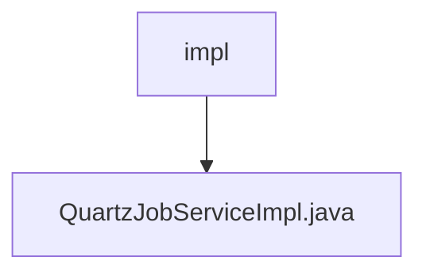

# 基础信息

|      |      |
|------|------|
| 名称 | impl |
| 编码语言 | .java |
| 代码路径 | JeecgBoot/jeecg-boot/jeecg-module-system/jeecg-system-biz/src/main/java/org/jeecg/modules/quartz/service/impl |
| 包名 | JeecgBoot.jeecg-boot.jeecg-module-system.jeecg-system-biz.src.main.java.org.jeecg.modules.quartz.service.impl |
| 概述说明 | QuartzJobServiceImpl实现定时任务的管理功能。 |

# 说明

QuartzJobServiceImpl是一个实现定时任务管理的服务类，提供了全面的功能支持。它能够处理定时任务的保存，确保任务信息被持久化存储。同时，该服务支持任务的启动和恢复，允许任务在需要时立即执行或从暂停状态重新激活。此外，QuartzJobServiceImpl还提供了任务的编辑功能，使得任务配置可以灵活调整。对于不再需要的任务，该服务支持删除操作，彻底移除任务记录。最后，任务暂停功能允许临时停止任务的执行，而无需删除任务本身。这些功能共同构成了一个完整的定时任务管理解决方案。

### 包内部结构视图

该流程图展示了路径2中的层级关系，`impl`文件夹包含一个文件`QuartzJobServiceImpl.java`。路径结构简洁明了，清晰地反映了文件在文件夹中的位置关系。

# 文件列表 File List

| 名称   | 类型  | 说明 |
|-------|------|-------------|
| [QuartzJobServiceImpl.java](QuartzJobServiceImpl.md) | file | QuartzJobServiceImpl实现定时任务的管理功能。 |

