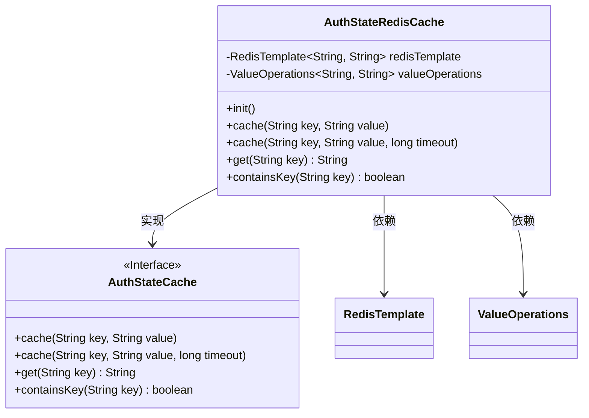
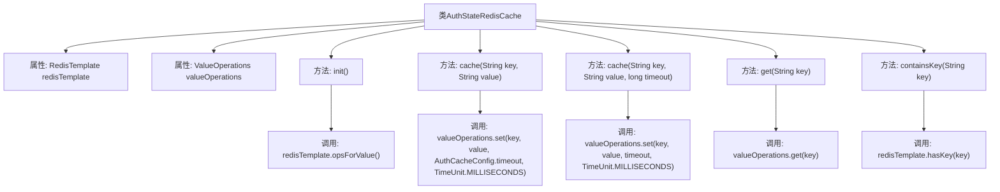

# 基础信息

|      |      |
|------|------|
| 名称 | AuthStateRedisCache |
| 编码语言 | .java |
| 代码路径 | JeecgBoot/jeecg-boot/jeecg-module-system/jeecg-system-biz/src/main/java/org/jeecg/modules/system/cache/AuthStateRedisCache.java |
| 包名 | org.jeecg.modules.system.cache |
| 依赖项 | ['me.zhyd.oauth.cache.AuthCacheConfig', 'me.zhyd.oauth.cache.AuthStateCache', 'org.springframework.beans.factory.annotation.Autowired', 'org.springframework.data.redis.core.RedisTemplate', 'org.springframework.data.redis.core.ValueOperations', 'javax.annotation.PostConstruct', 'java.util.concurrent.TimeUnit'] |
| 概述说明 | AuthStateRedisCache类通过RedisTemplate实现缓存管理，支持设置、获取和检查功能。 |

# 说明

AuthStateRedisCache类实现了AuthStateCache接口，利用RedisTemplate进行缓存管理。该类提供了设置缓存、获取缓存以及检查缓存是否存在的基本功能，确保对缓存数据的有效操作和维护。通过RedisTemplate，该类能够高效地与Redis数据库进行交互，实现缓存数据的存储和检索。

# 类列表 Class Summary

| 名称   | 类型  | 说明 |
|-------|------|-------------|
| AuthStateRedisCache | class | AuthStateRedisCache类实现AuthStateCache接口，使用RedisTemplate管理缓存，支持设置、获取和检查缓存。 |

## 类 AuthStateRedisCache

|      |      |
|------|------|
| 访问范围 | public |
| 类型 | class |
| 名称 | AuthStateRedisCache |
| 说明 | AuthStateRedisCache类实现AuthStateCache接口，使用RedisTemplate管理缓存，支持设置、获取和检查缓存。 |

### UML类图

这段代码定义了一个`AuthStateRedisCache`类，该类实现了`AuthStateCache`接口，用于通过Redis缓存认证状态。`AuthStateRedisCache`类依赖于`RedisTemplate`和`ValueOperations`来进行缓存操作。类中的方法包括初始化、缓存存储、缓存获取以及检查缓存是否存在等功能。通过`@PostConstruct`注解的`init`方法在类实例化后初始化`valueOperations`，以便后续使用。

### 内部方法调用关系图

**描述：**  
`AuthStateRedisCache`类实现了`AuthStateCache`接口，用于管理与Redis缓存相关的操作。类中包含两个属性：`redisTemplate`和`valueOperations`，其中`valueOperations`在`init`方法中通过`redisTemplate.opsForValue()`初始化。类提供了四个主要方法：`cache`方法用于将键值对存入缓存，支持默认和自定义过期时间；`get`方法用于获取指定键的缓存内容；`containsKey`方法用于检查指定键是否存在且未过期。这些方法通过`valueOperations`和`redisTemplate`与Redis进行交互。

### 字段列表 Field List

| 名称  | 类型  | 说明 |
|-------|-------|------|
| redisTemplate | RedisTemplate<String, String> | 自动注入RedisTemplate，用于操作字符串类型的Redis数据。 |
| valueOperations | ValueOperations<String, String> | 定义了一个私有变量valueOperations，类型为ValueOperations<String, String>。 |

### 方法列表 Method List

| 名称  | 类型  | 说明 |
|-------|-------|------|
| containsKey | boolean | 重写方法检查Redis中是否存在指定键。 |
| cache | void | 重写缓存方法，设置键值对及超时时间。 |
| init | void | PostConstruct方法初始化Redis模板的值操作。 |
| get | String | 重写get方法，通过valueOperations获取指定key的值。 |
| cache | void | 重写缓存方法，设置键值对及超时时间。 |

