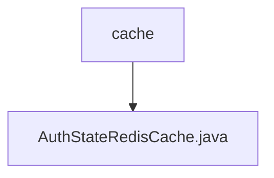

# 基础信息

|      |      |
|------|------|
| 名称 | cache |
| 编码语言 | .java |
| 代码路径 | JeecgBoot/jeecg-boot/jeecg-module-system/jeecg-system-biz/src/main/java/org/jeecg/modules/system/cache |
| 包名 | JeecgBoot.jeecg-boot.jeecg-module-system.jeecg-system-biz.src.main.java.org.jeecg.modules.system.cache |
| 概述说明 | AuthStateRedisCache类通过RedisTemplate实现缓存管理，支持设置、获取和检查功能。 |

# 说明

AuthStateRedisCache类实现了AuthStateCache接口，利用RedisTemplate进行缓存管理。该类提供了设置缓存、获取缓存以及检查缓存是否存在的基本功能，确保对缓存数据的有效操作和维护。通过RedisTemplate，该类能够高效地与Redis数据库进行交互，实现缓存数据的存储和检索。

### 包内部结构视图

该流程图展示了路径中的层级关系，`cache` 是顶级文件夹，`AuthStateRedisCache.java` 是位于 `cache` 文件夹下的文件。通过这种方式，清晰地展示了文件与文件夹之间的从属关系。

# 文件列表 File List

| 名称   | 类型  | 说明 |
|-------|------|-------------|
| [AuthStateRedisCache.java](AuthStateRedisCache.md) | file | AuthStateRedisCache类通过RedisTemplate实现缓存管理，支持设置、获取和检查功能。 |

