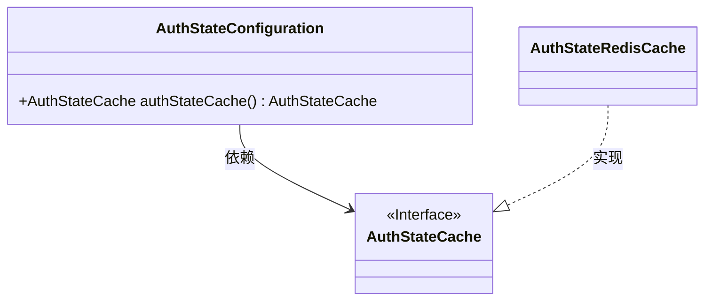
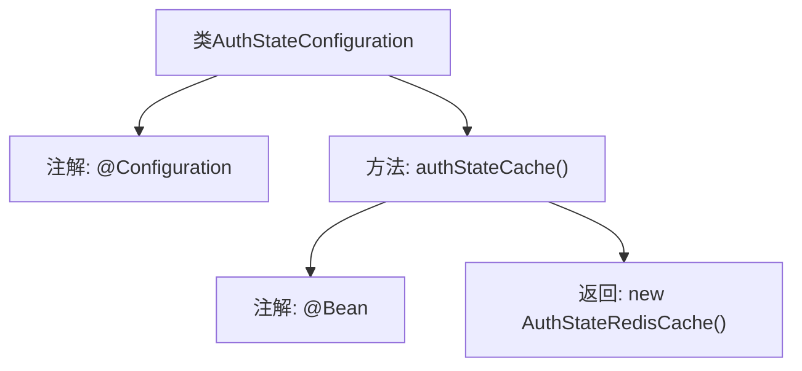

# 基础信息

|      |      |
|------|------|
| 名称 | AuthStateConfiguration |
| 编码语言 | .java |
| 代码路径 | JeecgBoot/jeecg-boot/jeecg-module-system/jeecg-system-biz/src/main/java/org/jeecg/modules/system/config/AuthStateConfiguration.java |
| 包名 | org.jeecg.modules.system.config |
| 依赖项 | ['me.zhyd.oauth.cache.AuthStateCache', 'org.jeecg.modules.system.cache.AuthStateRedisCache', 'org.springframework.context.annotation.Bean', 'org.springframework.context.annotation.Configuration'] |
| 概述说明 | AuthStateConfiguration类配置AuthStateCache的Bean，采用AuthStateRedisCache实现。 |

# 说明

AuthStateConfiguration类负责配置AuthStateCache的Bean，具体实现采用了AuthStateRedisCache。该配置类确保在应用中正确初始化和管理AuthStateCache的实例，以便在需要时能够有效地使用Redis缓存来存储和检索认证状态信息。

# 类列表 Class Summary

| 名称   | 类型  | 说明 |
|-------|------|-------------|
| AuthStateConfiguration | class | AuthStateConfiguration类配置了AuthStateCache的Bean，使用AuthStateRedisCache实现。 |

## 类 AuthStateConfiguration

|      |      |
|------|------|
| 访问范围 | @Configuration;public |
| 类型 | class |
| 名称 | AuthStateConfiguration |
| 说明 | AuthStateConfiguration类配置了AuthStateCache的Bean，使用AuthStateRedisCache实现。 |

### UML类图

这段代码定义了一个配置类 `AuthStateConfiguration`，其中包含一个方法 `authStateCache()`，该方法返回一个 `AuthStateCache` 类型的实例。`AuthStateCache` 是一个接口，而 `AuthStateRedisCache` 是该接口的一个具体实现。`AuthStateConfiguration` 类依赖于 `AuthStateCache` 接口，而 `AuthStateRedisCache` 类实现了该接口。通过这种方式，代码实现了依赖注入，使得 `AuthStateRedisCache` 实例可以在应用程序中被使用。

### 内部方法调用关系图

这段代码定义了一个名为 `AuthStateConfiguration` 的配置类，使用了 `@Configuration` 注解。该类中包含一个名为 `authStateCache()` 的方法，该方法使用了 `@Bean` 注解，表示该方法将返回一个由 Spring 管理的 Bean。方法内部创建并返回了一个 `AuthStateRedisCache` 的实例。该代码的主要作用是通过 Spring 的配置机制，将 `AuthStateRedisCache` 实例注册为 Spring 容器中的一个 Bean，以便在其他组件中使用。

### 字段列表 Field List

| 名称  | 类型  | 说明 |
|-------|-------|------|

### 方法列表 Method List

| 名称  | 类型  | 说明 |
|-------|-------|------|
| authStateCache | AuthStateCache | 定义Bean方法，返回AuthStateRedisCache实例。 |

