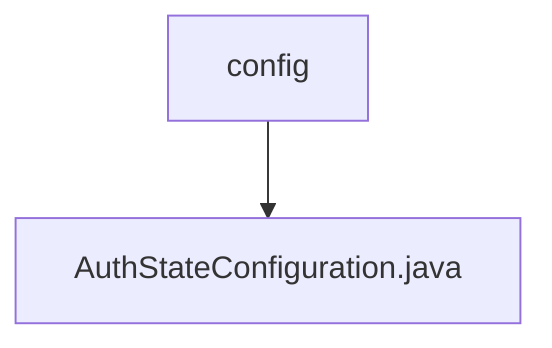

# 基础信息

|      |      |
|------|------|
| 名称 | config |
| 编码语言 | .java |
| 代码路径 | JeecgBoot/jeecg-boot/jeecg-module-system/jeecg-system-biz/src/main/java/org/jeecg/modules/system/config |
| 包名 | JeecgBoot.jeecg-boot.jeecg-module-system.jeecg-system-biz.src.main.java.org.jeecg.modules.system.config |
| 概述说明 | AuthStateConfiguration类配置AuthStateCache的Bean，采用AuthStateRedisCache实现。 |

# 说明

AuthStateConfiguration类负责配置AuthStateCache的Bean，具体实现采用了AuthStateRedisCache。该配置类确保在应用中正确初始化和管理AuthStateCache的实例，以便在需要时能够有效地使用Redis缓存来存储和检索认证状态信息。

### 包内部结构视图

该流程图展示了在`config`文件夹下的`AuthStateConfiguration.java`文件的层级关系。`config`作为根节点，直接包含`AuthStateConfiguration.java`文件，表示该文件位于`config`目录下。

# 文件列表 File List

| 名称   | 类型  | 说明 |
|-------|------|-------------|
| [AuthStateConfiguration.java](AuthStateConfiguration.md) | file | AuthStateConfiguration类配置AuthStateCache的Bean，采用AuthStateRedisCache实现。 |

