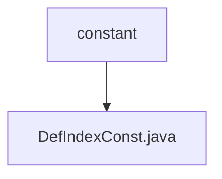

# 基础信息

|      |      |
|------|------|
| 名称 | constant |
| 编码语言 | .java |
| 代码路径 | JeecgBoot/jeecg-boot/jeecg-module-system/jeecg-system-biz/src/main/java/org/jeecg/modules/system/constant |
| 包名 | JeecgBoot.jeecg-boot.jeecg-module-system.jeecg-system-biz.src.main.java.org.jeecg.modules.system.constant |
| 概述说明 | 信息为空，无法生成概要描述。 |

# 说明

由于提供的内容为空，无法进行总结描述。请提供具体内容以便生成详细的总结。

### 包内部结构视图

该流程图展示了路径中的层级关系，`constant` 是父节点，`DefIndexConst.java` 是其子节点。这种结构清晰地表示了文件与文件夹之间的从属关系，便于理解项目中的组织架构。

# 文件列表 File List

| 名称   | 类型  | 说明 |
|-------|------|-------------|
| [DefIndexConst.java](DefIndexConst.md) | file | 信息为空，无法生成概要描述。 |

