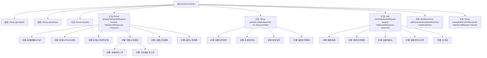

# 基础信息

|      |      |
|------|------|
| 名称 | CommonController |
| 编码语言 | .java |
| 代码路径 | JeecgBoot/jeecg-boot/jeecg-module-system/jeecg-system-biz/src/main/java/org/jeecg/modules/system/controller/CommonController.java |
| 包名 | org.jeecg.modules.system.controller |
| 依赖项 | ['lombok.extern.slf4j.Slf4j', 'org.jeecg.common.api.vo.Result', 'org.jeecg.common.constant.CommonConstant', 'org.jeecg.common.constant.SymbolConstant', 'org.jeecg.common.constant.enums.FileTypeEnum', 'org.jeecg.common.exception.JeecgBootException', 'org.jeecg.common.util.CommonUtils', 'org.jeecg.common.util.filter.SsrfFileTypeFilter', 'org.jeecg.common.util.oConvertUtils', 'org.springframework.beans.factory.annotation.Value', 'org.springframework.context.annotation.Lazy', 'org.springframework.util.AntPathMatcher', 'org.springframework.util.FileCopyUtils', 'org.springframework.web.bind.annotation', 'org.springframework.web.multipart.MultipartFile', 'org.springframework.web.multipart.MultipartHttpServletRequest', 'org.springframework.web.servlet.HandlerMapping', 'org.springframework.web.servlet.ModelAndView', 'javax.servlet.http.HttpServletRequest', 'javax.servlet.http.HttpServletResponse', 'java.io'] |
| 概述说明 | CommonController处理文件操作，支持多种存储，含安全检查与路径处理。 |

# 说明

CommonController是一个多功能控制器，负责处理文件的上传、预览和下载操作，同时具备权限验证功能。它支持多种存储方式，包括本地存储、Minio和阿里云存储，确保文件存储的灵活性和可扩展性。此外，该控制器还包含安全检查机制，防止恶意文件上传，并处理文件路径，确保文件操作的准确性和安全性。整体设计旨在提供全面、高效且安全的文件管理解决方案。

# 类列表 Class Summary

| 名称   | 类型  | 说明 |
|-------|------|-------------|
| CommonController | class | CommonController处理文件上传、预览、下载及权限验证，支持本地、Minio、阿里云存储，包含安全检查和路径处理。 |

## 类 CommonController

|      |      |
|------|------|
| 访问范围 | @Slf4j;@RestController;@RequestMapping("/sys/common");public |
| 类型 | class |
| 名称 | CommonController |
| 说明 | CommonController处理文件上传、预览、下载及权限验证，支持本地、Minio、阿里云存储，包含安全检查和路径处理。 |

### UML类图

```mermaid
classDiagram
    class CommonController {
        -String uploadpath
        -String uploadType
        +Result<?> noauth()
        +Result<?> upload(HttpServletRequest request, HttpServletResponse response) throws Exception
        -String uploadLocal(MultipartFile mf, String bizPath)
        +void view(HttpServletRequest request, HttpServletResponse response)
        +ModelAndView pdfPreviewIframe(ModelAndView modelAndView)
        -String extractPathFromPattern(HttpServletRequest request)
    }

    class Result~T~ {
        +String message
        +boolean success
        +void setMessage(String message)
        +void setSuccess(boolean success)
    }

    class MultipartFile {
        +String getOriginalFilename()
        +byte[] getBytes() throws IOException
    }

    class HttpServletRequest {
        +String getParameter(String name)
        +Object getAttribute(String name)
    }

    class HttpServletResponse {
        +void setStatus(int sc)
        +void setContentType(String type)
        +void addHeader(String name, String value)
        +OutputStream getOutputStream() throws IOException
        +void flushBuffer() throws IOException
    }

    class ModelAndView {
        +void setViewName(String viewName)
    }

    class File {
        +boolean exists()
        +void mkdirs()
        +String getPath()
    }

    class FileCopyUtils {
        +void copy(byte[] in, File out) throws IOException
    }

    class AntPathMatcher {
        +String extractPathWithinPattern(String pattern, String path)
    }

    class SsrfFileTypeFilter {
        +void checkUploadFileType(MultipartFile file)
        +void checkDownloadFileType(String filePath)
    }

    class CommonUtils {
        +String getFileName(String orgName)
        +String upload(MultipartFile file, String bizPath, String uploadType)
    }

    class JeecgBootException {
        +JeecgBootException(String message)
    }

    CommonController --> Result : 返回结果
    CommonController --> MultipartFile : 处理文件上传
    CommonController --> HttpServletRequest : 处理请求
    CommonController --> HttpServletResponse : 处理响应
    CommonController --> ModelAndView : 返回视图
    CommonController --> File : 文件操作
    CommonController --> FileCopyUtils : 文件复制
    CommonController --> AntPathMatcher : 路径匹配
    CommonController --> SsrfFileTypeFilter : 文件类型检查
    CommonController --> CommonUtils : 通用工具
    CommonController --> JeecgBootException : 抛出异常
```

### 描述
`CommonController` 是一个Spring Boot控制器，主要负责处理文件上传、预览、下载等操作。它通过`upload`方法处理文件上传，支持本地和云存储两种方式，并进行了文件类型检查和路径合法性验证。`view`方法用于预览图片和下载文件，`pdfPreviewIframe`方法用于PDF预览。控制器还依赖多个工具类和异常处理类，如`CommonUtils`、`SsrfFileTypeFilter`和`JeecgBootException`，以确保功能的完整性和安全性。

### 内部方法调用关系图

### 描述：
这段代码是一个Spring Boot控制器类，主要用于处理文件上传、预览和下载等操作。代码中定义了多个方法，包括文件上传、本地文件上传、文件预览、PDF预览等。`upload`方法处理文件上传逻辑，根据上传类型（本地或云存储）进行不同的处理，并返回上传结果。`view`方法用于预览或下载文件，提取路径后检查文件类型，设置响应头并读取文件内容。`uploadLocal`方法负责本地文件上传的具体操作，包括创建目录、生成文件名、保存文件等。

### 字段列表 Field List

| 名称  | 类型  | 说明 |
|-------|-------|------|
| uploadpath | String | 配置项`jeecg.path.upload`指定上传路径。 |
| uploadType | String | 配置项uploadType用于定义文件上传类型。 |

### 方法列表 Method List

| 名称  | 类型  | 说明 |
|-------|-------|------|
| noauth | Result<?> | 403接口返回无权限错误信息。 |
| pdfPreviewIframe | ModelAndView | 该方法用于返回PDF预览页面的视图。 |
| extractPathFromPattern | String | 从HTTP请求中提取路径并匹配最佳模式。 |
| uploadLocal | String | 上传本地文件并返回存储路径，处理文件名和目录创建。 |
| upload | Result<?> | 处理文件上传，验证路径，过滤文件类型，返回结果。 |
| view | void | 处理静态文件请求，检查路径和文件类型，强制下载并返回文件内容。 |

