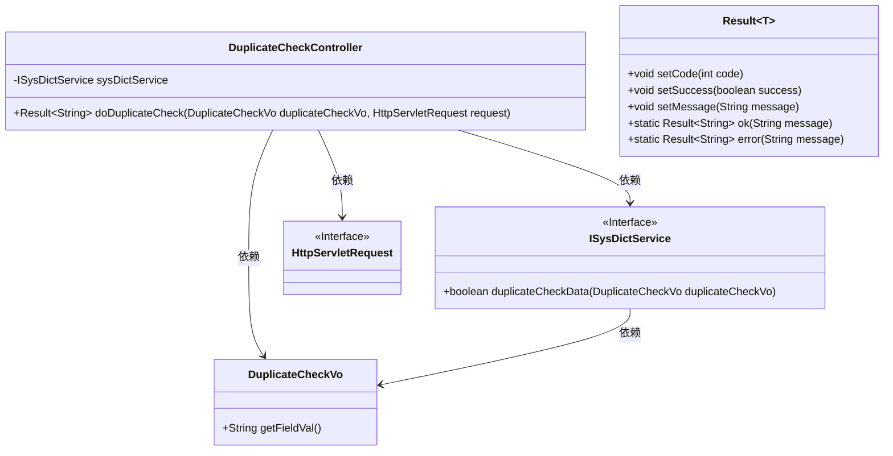
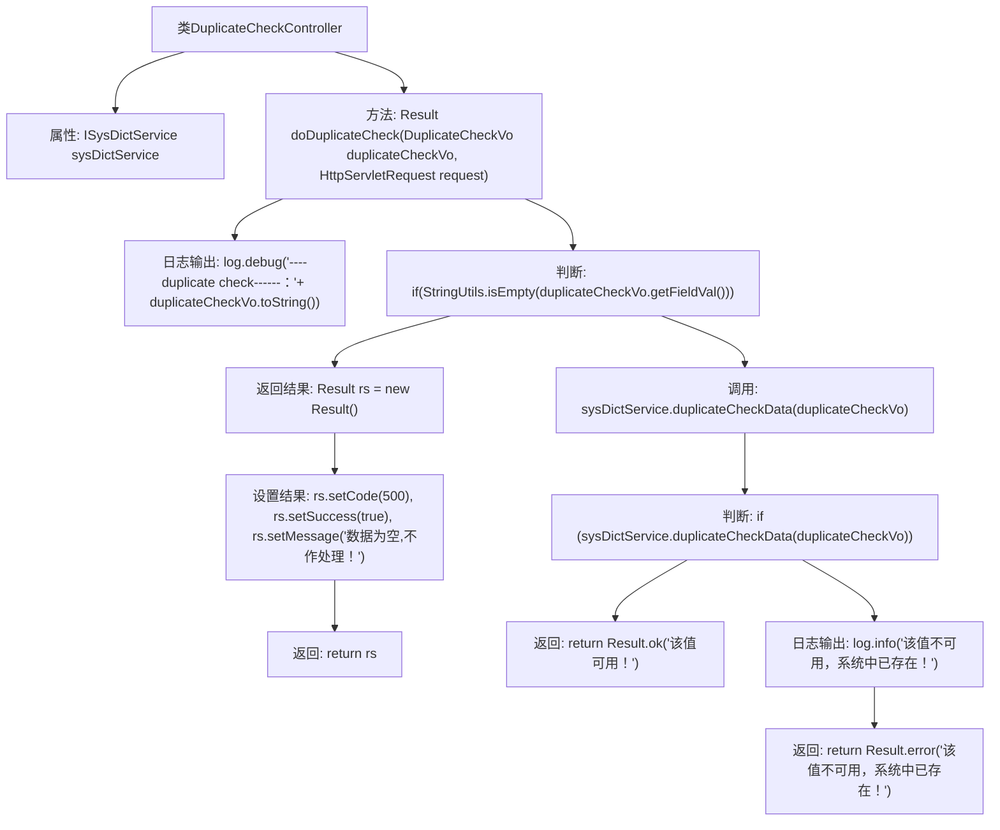

# 基础信息

|      |      |
|------|------|
| 名称 | DuplicateCheckController |
| 编码语言 | .java |
| 代码路径 | JeecgBoot/jeecg-boot/jeecg-module-system/jeecg-system-biz/src/main/java/org/jeecg/modules/system/controller/DuplicateCheckController.java |
| 包名 | org.jeecg.modules.system.controller |
| 依赖项 | ['io.swagger.v3.oas.annotations.Operation', 'io.swagger.v3.oas.annotations.tags.Tag', 'lombok.extern.slf4j.Slf4j', 'org.apache.commons.lang.StringUtils', 'org.jeecg.common.api.vo.Result', 'org.jeecg.modules.system.model.DuplicateCheckVo', 'org.jeecg.modules.system.service.ISysDictService', 'org.springframework.beans.factory.annotation.Autowired', 'org.springframework.web.bind.annotation.RequestMapping', 'org.springframework.web.bind.annotation.RequestMethod', 'org.springframework.web.bind.annotation.RestController', 'javax.servlet.http.HttpServletRequest'] |
| 概述说明 | 控制器校验数据：空值返回，非空检查可用性后返回结果。 |

# 说明

控制器在处理数据时，首先进行重复校验。如果数据为空值，则直接返回结果。如果数据非空，则进一步检查其可用性，并根据检查结果返回相应的处理结果。这一流程确保了数据处理的准确性和效率，避免了不必要的操作。

# 类列表 Class Summary

| 名称   | 类型  | 说明 |
|-------|------|-------------|
| DuplicateCheckController | class | 控制器处理数据重复校验，空值直接返回，非空值检查可用性并返回结果。 |

## 类 DuplicateCheckController

|      |      |
|------|------|
| 访问范围 | @Slf4j;@RestController;@RequestMapping("/sys/duplicate");@Tag(name="重复校验");public |
| 类型 | class |
| 名称 | DuplicateCheckController |
| 说明 | 控制器处理数据重复校验，空值直接返回，非空值检查可用性并返回结果。 |

### UML类图

**描述：**
`DuplicateCheckController` 是一个用于处理重复校验请求的控制器类，依赖于 `ISysDictService` 接口来执行具体的重复校验逻辑。`DuplicateCheckVo` 是一个值对象，用于封装校验数据。`Result` 是一个泛型类，用于封装返回结果。`HttpServletRequest` 是一个接口，用于处理HTTP请求。控制器通过 `doDuplicateCheck` 方法处理校验请求，并根据校验结果返回相应的 `Result` 对象。

### 内部方法调用关系图

这段代码定义了一个名为 `DuplicateCheckController` 的控制器类，用于处理重复校验的请求。方法 `doDuplicateCheck` 接收一个 `DuplicateCheckVo` 对象和 `HttpServletRequest` 请求，首先检查传入的值是否为空，如果为空则返回错误信息。如果值不为空，则调用 `sysDictService.duplicateCheckData` 方法进行校验，根据校验结果返回相应的成功或错误信息。整个过程通过日志记录关键步骤，确保流程的可追踪性。

### 字段列表 Field List

| 名称  | 类型  | 说明 |
|-------|-------|------|
| sysDictService | ISysDictService | 使用@Autowired注解自动注入ISysDictService实例。 |

### 方法列表 Method List

| 名称  | 类型  | 说明 |
|-------|-------|------|
| doDuplicateCheck | Result<String> | 重复校验接口：检查字段值是否重复，空值返回500，重复返回错误信息。 |

