# 基础信息

|      |      |
|------|------|
| 名称 | LoginController |
| 编码语言 | .java |
| 代码路径 | JeecgBoot/jeecg-boot/jeecg-module-system/jeecg-system-biz/src/main/java/org/jeecg/modules/system/controller/LoginController.java |
| 包名 | org.jeecg.modules.system.controller |
| 依赖项 | ['cn.hutool.core.util.RandomUtil', 'com.alibaba.fastjson.JSONObject', 'com.aliyuncs.exceptions.ClientException', 'com.baomidou.mybatisplus.core.conditions.query.LambdaQueryWrapper', 'com.baomidou.mybatisplus.core.toolkit.IdWorker', 'io.swagger.v3.oas.annotations.Operation', 'io.swagger.v3.oas.annotations.tags.Tag', 'lombok.extern.slf4j.Slf4j', 'org.apache.shiro.SecurityUtils', 'org.apache.shiro.authz.annotation.RequiresRoles', 'org.jeecg.common.api.vo.Result', 'org.jeecg.common.constant.CacheConstant', 'org.jeecg.common.constant.CommonConstant', 'org.jeecg.common.constant.SymbolConstant', 'org.jeecg.common.constant.enums.DySmsEnum', 'org.jeecg.common.system.util.JwtUtil', 'org.jeecg.common.system.vo.LoginUser', 'org.jeecg.common.util', 'org.jeecg.common.util.encryption.EncryptedString', 'org.jeecg.config.JeecgBaseConfig', 'org.jeecg.modules.base.service.BaseCommonService', 'org.jeecg.modules.system.entity.SysDepart', 'org.jeecg.modules.system.entity.SysRoleIndex', 'org.jeecg.modules.system.entity.SysTenant', 'org.jeecg.modules.system.entity.SysUser', 'org.jeecg.modules.system.model.SysLoginModel', 'org.jeecg.modules.system.service', 'org.jeecg.modules.system.service.impl.SysBaseApiImpl', 'org.jeecg.modules.system.util.RandImageUtil', 'org.springframework.beans.BeanUtils', 'org.springframework.beans.factory.annotation.Autowired', 'org.springframework.http.HttpStatus', 'org.springframework.web.bind.annotation', 'javax.annotation.Resource', 'javax.servlet.http.HttpServletRequest', 'javax.servlet.http.HttpServletResponse', 'java.util', 'java.util.stream.Collectors'] |
| 概述说明 | LoginController负责用户登录、验证码校验、信息获取和退出登录。 |

# 说明

LoginController负责处理用户登录相关功能，包括用户登录操作、验证码校验、用户信息获取以及退出登录等。该控制器确保用户身份验证的安全性，管理用户会话，并在用户退出时清理相关数据。通过集成验证码校验，增强了登录过程的安全性，防止恶意登录尝试。同时，用户信息获取功能允许系统在用户登录后获取必要的用户数据，以提供个性化服务。

# 类列表 Class Summary

| 名称   | 类型  | 说明 |
|-------|------|-------------|
| LoginController | class | LoginController处理用户登录、验证码校验、用户信息获取、退出登录等功能。 |

## 类 LoginController

|      |      |
|------|------|
| 访问范围 | @RestController;@RequestMapping("/sys");@Tag(name="用户登录");@Slf4j;public |
| 类型 | class |
| 名称 | LoginController |
| 说明 | LoginController处理用户登录、验证码校验、用户信息获取、退出登录等功能。 |

### UML类图

```mermaid
classDiagram
    class LoginController {
        -ISysUserService sysUserService
        -ISysPermissionService sysPermissionService
        -SysBaseApiImpl sysBaseApi
        -ISysLogService logService
        -RedisUtil redisUtil
        -ISysDepartService sysDepartService
        -ISysDictService sysDictService
        -BaseCommonService baseCommonService
        -JeecgBaseConfig jeecgBaseConfig
        -String BASE_CHECK_CODES
        +Result~JSONObject~ login(SysLoginModel sysLoginModel, HttpServletRequest request)
        +Result~JSONObject~ getUserInfo(HttpServletRequest request)
        +Result~Object~ logout(HttpServletRequest request, HttpServletResponse response)
        +Result~JSONObject~ loginfo()
        +Result~List~Map~String,Object~~~ visitInfo()
        +Result~JSONObject~ selectDepart(SysUser user)
        +Result~String~ sms(JSONObject jsonObject, HttpServletRequest request)
        +Result~JSONObject~ phoneLogin(JSONObject jsonObject, HttpServletRequest request)
        +Result~JSONObject~ userInfo(SysUser sysUser, Result~JSONObject~ result, HttpServletRequest request)
        +Result~Map~String,String~~ getEncryptedString()
        +Result~String~ randomImage(HttpServletResponse response, String key)
        +Result~String~ switchVue3Menu(HttpServletResponse response)
        +Result~JSONObject~ mLogin(SysLoginModel sysLoginModel)
        +Result~?~ checkCaptcha(SysLoginModel sysLoginModel)
        +Result~?~ getLoginQrcode()
        +Result~?~ scanLoginQrcode(String qrcodeId, String token)
        +Result getQrcodeToken(String qrcodeId)
        +boolean isLoginFailOvertimes(String username)
        +void addLoginFailOvertimes(String username)
        +Result~String~ sendSms(JSONObject jsonObject)
        +Result~?~ smsCheckCaptcha(SysLoginModel sysLoginModel, HttpServletRequest request)
    }

    class ISysUserService {
        <<Interface>>
        +SysUser getOne(LambdaQueryWrapper~SysUser~ queryWrapper)
        +Result~JSONObject~ checkUserIsEffective(SysUser sysUser)
        +SysUser getUserByName(String username)
        +SysUser getUserByPhone(String phone)
        +void updateUserDepart(String username, String orgCode, Integer tenantId)
        +SysUser getById(Integer id)
        +Result~JSONObject~ setLoginTenant(SysUser sysUser, JSONObject obj, String username, Result~JSONObject~ result)
    }

    class ISysPermissionService {
        <<Interface>>
        +void switchVue3Menu()
    }

    class SysBaseApiImpl {
        +LoginUser getUserByName(String username)
    }

    class ISysLogService {
        <<Interface>>
        +Long findTotalVisitCount()
        +Long findTodayVisitCount(Date dayStart, Date dayEnd)
        +Long findTodayIp(Date dayStart, Date dayEnd)
        +List~Map~String,Object~~ findVisitCount(Date dayStart, Date dayEnd)
    }

    class RedisUtil {
        +Object get(String key)
        +void del(String key)
        +void set(String key, Object value, long timeout)
        +void removeAll(String keyPrefix)
        +void expire(String key, long timeout)
    }

    class ISysDepartService {
        <<Interface>>
        +List~SysDepart~ queryUserDeparts(Integer userId)
    }

    class ISysDictService {
        <<Interface>>
        +Map~String, List~DictModel~~ queryAllDictItems()
    }

    class BaseCommonService {
        +void addLog(String logContent, Integer logType, Integer operatetype, LoginUser loginUser)
    }

    class JeecgBaseConfig {
        +String getSignatureSecret()
    }

    LoginController --> ISysUserService : 依赖
    LoginController --> ISysPermissionService : 依赖
    LoginController --> SysBaseApiImpl : 依赖
    LoginController --> ISysLogService : 依赖
    LoginController --> RedisUtil : 依赖
    LoginController --> ISysDepartService : 依赖
    LoginController --> ISysDictService : 依赖
    LoginController --> BaseCommonService : 依赖
    LoginController --> JeecgBaseConfig : 依赖
```

### 描述
`LoginController` 是一个处理用户登录、登出、获取用户信息、验证码等功能的控制器类。它依赖于多个服务类，如 `ISysUserService` 用于用户管理，`ISysPermissionService` 用于权限管理，`RedisUtil` 用于缓存操作等。该类通过多个接口方法实现了用户登录、验证码校验、用户信息获取、日志记录等功能，确保系统的安全性和用户体验。

### 内部方法调用关系图

```mermaid
graph TD
    A["类LoginController"]
    B["属性: ISysUserService sysUserService"]
    C["属性: ISysPermissionService sysPermissionService"]
    D["属性: SysBaseApiImpl sysBaseApi"]
    E["属性: ISysLogService logService"]
    F["属性: RedisUtil redisUtil"]
    G["属性: ISysDepartService sysDepartService"]
    H["属性: ISysDictService sysDictService"]
    I["属性: BaseCommonService baseCommonService"]
    J["属性: JeecgBaseConfig jeecgBaseConfig"]
    K["方法: Result<JSONObject> login(SysLoginModel sysLoginModel, HttpServletRequest request)"]
    L["方法: Result<JSONObject> getUserInfo(HttpServletRequest request)"]
    M["方法: Result<Object> logout(HttpServletRequest request, HttpServletResponse response)"]
    N["方法: Result<JSONObject> loginfo()"]
    O["方法: Result<List<Map<String,Object>>> visitInfo()"]
    P["方法: Result<JSONObject> selectDepart(SysUser user)"]
    Q["方法: Result<String> sms(JSONObject jsonObject, HttpServletRequest request)"]
    R["方法: Result<JSONObject> phoneLogin(JSONObject jsonObject, HttpServletRequest request)"]
    S["方法: Result<JSONObject> userInfo(SysUser sysUser, Result<JSONObject> result, HttpServletRequest request)"]
    T["方法: Result<Map<String,String>> getEncryptedString()"]
    U["方法: Result<String> randomImage(HttpServletResponse response, String key)"]
    V["方法: Result<String> switchVue3Menu(HttpServletResponse response)"]
    W["方法: Result<JSONObject> mLogin(SysLoginModel sysLoginModel)"]
    X["方法: Result<?> checkCaptcha(SysLoginModel sysLoginModel)"]
    Y["方法: Result<?> getLoginQrcode()"]
    Z["方法: Result<?> scanLoginQrcode(String qrcodeId, String token)"]
    AA["方法: Result getQrcodeToken(String qrcodeId)"]
    AB["方法: boolean isLoginFailOvertimes(String username)"]
    AC["方法: void addLoginFailOvertimes(String username)"]
    AD["方法: Result<String> sendSms(JSONObject jsonObject)"]
    AE["方法: Result<?> smsCheckCaptcha(SysLoginModel sysLoginModel, HttpServletRequest request)"]

    A --> B
    A --> C
    A --> D
    A --> E
    A --> F
    A --> G
    A --> H
    A --> I
    A --> J
    A --> K
    A --> L
    A --> M
    A --> N
    A --> O
    A --> P
    A --> Q
    A --> R
    A --> S
    A --> T
    A --> U
    A --> V
    A --> W
    A --> X
    A --> Y
    A --> Z
    A --> AA
    A --> AB
    A --> AC
    A --> AD
    A --> AE
```

这段代码定义了一个名为 `LoginController` 的 Spring Boot 控制器类，用于处理用户登录、获取用户信息、退出登录、记录访问量、发送短信验证码等操作。代码中包含了多个方法，每个方法负责处理不同的业务逻辑，如登录验证、用户信息获取、日志记录等。通过流程图可以清晰地看到类中各属性的依赖关系以及方法的调用顺序，便于理解和维护代码。

### 字段列表 Field List

| 名称  | 类型  | 说明 |
|-------|-------|------|
| sysPermissionService | ISysPermissionService | 自动注入系统权限服务实例。 |
| sysBaseApi | SysBaseApiImpl | 自动注入SysBaseApiImpl实例。 |
| sysDictService | ISysDictService | 自动注入系统字典服务实例。 |
| sysUserService | ISysUserService | 自动注入系统用户服务接口实例。 |
| sysDepartService | ISysDepartService | 自动注入系统部门服务实例。 |
| baseCommonService | BaseCommonService | 类中注入基础公共服务实例。 |
| redisUtil | RedisUtil | 自动注入RedisUtil工具类实例。 |
| logService | ISysLogService | 自动注入系统日志服务实例。 |
| BASE_CHECK_CODES = "qwertyuiplkjhgfdsazxcvbnmQWERTYUPLKJHGFDSAZXCVBNM1234567890" | String | 定义包含字母和数字的字符串常量BASE_CHECK_CODES。 |
| jeecgBaseConfig | JeecgBaseConfig | 使用Autowired注解注入JeecgBaseConfig依赖。 |

### 方法列表 Method List

| 名称  | 类型  | 说明 |
|-------|-------|------|
| switchVue3Menu | Result<String> | 管理员权限下切换Vue3菜单的接口。 |
| selectDepart | Result<JSONObject> | 通过PUT请求更新用户登录部门和租户信息，并返回用户信息。 |
| getEncryptedString | Result<Map<String,String>> | 通过GET请求获取加密字符串的密钥和IV，返回包含两者的结果对象。 |
| visitInfo | Result<List<Map<String,Object>>> | 获取访问信息接口，返回过去7天访问数据列表。 |
| scanLoginQrcode | Result<?> | 扫码登录二维码接口，验证二维码有效性并存储token。 |
| loginfo | Result<JSONObject> | 该方法获取系统访问记录，包括总访问量、今日访问量和今日IP数，并返回成功结果。 |
| getUserInfo | Result<JSONObject> | 通过JWT获取用户名，查询用户信息及首页配置，返回用户信息和字典数据。 |
| phoneLogin | Result<JSONObject> | 手机号登录接口，验证用户有效性及手机验证码，失败锁定用户。 |
| addLoginFailOvertimes | void | 记录用户登录失败次数并存储至Redis，有效期为10分钟。 |
| isLoginFailOvertimes | boolean | 检查用户登录失败次数是否超过5次。 |
| randomImage | Result<String> | 生成验证码并存储至Redis，返回Base64编码图像。 |
| getQrcodeToken | Result | 通过二维码ID获取用户登录token，检查二维码是否过期并返回相应结果。 |
| checkCaptcha | Result<?> | 验证验证码，无效或错误返回错误信息，正确返回成功。 |
| userInfo | Result<JSONObject> | 用户登录生成token，设置租户、用户信息和部门，优化数据字典加载。 |
| sms | Result<String> | 处理短信验证码请求，验证手机号有效性，防止恶意请求，发送验证码并缓存10分钟。 |
| login | Result<JSONObject> | 登录接口处理用户登录，验证验证码、用户有效性及密码，记录日志并返回结果。 |
| mLogin | Result<JSONObject> | 处理移动端登录，验证用户有效性、密码正确性，设置部门、租户信息，生成并返回登录token。 |
| logout | Result<Object> | 用户退出登录逻辑：验证token，记录日志，清除缓存，调用shiro退出，返回结果。 |
| sendSms | Result<String> | 发送修改密码短信验证码，校验手机号与用户匹配，生成并发送6位随机验证码，5分钟内有效。 |
| smsCheckCaptcha | Result<?> | POST请求验证短信验证码，无效或错误返回相应提示，验证成功则清除相关记录。 |
| getLoginQrcode | Result<?> | 生成登录二维码，存储唯一标识，有效期30秒。 |

