# 基础信息

|      |      |
|------|------|
| 名称 | SysAnnouncementController |
| 编码语言 | .java |
| 代码路径 | JeecgBoot/jeecg-boot/jeecg-module-system/jeecg-system-biz/src/main/java/org/jeecg/modules/system/controller/SysAnnouncementController.java |
| 包名 | org.jeecg.modules.system.controller |
| 依赖项 | ['com.alibaba.fastjson.JSONObject', 'com.baomidou.mybatisplus.core.conditions.query.LambdaQueryWrapper', 'com.baomidou.mybatisplus.core.conditions.query.QueryWrapper', 'com.baomidou.mybatisplus.core.metadata.IPage', 'com.baomidou.mybatisplus.extension.plugins.pagination.Page', 'com.jeecg.dingtalk.api.core.response.Response', 'lombok.extern.slf4j.Slf4j', 'org.apache.commons.lang.StringUtils', 'org.apache.shiro.SecurityUtils', 'org.jeecg.common.api.vo.Result', 'org.jeecg.common.config.TenantContext', 'org.jeecg.common.constant.CommonConstant', 'org.jeecg.common.constant.CommonSendStatus', 'org.jeecg.common.constant.WebsocketConst', 'org.jeecg.common.system.query.QueryGenerator', 'org.jeecg.common.system.util.JwtUtil', 'org.jeecg.common.system.vo.LoginUser', 'org.jeecg.common.util', 'org.jeecg.config.mybatis.MybatisPlusSaasConfig', 'org.jeecg.modules.message.enums.RangeDateEnum', 'org.jeecg.modules.message.websocket.WebSocket', 'org.jeecg.modules.system.entity.SysAnnouncement', 'org.jeecg.modules.system.entity.SysAnnouncementSend', 'org.jeecg.modules.system.service.ISysAnnouncementSendService', 'org.jeecg.modules.system.service.ISysAnnouncementService', 'org.jeecg.modules.system.service.impl.SysBaseApiImpl', 'org.jeecg.modules.system.service.impl.ThirdAppDingtalkServiceImpl', 'org.jeecg.modules.system.service.impl.ThirdAppWechatEnterpriseServiceImpl', 'org.jeecg.modules.system.util.XssUtils', 'org.jeecgframework.poi.excel.ExcelImportUtil', 'org.jeecgframework.poi.excel.def.NormalExcelConstants', 'org.jeecgframework.poi.excel.entity.ExportParams', 'org.jeecgframework.poi.excel.entity.ImportParams', 'org.jeecgframework.poi.excel.view.JeecgEntityExcelView', 'org.springframework.beans.factory.annotation.Autowired', 'org.springframework.context.annotation.Lazy', 'org.springframework.data.redis.core.RedisTemplate', 'org.springframework.http.HttpStatus', 'org.springframework.util.CollectionUtils', 'org.springframework.web.bind.annotation', 'org.springframework.web.multipart.MultipartFile', 'org.springframework.web.multipart.MultipartHttpServletRequest', 'org.springframework.web.servlet.ModelAndView', 'javax.annotation.Resource', 'javax.servlet.http.HttpServletRequest', 'javax.servlet.http.HttpServletResponse', 'java.io.IOException', 'java.util.Date', 'java.util.HashMap', 'java.util.List', 'java.util.Map', 'java.util.concurrent.ExecutorService', 'java.util.concurrent.SynchronousQueue', 'java.util.concurrent.ThreadPoolExecutor', 'java.util.concurrent.TimeUnit', 'java.util.stream.Collectors', 'org.jeecg.common.constant.CommonConstant.ANNOUNCEMENT_SEND_STATUS_1'] |
| 概述说明 | 系统公告控制器支持增删改查、发布、撤销、同步，具备多租户、XSS防护及第三方消息推送功能。 |

# 说明

系统公告控制器具备公告的增删改查、发布、撤销和同步等核心功能，支持多租户架构，有效防护XSS攻击，并能与第三方消息推送系统集成，确保公告管理的全面性和安全性。

# 类列表 Class Summary

| 名称   | 类型  | 说明 |
|-------|------|-------------|
| SysAnnouncementController | class | 系统公告控制器提供公告的增删改查、发布、撤销、同步等功能，支持多租户、XSS防护、第三方消息推送。 |

## 类 SysAnnouncementController

|      |      |
|------|------|
| 访问范围 | @RestController;@RequestMapping("/sys/annountCement");@Slf4j;public |
| 类型 | class |
| 名称 | SysAnnouncementController |
| 说明 | 系统公告控制器提供公告的增删改查、发布、撤销、同步等功能，支持多租户、XSS防护、第三方消息推送。 |

### UML类图

```mermaid
classDiagram
    class SysAnnouncementController {
        -ISysAnnouncementService sysAnnouncementService
        -ISysAnnouncementSendService sysAnnouncementSendService
        -WebSocket webSocket
        -ThirdAppWechatEnterpriseServiceImpl wechatEnterpriseService
        -ThirdAppDingtalkServiceImpl dingtalkService
        -SysBaseApiImpl sysBaseApi
        -RedisUtil redisUtil
        -RedisTemplate redisTemplate
        +ExecutorService cachedThreadPool
        +ExecutorService completeNoteThreadPool
        +Result~IPage~SysAnnouncement~~ queryPageList(SysAnnouncement sysAnnouncement, Integer pageNo, Integer pageSize, HttpServletRequest req)
        +Result~SysAnnouncement~ add(SysAnnouncement sysAnnouncement)
        +Result~SysAnnouncement~ eidt(SysAnnouncement sysAnnouncement)
        +Result~SysAnnouncement~ delete(String id)
        +Result~SysAnnouncement~ deleteBatch(String ids)
        +Result~SysAnnouncement~ queryById(String id)
        +Result~SysAnnouncement~ doReleaseData(String id, HttpServletRequest request)
        +Result~SysAnnouncement~ doReovkeData(String id, HttpServletRequest request)
        +Result~Map~String, Object~~ listByUser(Integer pageSize, HttpServletRequest request)
        +Result~Integer~ getUnreadMessageCount(Integer pageSize, HttpServletRequest request)
        +ModelAndView exportXls(SysAnnouncement sysAnnouncement, HttpServletRequest request)
        +Result~?~ importExcel(HttpServletRequest request, HttpServletResponse response)
        +Result~SysAnnouncement~ syncNotic(String anntId, HttpServletRequest request)
        +ModelAndView showContent(ModelAndView modelAndView, String id, HttpServletRequest request)
        +Result~List~SysAnnouncement~~ vue3List(String fromUser, String starFlag, String rangeDateKey, String beginDate, String endDate, Integer pageNo, Integer pageSize)
        +Result~Page~SysAnnouncementSend~~ getLastAnnountTime(String userId)
        +Result~String~ clearAllUnReadMessage()
    }

    class ISysAnnouncementService {
        <<Interface>>
        +IPage~SysAnnouncement~ page(Page~SysAnnouncement~ page, QueryWrapper~SysAnnouncement~ queryWrapper)
        +void saveAnnouncement(SysAnnouncement sysAnnouncement)
        +boolean upDateAnnouncement(SysAnnouncement sysAnnouncement)
        +boolean updateById(SysAnnouncement sysAnnouncement)
        +SysAnnouncement getById(String id)
        +void batchInsertSysAnnouncementSend(String id, Integer tenantId)
        +Page~SysAnnouncement~ querySysCementPageByUserId(Page~SysAnnouncement~ page, String userId, String type, String lastMonthStartDay)
        +Integer getUnreadMessageCountByUserId(String userId, Date lastMonthStartDay)
        +List~SysAnnouncement~ querySysMessageList(Integer pageSize, Integer pageNo, String fromUser, String starFlag, Date beginTime, Date endTime)
        +void updateReaded(List~String~ annoceIdList)
        +void clearAllUnReadMessage()
    }

    class ISysAnnouncementSendService {
        <<Interface>>
        +Page~SysAnnouncementSend~ page(Page~SysAnnouncementSend~ page, LambdaQueryWrapper~SysAnnouncementSend~ query)
    }

    class WebSocket {
        +void sendMessage(String message)
        +void sendMessage(String[] userIds, String message)
    }

    class ThirdAppWechatEnterpriseServiceImpl {
        +void sendTextCardMessage(SysAnnouncement sysAnnouncement, boolean isSync)
    }

    class ThirdAppDingtalkServiceImpl {
        +Response~String~ sendActionCardMessage(SysAnnouncement sysAnnouncement, String taskId, boolean isSync)
        +void recallMessage(String taskId)
    }

    class SysBaseApiImpl {
        +boolean verifyToken(HttpServletRequest request, SysBaseApiImpl sysBaseApi, RedisUtil redisUtil)
    }

    class RedisUtil {
        +void set(String key, Object value, long timeout, TimeUnit unit)
        +Object get(String key)
        +boolean hasKey(String key)
    }

    class RedisTemplate {
        +void opsForValue().set(String key, Object value, long timeout, TimeUnit unit)
        +Object opsForValue().get(String key)
        +boolean hasKey(String key)
    }

    class SysAnnouncement {
        -String id
        -String titile
        -String delFlag
        -String sendStatus
        -Date sendTime
        -String sender
        -String msgType
        -String userIds
        -String dtTaskId
        -Date cancelTime
        -String readFlag
        -Date createTime
    }

    class SysAnnouncementSend {
        -String id
        -String userId
        -Date createTime
    }

    class Result~T~ {
        -boolean success
        -String message
        -T result
        +void setSuccess(boolean success)
        +void setResult(T result)
        +void error500(String message)
        +void success(String message)
    }

    class IPage~T~ {
        -List~T~ records
        -long total
        +List~T~ getRecords()
        +long getTotal()
    }

    class Page~T~ {
        -int current
        -int size
        +Page(int current, int size)
    }

    class QueryWrapper~T~ {
        +QueryWrapper~T~ initQueryWrapper(T entity, Map~String, String~ parameterMap)
    }

    class LambdaQueryWrapper~T~ {
        +LambdaQueryWrapper~T~ eq(String column, Object value)
        +LambdaQueryWrapper~T~ ne(String column, Object value)
        +LambdaQueryWrapper~T~ select(String... columns)
        +LambdaQueryWrapper~T~ orderByDesc(String column)
    }

    class HttpServletRequest {
        +Map~String, String~ getParameterMap()
    }

    class HttpServletResponse {
        +void setStatus(int status)
    }

    class ModelAndView {
        -String viewName
        -Map~String, Object~ model
        +void addObject(String key, Object value)
        +void setViewName(String viewName)
        +void setStatus(HttpStatus status)
    }

    class MultipartHttpServletRequest {
        +Map~String, MultipartFile~ getFileMap()
    }

    class MultipartFile {
        +InputStream getInputStream()
    }

    class ImportParams {
        +void setTitleRows(int rows)
        +void setHeadRows(int rows)
        +void setNeedSave(boolean needSave)
    }

    class ExcelImportUtil {
        +List~T~ importExcel(InputStream inputStream, Class~T~ clazz, ImportParams params)
    }

    class LoginUser {
        -String id
        -String realname
        +String getId()
        +String getRealname()
    }

    class SecurityUtils {
        +Subject getSubject()
    }

    class Subject {
        +Principal getPrincipal()
    }

    class Principal {
        +String getId()
        +String getRealname()
    }

    class DateRangeUtils {
        +Date getLastMonthStartDay()
    }

    class RangeDateEnum {
        +Date[] getRangeArray(String key)
    }

    class DateUtils {
        +Date parseDatetime(String date)
    }

    class CollectionUtils {
        +boolean isEmpty(Collection~?~ collection)
    }

    class JSONObject {
        +void put(String key, Object value)
        +String toJSONString()
    }

    class WebsocketConst {
        +String MSG_CMD
        +String MSG_ID
        +String MSG_TXT
        +String CMD_TOPIC
        +String CMD_USER
    }

    class CommonConstant {
        +String DEL_FLAG_0
        +String DEL_FLAG_1
        +String MSG_TYPE_ALL
        +String CACHE_KEY_USER_LAST_ANNOUNT_TIME_1HOUR
    }

    class CommonSendStatus {
        +String UNPUBLISHED_STATUS_0
        +String PUBLISHED_STATUS_1
        +String REVOKE_STATUS_2
    }

    class Response~T~ {
        -boolean success
        -T result
        +boolean isSuccess()
        +T getResult()
    }

    SysAnnouncementController --> ISysAnnouncementService : 依赖
    SysAnnouncementController --> ISysAnnouncementSendService : 依赖
    SysAnnouncementController --> WebSocket : 依赖
    SysAnnouncementController --> ThirdAppWechatEnterpriseServiceImpl : 依赖
    SysAnnouncementController --> ThirdAppDingtalkServiceImpl : 依赖
    SysAnnouncementController --> SysBaseApiImpl : 依赖
    SysAnnouncementController --> RedisUtil : 依赖
    SysAnnouncementController --> RedisTemplate : 依赖
    ISysAnnouncementService --> SysAnnouncement : 依赖
    ISysAnnouncementSendService --> SysAnnouncementSend : 依赖
    Result~T~ --> T : 依赖
    IPage~T~ --> T : 依赖
    Page~T~ --> T : 依赖
    QueryWrapper~T~ --> T : 依赖
    LambdaQueryWrapper~T~ --> T : 依赖
    ModelAndView --> HttpStatus : 依赖
    MultipartHttpServletRequest --> MultipartFile : 依赖
    ExcelImportUtil --> ImportParams : 依赖
    SecurityUtils --> Subject : 依赖
    Subject --> Principal : 依赖
    DateRangeUtils --> Date : 依赖
    RangeDateEnum --> Date : 依赖
    DateUtils --> Date : 依赖
    CollectionUtils --> Collection~?~ : 依赖
    Response~T~ --> T : 依赖
```

这段代码定义了一个`SysAnnouncementController`类，它是一个Spring Boot的REST控制器，用于管理系统公告的增删改查、发布、撤销等操作。控制器依赖于多个服务类，如`ISysAnnouncementService`、`ISysAnnouncementSendService`、`WebSocket`等，用于处理公告的存储、推送、第三方集成等功能。代码中还使用了线程池来处理异步任务，并通过Redis缓存优化性能。整体设计符合MVC架构，控制器负责接收请求并调用相应的服务类处理业务逻辑。

### 内部方法调用关系图

```mermaid
graph TD
    A["类SysAnnouncementController"]
    B["属性: ISysAnnouncementService sysAnnouncementService"]
    C["属性: ISysAnnouncementSendService sysAnnouncementSendService"]
    D["属性: WebSocket webSocket"]
    E["属性: ThirdAppWechatEnterpriseServiceImpl wechatEnterpriseService"]
    F["属性: ThirdAppDingtalkServiceImpl dingtalkService"]
    G["属性: SysBaseApiImpl sysBaseApi"]
    H["属性: RedisUtil redisUtil"]
    I["属性: RedisTemplate redisTemplate"]
    J["线程池: ExecutorService cachedThreadPool"]
    K["线程池: ExecutorService completeNoteThreadPool"]
    L["方法: queryPageList"]
    M["方法: add"]
    N["方法: eidt"]
    O["方法: delete"]
    P["方法: deleteBatch"]
    Q["方法: queryById"]
    R["方法: doReleaseData"]
    S["方法: doReovkeData"]
    T["方法: listByUser"]
    U["方法: getUnreadMessageCount"]
    V["方法: exportXls"]
    W["方法: importExcel"]
    X["方法: syncNotic"]
    Y["方法: showContent"]
    Z["方法: vue3List"]
    AA["方法: getLastAnnountTime"]
    AB["方法: clearAllUnReadMessage"]

    A --> B
    A --> C
    A --> D
    A --> E
    A --> F
    A --> G
    A --> H
    A --> I
    A --> J
    A --> K
    A --> L
    A --> M
    A --> N
    A --> O
    A --> P
    A --> Q
    A --> R
    A --> S
    A --> T
    A --> U
    A --> V
    A --> W
    A --> X
    A --> Y
    A --> Z
    A --> AA
    A --> AB
```

这段代码是一个Spring Boot控制器类，用于管理系统公告的增删改查操作。它包含了多个请求处理方法，支持分页查询、添加、编辑、删除、批量删除、查询公告详情、发布、撤销发布、获取用户未读消息数量、导出Excel、导入Excel、同步通知、查看公告内容、获取最新公告时间等功能。代码中还使用了多线程池来处理异步任务，并通过WebSocket实现实时消息推送。

### 字段列表 Field List

| 名称  | 类型  | 说明 |
|-------|-------|------|
| sysAnnouncementService | ISysAnnouncementService | 自动注入系统公告服务接口实例。 |
| webSocket | WebSocket | 在类中声明了一个私有的WebSocket对象。 |
| redisTemplate | RedisTemplate | 自动注入RedisTemplate实例，用于操作Redis数据库。 |
| sysAnnouncementSendService | ISysAnnouncementSendService | 自动注入系统公告发送服务实例。 |
| redisUtil | RedisUtil | 使用@Autowired和@Lazy注解延迟注入RedisUtil实例。 |
| completeNoteThreadPool = new ThreadPoolExecutor(0, 1024,60L, TimeUnit.SECONDS, new SynchronousQueue<Runnable>()) | ExecutorService | 创建线程池，最大1024线程，60秒空闲超时，使用同步队列。 |
| cachedThreadPool = new ThreadPoolExecutor(0, 1024,60L, TimeUnit.SECONDS, new SynchronousQueue<Runnable>()) | ExecutorService | 创建可缓存线程池，核心线程0，最大1024，超时60秒，使用同步队列。 |
| sysBaseApi | SysBaseApiImpl | 使用@Autowired注解自动注入SysBaseApiImpl实例。 |
| wechatEnterpriseService | ThirdAppWechatEnterpriseServiceImpl | 自动注入微信企业服务实现类实例。 |
| dingtalkService | ThirdAppDingtalkServiceImpl | 自动注入DingTalk服务实现类。 |

### 方法列表 Method List

| 名称  | 类型  | 说明 |
|-------|-------|------|
| delete | Result<SysAnnouncement> | 通过ID删除系统公告，若存在则标记删除并返回成功信息。 |
| clearAllUnReadMessage | Result<String> | 清除所有未读消息的API接口。 |
| exportXls | ModelAndView | 导出系统通告列表为Excel文件，包含查询条件和导出信息。 |
| queryById | Result<SysAnnouncement> | 通过ID查询系统公告，返回结果或错误信息。 |
| getUnreadMessageCount | Result<Integer> | 获取用户近两个月未读消息数量，默认页大小为5。 |
| queryPageList | Result<IPage<SysAnnouncement>> | GET请求获取公告列表，支持分页和多租户数据隔离。 |
| getLastAnnountTime | Result<Page<SysAnnouncementSend>> | 接口通过Redis缓存查询用户最后一次收到系统通知时间，缓存1小时。 |
| add | Result<SysAnnouncement> | POST请求添加公告，处理XSS攻击，设置未发布状态，返回操作结果。 |
| listByUser | Result<Map<String, Object>> | 通过GET请求查询用户近两个月的系统公告和通知，返回分页结果。 |
| importExcel | Result<?> | 导入Excel文件并处理数据，保存到数据库，返回成功或失败信息。 |
| eidt | Result<SysAnnouncement> | 处理系统公告编辑请求，验证实体并防止XSS攻击，返回修改结果。 |
| deleteBatch | Result<SysAnnouncement> | 删除批量公告，校验参数后逐个标记删除并返回结果。 |
| doReovkeData | Result<SysAnnouncement> | GET请求撤销系统通知，更新状态并记录时间，成功则撤回第三方消息。 |
| syncNotic | Result<SysAnnouncement> | 通过WebSocket同步公告，支持按ID查询和批量设置已读。 |
| showContent | ModelAndView | 通过ID获取公告内容，验证Token有效性，若有效或公告已发布则显示，否则返回404。 |
| vue3List | Result<List<SysAnnouncement>> | GET请求处理/vue3List，查询通知消息并设置已读，记录耗时。 |
| doReleaseData | Result<SysAnnouncement> | 通过ID获取系统公告并发布，更新状态和时间，推送WebSocket通知，同步企业微信和钉钉消息。 |

